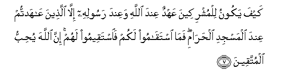
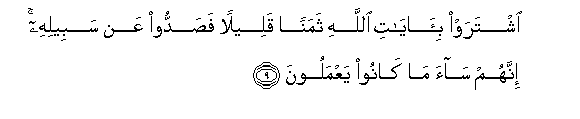
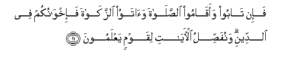
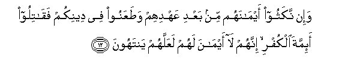
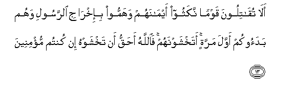
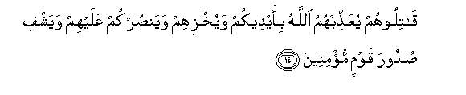
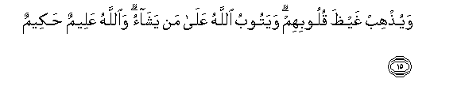
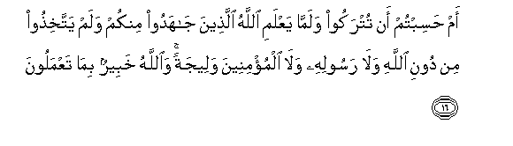

  
[Intangible Textual Heritage](../../index)  [Islam](../index.md) 
[Index](index.md)   
[Hypertext Qur'an](../htq/index)  [Unicode](../uq/009.htm#009_007.md) 
[Palmer](../sbe06/009)  [Pickthall](../pick/009.htm#009_007.md)  [Yusuf Ali
English](../yaq/yaq009)  [Rodwell](../qr/009.md)   
  
[Sūra IX.: Tauba (Repentance) or Barāat (Immunity). Index](009.md)  
  [Previous](00901)  [Next](00903.md) 

------------------------------------------------------------------------

  
*The Holy Quran*, tr. by Yusuf Ali, \[1934\], at Intangible Textual
Heritage

------------------------------------------------------------------------

# Sūra IX.: Tauba (Repentance) or Barāat (Immunity).

### Section 2

------------------------------------------------------------------------

7. Kayfa yakoonu lilmushrikeena AAahdun AAinda All<u>a</u>hi waAAinda
rasoolihi ill<u>a</u> alla<u>th</u>eena AA<u>a</u>hadtum AAinda
almasjidi al<u>h</u>ar<u>a</u>mi fam<u>a</u> istaq<u>a</u>moo lakum
fa**i**staqeemoo lahum inna All<u>a</u>ha yu<u>h</u>ibbu
almuttaqeen**a**

7\. How can there be a league,  
Before God and His Apostle,  
With the Pagans, except those  
With whom ye made a treaty  
Near the Sacred Mosque?  
As long as these stand true  
To you, stand ye true to them:  
For God doth love the righteous.

------------------------------------------------------------------------

8. Kayfa wa-in ya*<u>th</u>*haroo AAalaykum l<u>a</u> yarquboo feekum
illan wal<u>a</u> <u>th</u>immatan yur<u>d</u>oonakum
bi-afw<u>a</u>hihim wata/b<u>a</u> quloobuhum waaktharuhum
f<u>a</u>siqoon**a**

8\. How (can there be such a league),  
Seeing that if they get an advantage  
Over you, they respect not  
In you the ties either of kinship  
Or of covenant? With (fair words  
From) their mouths they entice you,  
But their hearts are averse  
From you; and most of them  
Are rebellious and wicked.

------------------------------------------------------------------------

9. Ishtaraw bi-<u>a</u>y<u>a</u>ti All<u>a</u>hi thamanan qaleelan
fa<u>s</u>addoo AAan sabeelihi innahum s<u>a</u>a m<u>a</u> k<u>a</u>noo
yaAAmaloon**a**

9\. The Signs of God have they sold  
For a miserable price,  
And (many) have they hindered  
From His Way: evil indeed  
Are the deeds they have done.

------------------------------------------------------------------------

10. L<u>a</u> yarquboona fee mu/minin illan wal<u>a</u> <u>th</u>immatan
waol<u>a</u>-ika humu almuAAtadoon**a**

10\. In a Believer they respect not  
The ties either of kinship  
Or of covenant! It is they  
Who have transgressed all bounds.

------------------------------------------------------------------------

11. Fa-in t<u>a</u>boo waaq<u>a</u>moo a**l**<u>ss</u>al<u>a</u>ta
wa<u>a</u>tawoo a**l**zzak<u>a</u>ta fa-ikhw<u>a</u>nukum fee
a**l**ddeeni wanufa<u>ss</u>ilu al-<u>a</u>y<u>a</u>ti liqawmin
yaAAlamoon**a**

11\. But (even so), if they repent,  
Establish regular prayers,  
And practise regular charity,—  
They are your brethren in Faith:  
(Thus) do We explain the Signs  
in detail, for those who understand.

------------------------------------------------------------------------

12. Wa-in nakathoo aym<u>a</u>nahum min baAAdi AAahdihim
wa<u>t</u>aAAanoo fee deenikum faq<u>a</u>tiloo a-immata alkufri innahum
l<u>a</u> aym<u>a</u>na lahum laAAallahum yantahoon**a**

12\. But if they violate their oaths  
After their covenant,  
And taunt you for your Faith,—  
Fight ye the chiefs of Unfaith:  
For their oaths are nothing to them:  
That thus they may be restrained.

------------------------------------------------------------------------

13. Al<u>a</u> tuq<u>a</u>tiloona qawman nakathoo aym<u>a</u>nahum
wahammoo bi-ikhr<u>a</u>ji a**l**rrasooli wahum badaookum awwala
marratin atakhshawnahum fa**A**ll<u>a</u>hu a<u>h</u>aqqu an takhshawhu
in kuntum mu/mineen**a**

13\. Will ye not fight people  
Who violated their oaths,  
Plotted to expel the Apostle,  
And took the aggressive  
By being the first (to assault) you?  
Do ye fear them? Nay,  
It is God Whom ye should  
More justly fear, if ye believe!

------------------------------------------------------------------------

14. Q<u>a</u>tiloohum yuAAa<u>thth</u>ibhumu All<u>a</u>hu bi-aydeekum
wayukhzihim wayan<u>s</u>urkum AAalayhim wayashfi <u>s</u>udoora qawmin
mu/mineen**a**

14\. Fight them, and God will  
Punish them by your hands,  
Cover them with shame,  
Help you (to victory) over them,  
Heal the breasts of Believers,

------------------------------------------------------------------------

15. Wayu<u>th</u>hib ghay*<u>th</u>*a quloobihim wayatoobu All<u>a</u>hu
AAal<u>a</u> man yash<u>a</u>o wa**A**ll<u>a</u>hu AAaleemun
<u>h</u>akeem**un**

15\. And still the indignation of their hearts!  
For God will turn (in mercy)  
To whom He will; and God  
Is All-Knowing, All-Wise.

------------------------------------------------------------------------

16. Am <u>h</u>asibtum an tutrakoo walamm<u>a</u> yaAAlami All<u>a</u>hu
alla<u>th</u>eena j<u>a</u>hadoo minkum walam yattakhi<u>th</u>oo min
dooni All<u>a</u>hi wal<u>a</u> rasoolihi wal<u>a</u> almu/mineena
waleejatan wa**A**ll<u>a</u>hu khabeerun bim<u>a</u> taAAmaloon**a**

16\. Or think ye that ye  
Shall be abandoned,  
As though God did not know'  
Those among you who strive  
With might and main, and take  
None for friends and protectors  
Except God, His Apostle,  
And the (community of) Believers?  
But God is well-acquainted  
With (all) that ye do.

------------------------------------------------------------------------

[Next: Section 3 (17-24)](00903.md)

