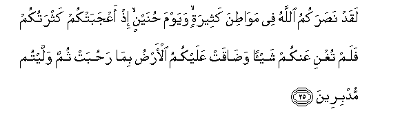
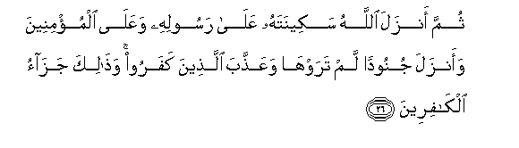
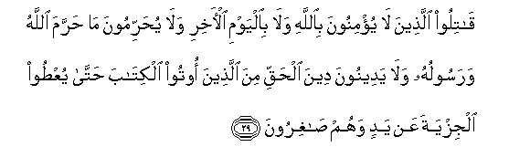

  
[Intangible Textual Heritage](../../index)  [Islam](../index.md) 
[Index](index.md)   
[Hypertext Qur'an](../htq/index)  [Unicode](../uq/009.htm#009_025.md) 
[Palmer](../sbe06/009)  [Pickthall](../pick/009.htm#009_025.md)  [Yusuf Ali
English](../yaq/yaq009)  [Rodwell](../qr/009.md)   
  
[Sūra IX.: Tauba (Repentance) or Barāat (Immunity). Index](009.md)  
  [Previous](00903)  [Next](00905.md) 

------------------------------------------------------------------------

  
*The Holy Quran*, tr. by Yusuf Ali, \[1934\], at Intangible Textual
Heritage

------------------------------------------------------------------------

# Sūra IX.: Tauba (Repentance) or Barāat (Immunity).

### Section 4

------------------------------------------------------------------------

25. Laqad na<u>s</u>arakumu All<u>a</u>hu fee maw<u>at</u>ina
katheeratin wayawma <u>h</u>unaynin i<u>th</u> aAAjabatkum kathratukum
falam tughni AAankum shay-an wa<u>da</u>qat AAalaykumu al-ar<u>d</u>u
bim<u>a</u> ra<u>h</u>ubat thumma wallaytum mudbireen**a**

25\. Assuredly God did help you  
In many battle-fields  
And on the day of Ḥunain:  
Behold! your great numbers  
Elated you, but they availed  
You naught: the land,  
For all that it is wide,  
Did. constrain you, and ye  
Turned back in retreat.

------------------------------------------------------------------------

26. Thumma anzala All<u>a</u>hu sakeenatahu AAal<u>a</u> rasoolihi
waAAal<u>a</u> almu/mineena waanzala junoodan lam tarawh<u>a</u>
waAAa<u>thth</u>aba alla<u>th</u>eena kafaroo wa<u>tha</u>lika
jaz<u>a</u>o alk<u>a</u>fireen**a**

26\. But God did pour His calm  
On the Apostle and on the Believers,  
And sent down forces which ye  
Saw not: He punished  
The Unbelievers: thus doth He  
Reward those without Faith.

------------------------------------------------------------------------

27. Thumma yatoobu All<u>a</u>hu min baAAdi <u>tha</u>lika AAal<u>a</u>
man yash<u>a</u>o wa**A**ll<u>a</u>hu ghafoorun ra<u>h</u>eem**un**

27\. Again will God, after this,  
Turn (in mercy) to whom  
He will: for God  
Is Oft-forgiving, Most Merciful.

------------------------------------------------------------------------

28. Y<u>a</u> ayyuh<u>a</u> alla<u>th</u>eena <u>a</u>manoo
innam<u>a</u> almushrikoona najasun fal<u>a</u> yaqraboo almasjida
al<u>h</u>ar<u>a</u>ma baAAda AA<u>a</u>mihim h<u>atha</u> wa-in khiftum
AAaylatan fasawfa yughneekumu All<u>a</u>hu min fa<u>d</u>lihi in
sh<u>a</u>a inna All<u>a</u>ha AAaleemun <u>h</u>akeem**un**

28\. O ye who believe! Truly  
The Pagans are unclean;  
So let them not,  
After this year of theirs,  
Approach the Sacred Mosque.  
And if ye fear poverty,  
Soon will God enrich you,  
If He wills, out of His bounty,  
For God is All-Knowing, All-Wise.

------------------------------------------------------------------------

29. Q<u>a</u>tiloo alla<u>th</u>eena l<u>a</u> yu/minoona
bi**A**ll<u>a</u>hi wal<u>a</u> bi**a**lyawmi al-<u>a</u>khiri
wal<u>a</u> yu<u>h</u>arrimoona m<u>a</u> <u>h</u>arrama All<u>a</u>hu
warasooluhu wal<u>a</u> yadeenoona deena al<u>h</u>aqqi mina
alla<u>th</u>eena ootoo alkit<u>a</u>ba <u>h</u>att<u>a</u>
yuAA<u>t</u>oo aljizyata AAan yadin wahum <u>sa</u>ghiroon**a**

29\. Fight those who believe not  
In God nor the Last Day,  
Nor hold that forbidden  
Which hath been forbidden  
By God and His Apostle,  
Nor acknowledge the Religion  
Of Truth, (even if they are)  
Of the People of the Book,  
Until they pay the Jizya  
With willing submission,  
And feel themselves subdued.

------------------------------------------------------------------------

[Next: Section 5 (30-37)](00905.md)

