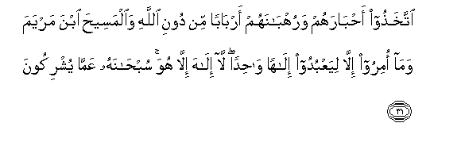
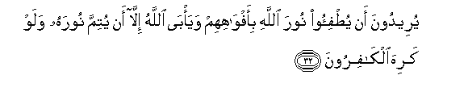
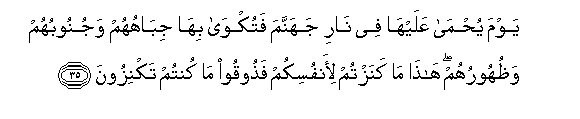
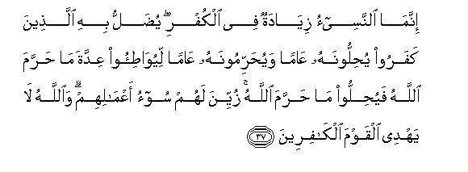

  
[Intangible Textual Heritage](../../index)  [Islam](../index.md) 
[Index](index.md)   
[Hypertext Qur'an](../htq/index)  [Unicode](../uq/009.htm#009_030.md) 
[Palmer](../sbe06/009)  [Pickthall](../pick/009.htm#009_030.md)  [Yusuf Ali
English](../yaq/yaq009)  [Rodwell](../qr/009.md)   
  
[Sūra IX.: Tauba (Repentance) or Barāat (Immunity). Index](009.md)  
  [Previous](00904)  [Next](00906.md) 

------------------------------------------------------------------------

  
*The Holy Quran*, tr. by Yusuf Ali, \[1934\], at Intangible Textual
Heritage

------------------------------------------------------------------------

# Sūra IX.: Tauba (Repentance) or Barāat (Immunity).

### Section 5

------------------------------------------------------------------------

30. Waq<u>a</u>lati alyahoodu AAuzayrun ibnu All<u>a</u>hi
waq<u>a</u>lati a**l**nna<u>sa</u>r<u>a</u> almasee<u>h</u>u ibnu
All<u>a</u>hi <u>tha</u>lika qawluhum bi-afw<u>a</u>hihim
yu<u>da</u>hi-oona qawla alla<u>th</u>eena kafaroo min qablu
q<u>a</u>talahumu All<u>a</u>hu ann<u>a</u> yu/fakoon**a**

30\. The Jews call ’Uzair a son  
Of God, and the Christians  
Call Christ the Son of God.  
That is a saying from their mouth;  
(In this) they but imitate  
What the Unbelievers of old  
Used to say. God's curse  
Be on them: how they are deluded  
Away from the Truth!

------------------------------------------------------------------------

31. Ittakha<u>th</u>oo a<u>h</u>b<u>a</u>rahum waruhb<u>a</u>nahum
arb<u>a</u>ban min dooni All<u>a</u>hi wa**a**lmasee<u>h</u>a ibna
maryama wam<u>a</u> omiroo ill<u>a</u> liyaAAbudoo il<u>a</u>han
w<u>ah</u>idan l<u>a</u> il<u>a</u>ha ill<u>a</u> huwa sub<u>ha</u>nahu
AAamm<u>a</u> yushrikoon**a**

31\. They take their priests  
And their anchorites to be  
Their lords in derogation of God,  
And (they take as their Lord)  
Christ the son of Mary;  
Yet they were commanded  
To worship but One God:  
There is no god but He.  
Praise and glory to Him  
(Far is He) from having  
The partners they associate  
(With Him).

------------------------------------------------------------------------

32. Yureedoona an yu<u>t</u>fi-oo noora All<u>a</u>hi
bi-afw<u>a</u>hihim waya/b<u>a</u> All<u>a</u>hu ill<u>a</u> an yutimma
noorahu walaw kariha alk<u>a</u>firoon**a**

32\. Fain would they extinguish  
God's Light with their mouths,  
But God will not allow  
But that His Light should be  
Perfected, even though the Unbelievers  
May detest (it).

------------------------------------------------------------------------

33. Huwa alla<u>th</u>ee arsala rasoolahu bi**a**lhud<u>a</u> wadeeni
al<u>h</u>aqqi liyu*<u>th</u>*hirahu AAal<u>a</u> a**l**ddeeni kullihi
walaw kariha almushrikoon**a**

33\. It is He Who hath sent  
His Apostle with Guidance  
And the Religion of Truth,  
To proclaim it  
Over all religion,  
Even though the Pagans  
May detest (it).

------------------------------------------------------------------------

34. Y<u>a</u> ayyuh<u>a</u> alla<u>th</u>eena <u>a</u>manoo inna
katheeran mina al-a<u>h</u>b<u>a</u>ri wa**al**rruhb<u>a</u>ni
laya/kuloona amw<u>a</u>la a**l**nn<u>a</u>si bi**a**lb<u>at</u>ili
waya<u>s</u>uddoona AAan sabeeli All<u>a</u>hi wa**a**lla<u>th</u>eena
yaknizoona a**l**<u>thth</u>ahaba wa**a**lfi<u>dd</u>ata wal<u>a</u>
yunfiqoonah<u>a</u> fee sabeeli All<u>a</u>hi fabashshirhum
biAAa<u>tha</u>bin aleem**in**

34\. O ye who believe! There are  
Indeed many among the priests  
And anchorites, who in falsehood  
Devour the substance of men  
And hinder (them) from the Way  
Of God. And there are those  
Who bury gold and silver  
And spend it not in the Way.  
Of God: announce unto them  
A most grievous penalty—

------------------------------------------------------------------------

35. Yawma yu<u>h</u>m<u>a</u> AAalayh<u>a</u> fee n<u>a</u>ri jahannama
fatukw<u>a</u> bih<u>a</u> jib<u>a</u>huhum wajunoobuhum
wa*<u>th</u>*uhooruhum h<u>atha</u> m<u>a</u> kanaztum li-anfusikum
fa<u>th</u>ooqoo m<u>a</u> kuntum taknizoon**a**

35\. On the Day when heat  
Will be produced out of  
That (wealth) in the fire  
Of Hell, and with it will be  
Branded their foreheads,  
Their flanks, and their backs.  
—"This is the (treasure) which ye  
Buried for yourselves: taste ye,  
Then, the (treasures) ye buried!"

------------------------------------------------------------------------

36. Inna AAiddata a**l**shshuhoori AAinda All<u>a</u>hi ithn<u>a</u>
AAashara shahran fee kit<u>a</u>bi All<u>a</u>hi yawma khalaqa
a**l**ssam<u>a</u>w<u>a</u>ti wa**a**l-ar<u>d</u>a minh<u>a</u>
arbaAAatun <u>h</u>urumun <u>tha</u>lika a**l**ddeenu alqayyimu
fal<u>a</u> ta*<u>th</u>*limoo feehinna anfusakum waq<u>a</u>tiloo
almushrikeena k<u>a</u>ffatan kam<u>a</u> yuq<u>a</u>tiloonakum
k<u>a</u>ffatan wa**i**AAlamoo anna All<u>a</u>ha maAAa almuttaqeen**a**

36\. The number of months  
In the sight of God  
Is twelve (in a year)  
So ordained by Him  
The day He created  
The heavens and the earth;  
Of them four are sacred:  
That is the straight usage.  
So wrong not yourselves  
Therein, and fight the Pagans  
All together as they  
Fight you all together.  
But know that God  
Is with those who restrain  
Themselves.

------------------------------------------------------------------------

37. Innam<u>a</u> a**l**nnasee-o ziy<u>a</u>datun fee alkufri
yu<u>d</u>allu bihi alla<u>th</u>eena kafaroo yu<u>h</u>illoonahu
AA<u>a</u>man wayu<u>h</u>arrimoonahu AA<u>a</u>man liyuw<u>at</u>i-oo
AAiddata m<u>a</u> <u>h</u>arrama All<u>a</u>hu fayu<u>h</u>illoo
m<u>a</u> <u>h</u>arrama All<u>a</u>hu zuyyina lahum soo-o
aAAm<u>a</u>lihim wa**A**ll<u>a</u>hu l<u>a</u> yahdee alqawma
alk<u>a</u>fireen**a**

37\. Verily the transposing  
(Of a prohibited month)  
Is an addition to Unbelief:  
The Unbelievers are led  
To wrong thereby: for they make  
It lawful one year,  
And forbidden another year,  
In order to adjust the number  
Of months forbidden by God  
And make such forbidden ones  
Lawful. The evil of their course  
Seems pleasing to them.  
But God guideth not  
Those who reject Faith.

------------------------------------------------------------------------

[Next: Section 6 (38-42)](00906.md)

