

  
[Intangible Textual Heritage](../../index)  [Islam](../index) 
[Index](index)   
[Hypertext Qur'an](../htq/index)  [Unicode](../uq/009.htm#009_043) 
[Palmer](../sbe06/009)  [Pickthall](../pick/009.htm#009_043)  [Yusuf Ali
English](../yaq/yaq009)  [Rodwell](../qr/009)   
  
[Sūra IX.: Tauba (Repentance) or Barāat (Immunity). Index](009)  
  [Previous](00906)  [Next](00908) 

------------------------------------------------------------------------

  
*The Holy Quran*, tr. by Yusuf Ali, \[1934\], at Intangible Textual
Heritage

------------------------------------------------------------------------

# Sūra IX.: Tauba (Repentance) or Barāat (Immunity).

### Section 7

------------------------------------------------------------------------

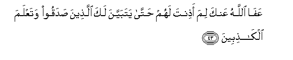

43. AAaf<u>a</u> All<u>a</u>hu AAanka lima a<u>th</u>inta lahum
<u>h</u>att<u>a</u> yatabayyana laka alla<u>th</u>eena <u>s</u>adaqoo
wataAAlama alk<u>ath</u>ibeen**a**

43\. God give thee grace! Why  
Didst thou grant them exemption  
Until those who told the truth  
Were seen by thee in a clear light,  
And thou hadst proved the liars?

------------------------------------------------------------------------

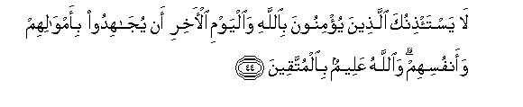

44. L<u>a</u> yasta/<u>th</u>inuka alla<u>th</u>eena yu/minoona
bi**A**ll<u>a</u>hi wa**a**lyawmi al-<u>a</u>khiri an yuj<u>a</u>hidoo
bi-amw<u>a</u>lihim waanfusihim wa**A**ll<u>a</u>hu AAaleemun
bi**a**lmuttaqeen**a**

44\. Those who believe in God  
And the Last Day ask thee  
For no exemption from fighting  
With their goods and persons.  
And God knoweth well  
Those who do their duty.

------------------------------------------------------------------------

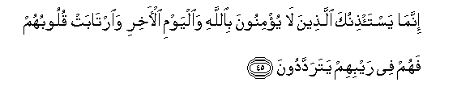

45. Innam<u>a</u> yasta/<u>th</u>inuka alla<u>th</u>eena l<u>a</u>
yu/minoona bi**A**ll<u>a</u>hi wa**a**lyawmi al-<u>a</u>khiri
wa**i**rt<u>a</u>bat quloobuhum fahum fee raybihim yataraddadoon**a**

45\. Only those ask thee for exemption  
Who believe not in God  
And the Last Day, and  
Whose hearts are in doubt,  
So that they are tossed  
In their doubts to and fro.

------------------------------------------------------------------------

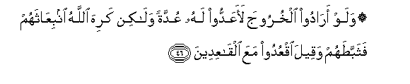

46. Walaw ar<u>a</u>doo alkhurooja laaAAaddoo lahu AAuddatan
wal<u>a</u>kin kariha All<u>a</u>hu inbiAA<u>a</u>thahum
fathabba<u>t</u>ahum waqeela oqAAudoo maAAa alq<u>a</u>AAideen**a**

46\. If they had intended  
To come out, they would  
Certainly have made  
Some preparation therefor;  
But God was averse  
To their being sent forth;  
So He made them lag behind,  
And they were told,  
"Sit ye among those  
Who sit (inactive)."

------------------------------------------------------------------------

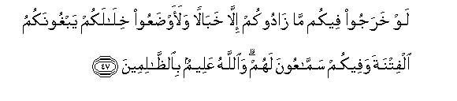

47. Law kharajoo feekum m<u>a</u> z<u>a</u>dookum ill<u>a</u>
khab<u>a</u>lan walaaw<u>d</u>aAAoo khil<u>a</u>lakum yabghoonakumu
alfitnata wafeekum samm<u>a</u>AAoona lahum wa**A**ll<u>a</u>hu
AAaleemun bi**al***<u>thth</u>*<u>a</u>limeen**a**

47\. If they had come out  
With you, they would not  
Have added to your (strength)  
But only (made for) disorder,  
Hurrying to and fro in your midst  
And sowing sedition among you,  
And there would have been  
Some among you  
Who would have listened to them.  
But God knoweth well  
Those who do wrong.

------------------------------------------------------------------------

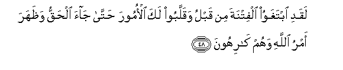

48. Laqadi ibtaghawoo alfitnata min qablu waqallaboo laka al-omoora
<u>h</u>att<u>a</u> j<u>a</u>a al<u>h</u>aqqu wa*<u>th</u>*ahara amru
All<u>a</u>hi wahum k<u>a</u>rihoon**a**

48\. Indeed they had plotted  
Sedition before, and upset  
Matters for thee,—until  
The Truth arrived, and the Decree  
Of God became manifest,  
Much to their disgust.

------------------------------------------------------------------------

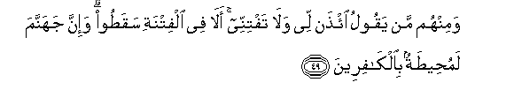

49. Waminhum man yaqoolu i/<u>th</u>an lee wal<u>a</u> taftinnee
al<u>a</u> fee alfitnati saqa<u>t</u>oo wa-inna jahannama
lamu<u>h</u>ee<u>t</u>atun bi**a**lk<u>a</u>fireen**a**

49\. Among them is (many) a man  
Who says: "Grant me exemption  
And draw me not.  
Into trial." Have they not  
Fallen into trial already?  
And indeed Hell surrounds  
The Unbelievers (on all sides).

------------------------------------------------------------------------

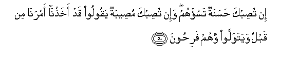

50. In tu<u>s</u>ibka <u>h</u>asanatun tasu/hum wa-in tu<u>s</u>ibka
mu<u>s</u>eebatun yaqooloo qad akha<u>th</u>n<u>a</u> amran<u>a</u> min
qablu wayatawallaw wahum fari<u>h</u>oon**a**

50\. If good befalls thee,  
It grieves them; but if  
A misfortune befalls thee,  
They say, "We took indeed  
Our precautions beforehand,"  
And they turn away rejoicing.

------------------------------------------------------------------------

51. Qul lan yu<u>s</u>eeban<u>a</u> ill<u>a</u> m<u>a</u> kataba
All<u>a</u>hu lan<u>a</u> huwa mawl<u>a</u>n<u>a</u> waAAal<u>a</u>
All<u>a</u>hi falyatawakkali almu/minoon**a**

51\. Say: "Nothing will happen to us  
Except what God has decreed  
For us: He is our Protector":  
And on God let the Believers  
Put their trust.

------------------------------------------------------------------------

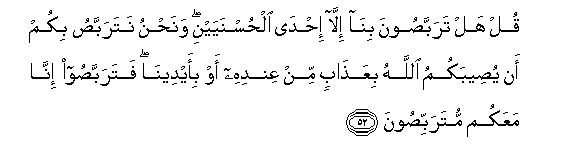

52. Qul hal tarabba<u>s</u>oona bin<u>a</u> ill<u>a</u>
i<u>h</u>d<u>a</u> al<u>h</u>usnayayni wana<u>h</u>nu natarabba<u>s</u>u
bikum an yu<u>s</u>eebakumu All<u>a</u>hu biAAa<u>tha</u>bin min
AAindihi aw bi-aydeen<u>a</u> fatarabba<u>s</u>oo inn<u>a</u> maAAakum
mutarabbi<u>s</u>oon**a**

52\. Say: "Can you expect for us  
(Any fate) other than one  
Of two glorious things—  
(Martyrdom or victory)?  
But we can expect for you  
Either that God will send  
His punishment from Himself,  
Or by our hands. So wait  
(Expectant); we too  
Will wait with you."

------------------------------------------------------------------------

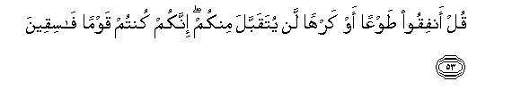

53. Qul anfiqoo <u>t</u>awAAan aw karhan lan yutaqabbala minkum innakum
kuntum qawman f<u>a</u>siqeen**a**

53\. Say: "Spend (for the Cause)  
Willingly or unwillingly:  
Not from you will it be  
Accepted: for ye are indeed  
A people rebellious and wicked."

------------------------------------------------------------------------

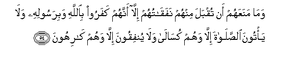

54. Wam<u>a</u> manaAAahum an tuqbala minhum nafaq<u>a</u>tuhum
ill<u>a</u> annahum kafaroo bi**A**ll<u>a</u>hi wabirasoolihi
wal<u>a</u> ya/toona a**l**<u>ss</u>al<u>a</u>ta ill<u>a</u> wahum
kus<u>a</u>l<u>a</u> wal<u>a</u> yunfiqoona ill<u>a</u> wahum
k<u>a</u>rihoon**a**

54\. The only reasons why  
Their contributions are not  
Accepted are: that they reject  
God and His Apostle;  
That they come to prayer  
Without earnestness; and that  
They offer contributions unwillingly.

------------------------------------------------------------------------

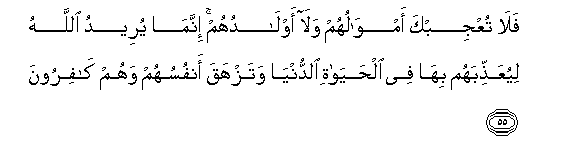

55. Fal<u>a</u> tuAAjibka amw<u>a</u>luhum wal<u>a</u> awl<u>a</u>duhum
innam<u>a</u> yureedu All<u>a</u>hu liyuAAa<u>thth</u>ibahum bih<u>a</u>
fee al<u>h</u>ay<u>a</u>ti a**l**dduny<u>a</u> watazhaqa anfusuhum wahum
k<u>a</u>firoon**a**

55\. Let not their wealth rats  
Nor their (following in) sons  
Dazzle thee: in reality  
God's Plan is to punish them  
With these things in this life,  
And that their souls may perish  
In their (very) denial of God.

------------------------------------------------------------------------

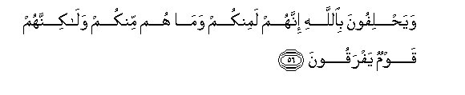

56. Waya<u>h</u>lifoona bi**A**ll<u>a</u>hi innahum laminkum wam<u>a</u>
hum minkum wal<u>a</u>kinnahum qawmun yafraqoon**a**

56\. They swear by God  
That they are indeed  
Of you; but they are not  
Of you: yet they are afraid  
(To appear in their true colours).

------------------------------------------------------------------------

57. Law yajidoona maljaan aw magh<u>a</u>r<u>a</u>tin aw muddakhalan
lawallaw ilayhi wahum yajma<u>h</u>oon**a**

57\. If they could find  
A place to flee to,  
Or caves, or a place  
Of concealment, they would  
Turn straightway thereto,  
With an obstinate rush.

------------------------------------------------------------------------

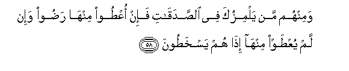

58. Waminhum man yalmizuka fee a**l**<u>ss</u>adaq<u>a</u>ti fa-in
oAA<u>t</u>oo minh<u>a</u> ra<u>d</u>oo wa-in lam yuAA<u>t</u>aw
minh<u>a</u> i<u>tha</u> hum yaskha<u>t</u>oon**a**

58\. And among them are men  
Who slander thee in the matter  
Of (the distribution of) the alms:  
If they are given part thereof,  
They are pleased, but if not,  
Behold! they are indignant!

------------------------------------------------------------------------

59. Walaw annahum ra<u>d</u>oo m<u>a</u> <u>a</u>t<u>a</u>humu
All<u>a</u>hu warasooluhu waq<u>a</u>loo <u>h</u>asbun<u>a</u>
All<u>a</u>hu sayu/teen<u>a</u> All<u>a</u>hu min fa<u>d</u>lihi
warasooluhu inn<u>a</u> il<u>a</u> All<u>a</u>hi r<u>a</u>ghiboon**a**

59\. If only they had been content  
With what God and His Apostle  
Gave them, and had said,  
"Sufficient unto us is God!  
God and His Apostle will soon  
Give us of His bounty:  
To God do we turn our hopes!"  
(That would have been the right course).

------------------------------------------------------------------------

[Next: Section 8 (60-66)](00908)

