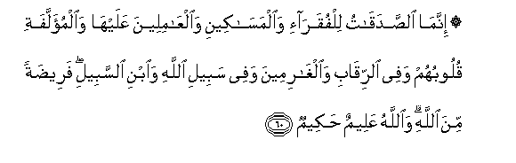
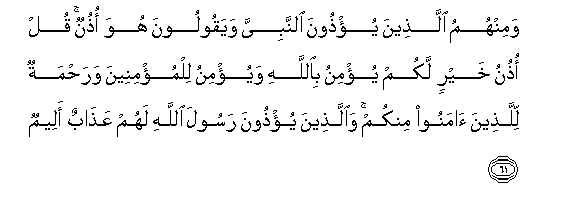
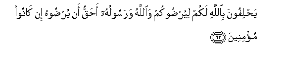
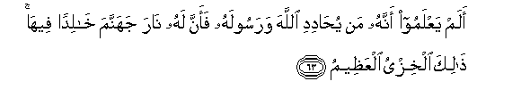
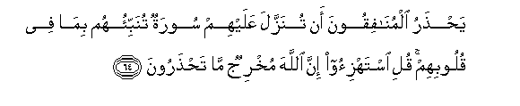
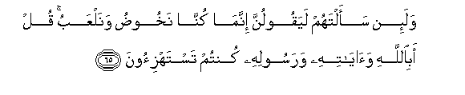
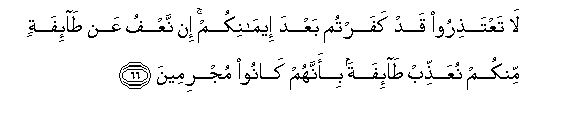

  
[Intangible Textual Heritage](../../index)  [Islam](../index.md) 
[Index](index.md)   
[Hypertext Qur'an](../htq/index)  [Unicode](../uq/009.htm#009_060.md) 
[Palmer](../sbe06/009)  [Pickthall](../pick/009.htm#009_060.md)  [Yusuf Ali
English](../yaq/yaq009)  [Rodwell](../qr/009.md)   
  
[Sūra IX.: Tauba (Repentance) or Barāat (Immunity). Index](009.md)  
  [Previous](00907)  [Next](00909.md) 

------------------------------------------------------------------------

  
*The Holy Quran*, tr. by Yusuf Ali, \[1934\], at Intangible Textual
Heritage

------------------------------------------------------------------------

# Sūra IX.: Tauba (Repentance) or Barāat (Immunity).

### Section 8

------------------------------------------------------------------------

60. Innam<u>a</u> a**l**<u>ss</u>adaq<u>a</u>tu lilfuqar<u>a</u>-i
wa**a**lmas<u>a</u>keeni wa**a**lAA<u>a</u>mileena AAalayh<u>a</u>
wa**a**lmu-allafati quloobuhum wafee a**l**rriq<u>a</u>bi
wa**a**lgh<u>a</u>rimeena wafee sabeeli All<u>a</u>hi wa**i**bni
a**l**ssabeeli faree<u>d</u>atan mina All<u>a</u>hi wa**A**ll<u>a</u>hu
AAaleemun <u>h</u>akeemun

60\. Alms are for the poor  
And the needy, and those  
Employed to administer the (funds);  
For those whose hearts  
Have been (recently) reconciled  
(To Truth); for those in bondage  
And in debt; in the cause  
Of God; and for the wayfarer:  
(Thus is it) ordained by God,  
And God is full of knowledge  
And wisdom.

------------------------------------------------------------------------

61. Waminhumu alla<u>th</u>eena yu/<u>th</u>oona a**l**nnabiyya
wayaqooloona huwa o<u>th</u>unun qul o<u>th</u>unu khayrin lakum yu/minu
bi**A**ll<u>a</u>hi wayu/minu lilmu/mineena wara<u>h</u>matun
lilla<u>th</u>eena <u>a</u>manoo minkum wa**a**lla<u>th</u>eena
yu/<u>th</u>oona rasoola All<u>a</u>hi lahum AAa<u>tha</u>bun
aleem**un**

61\. Among them are men  
Who molest the Prophet  
And say, "He is (all) ear."  
Say, "He listens to what is  
Best for you: he believes  
In God, has faith  
In the Believers, and is a Mercy  
To those of you who believe."  
But those who molest the Apostle  
Will have a grievous penalty.

------------------------------------------------------------------------

62. Ya<u>h</u>lifoona bi**A**ll<u>a</u>hi lakum liyur<u>d</u>ookum
wa**A**ll<u>a</u>hu warasooluhu a<u>h</u>aqqu an yur<u>d</u>oohu in
k<u>a</u>noo mu/mineen**a**

62\. To you they swear by God.  
In order to please you:  
But it is more fitting  
That they should please  
God and His Apostle,  
If they are Believers.

------------------------------------------------------------------------

63. Alam yaAAlamoo annahu man yu<u>ha</u>didi All<u>a</u>ha warasoolahu
faanna lahu n<u>a</u>ra jahannama kh<u>a</u>lidan feeh<u>a</u>
<u>tha</u>lika alkhizyu alAAa*<u>th</u>*eem**u**

63\. Know they not that for those  
Who oppose God and His Apostle,  
Is the Fire of Hell?—  
Wherein they shall dwell.  
That is the supreme disgrace.

------------------------------------------------------------------------

64. Ya<u>hth</u>aru almun<u>a</u>fiqoona an tunazzala AAalayhim sooratun
tunabbi-ohum bim<u>a</u> fee quloobihim quli istahzi-oo inna
All<u>a</u>ha mukhrijun m<u>a</u> ta<u>hth</u>aroon**a**

64\. The Hypocrites are afraid  
Lest a Sūra should be sent down  
About them, showing them what  
Is (really passing) in their hearts.  
Say: "Mock ye! But verily  
God will bring to light all  
That ye fear (should be revealed).

------------------------------------------------------------------------

65. Wala-in saaltahum layaqoolunna innam<u>a</u> kunn<u>a</u>
nakhoo<u>d</u>u wanalAAabu qul abi**A**ll<u>a</u>hi
wa<u>a</u>y<u>a</u>tihi warasoolihi kuntum tastahzi-oon**a**

65\. If thou dost question them,  
They declare (with emphasis):  
"We were only talking idly  
And in play." Say: "Was it  
At God, and His Signs,  
And His Apostle, that ye  
Were mocking?"

------------------------------------------------------------------------

66. L<u>a</u> taAAta<u>th</u>iroo qad kafartum baAAda eem<u>a</u>nikum
in naAAfu AAan <u>ta</u>-ifatin minkum nuAAa<u>thth</u>ib
<u>ta</u>-ifatan bi-annahum k<u>a</u>noo mujrimeen**a**

66\. Make ye no excuses:  
Ye have rejected Faith  
After ye had accepted it.  
If We pardon some of you,  
We will punish others amongst you,  
For that they are in sin.

------------------------------------------------------------------------

[Next: Section 9 (67-72)](00909.md)

