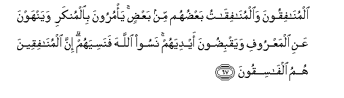
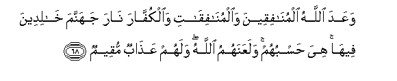
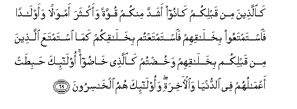
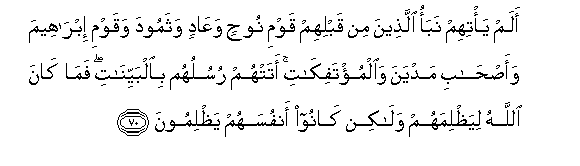
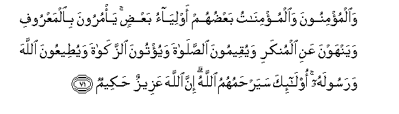
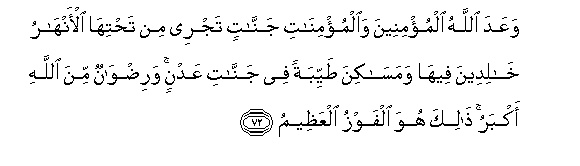

  
[Intangible Textual Heritage](../../index)  [Islam](../index.md) 
[Index](index.md)   
[Hypertext Qur'an](../htq/index)  [Unicode](../uq/009.htm#009_067.md) 
[Palmer](../sbe06/009)  [Pickthall](../pick/009.htm#009_067.md)  [Yusuf Ali
English](../yaq/yaq009)  [Rodwell](../qr/009.md)   
  
[Sūra IX.: Tauba (Repentance) or Barāat (Immunity). Index](009.md)  
  [Previous](00908)  [Next](00910.md) 

------------------------------------------------------------------------

  
*The Holy Quran*, tr. by Yusuf Ali, \[1934\], at Intangible Textual
Heritage

------------------------------------------------------------------------

# Sūra IX.: Tauba (Repentance) or Barāat (Immunity).

### Section 9

------------------------------------------------------------------------

67. Almun<u>a</u>fiqoona wa**a**lmun<u>a</u>fiq<u>a</u>tu
baAA<u>d</u>uhum min baAA<u>d</u>in ya/muroona bi**a**lmunkari
wayanhawna AAani almaAAroofi wayaqbi<u>d</u>oona aydiyahum nasoo
All<u>a</u>ha fanasiyahum inna almun<u>a</u>fiqeena humu
alf<u>a</u>siqoon**a**

67\. The Hypocrites, men and women,  
(Have an understanding) with each other:  
They enjoin evil, and forbid  
What is just, and are close  
With their hands. They have  
Forgotten God; so He  
Hath forgotten them. Verily  
The Hypocrites are rebellious  
And perverse.

------------------------------------------------------------------------

68. WaAAada All<u>a</u>hu almun<u>a</u>fiqeena
wa**a**lmun<u>a</u>fiq<u>a</u>ti wa**a**lkuff<u>a</u>ra n<u>a</u>ra
jahannama kh<u>a</u>lideena feeh<u>a</u> hiya <u>h</u>asbuhum
walaAAanahumu All<u>a</u>hu walahum AAa<u>tha</u>bun muqeem**un**

68\. God hath promised the Hypocrites  
Men and women, and the rejecters,  
Of Faith, the fire of Hell:  
Therein shall they dwell:  
Sufficient is it for them:  
For them is the curse of God,  
And an enduring punishment,—

------------------------------------------------------------------------

69. Ka**a**lla<u>th</u>eena min qablikum k<u>a</u>noo ashadda minkum
quwwatan waakthara amw<u>a</u>lan waawl<u>a</u>dan fa**i**stamtaAAoo
bikhal<u>a</u>qihim fa**i**stamtaAAtum bikhal<u>a</u>qikum kam<u>a</u>
istamtaAAa alla<u>th</u>eena min qablikum bikhal<u>a</u>qihim
wakhu<u>d</u>tum ka**a**lla<u>th</u>ee kh<u>ad</u>oo ol<u>a</u>-ika
<u>h</u>abi<u>t</u>at aAAm<u>a</u>luhum fee a**l**dduny<u>a</u>
wa**a**l-<u>a</u>khirati waol<u>a</u>-ika humu alkh<u>a</u>siroon**a**

69\. As in the case of those  
Before you: they were  
Mightier than you in power,  
And more flourishing in wealth  
And children. They had  
Their enjoyment of their portion:  
And ye have of yours, as did  
Those before you; and ye  
Indulge in idle talk  
As they did. They!—  
Their works are fruitless  
In this world and in the Hereafter,  
And they will lose  
(All spiritual good).

------------------------------------------------------------------------

70. Alam ya/tihim nabao alla<u>th</u>eena min qablihim qawmi
noo<u>h</u>in waAA<u>a</u>din wathamooda waqawmi ibr<u>a</u>heema
waa<u>s</u>-<u>ha</u>bi madyana wa**a**lmu/tafik<u>a</u>ti atat-hum
rusuluhum bi**a**lbayyin<u>a</u>ti fam<u>a</u> k<u>a</u>na All<u>a</u>hu
liya*<u>th</u>*limahum wal<u>a</u>kin k<u>a</u>noo anfusahum
ya*<u>th</u>*limoon**a**

70\. Hath not the story reached them  
Of those before them?—  
The people of Noah, and ’Ād,  
And <u>Th</u>amūd; the people  
Of Abraham, the men  
Of Midian, and the Cities overthrown.  
To them came their apostles  
With Clear Signs. It is  
Not God Who wrongs them,  
But they wrong their own souls.

------------------------------------------------------------------------

71. Wa**a**lmu/minoona wa**a**lmu/min<u>a</u>tu baAA<u>d</u>uhum
awliy<u>a</u>o baAA<u>d</u>in ya/muroona bi**a**lmaAAroofi wayanhawna
AAani almunkari wayuqeemoona a**l**<u>ss</u>al<u>a</u>ta wayu/toona
a**l**zzak<u>a</u>ta wayu<u>t</u>eeAAoona All<u>a</u>ha warasoolahu
ol<u>a</u>-ika sayar<u>h</u>amuhumu All<u>a</u>hu inna All<u>a</u>ha
AAazeezun <u>h</u>akeem**un**

71\. The Believers, men  
And women, are protectors,  
One of another: they enjoin  
What is just, and forbid  
What is evil: they observe  
Regular prayers, practise  
Regular charity, and obey  
God and His Apostle.  
On them will God pour  
His mercy: for God  
Is Exalted in power, Wise:

------------------------------------------------------------------------

72. WaAAada All<u>a</u>hu almu/mineena wa**a**lmu/min<u>a</u>ti
jann<u>a</u>tin tajree min ta<u>h</u>tih<u>a</u> al-anh<u>a</u>ru
kh<u>a</u>lideena feeh<u>a</u> wamas<u>a</u>kina <u>t</u>ayyibatan fee
jann<u>a</u>ti AAadnin wari<u>d</u>w<u>a</u>nun mina All<u>a</u>hi
akbaru <u>tha</u>lika huwa alfawzu alAAa*<u>th</u>*eem**u**

72\. God hath promised to Believers,  
Men and women, Gardens  
Under which rivers flow,  
To dwell therein,  
And beautiful mansions  
In Gardens of everlasting bliss.  
But the greatest bliss  
Is the Good Pleasure of God:  
That is the supreme felicity.

------------------------------------------------------------------------

[Next: Section 10 (73-80)](00910.md)

