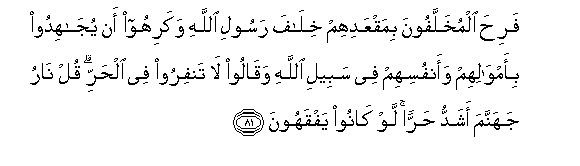
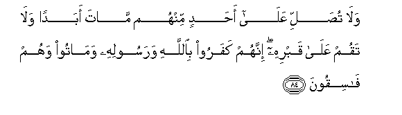
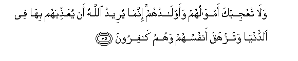
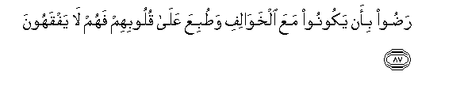
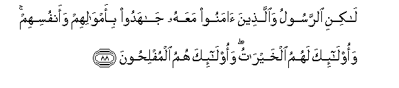
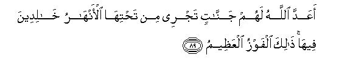

  
[Intangible Textual Heritage](../../index)  [Islam](../index.md) 
[Index](index.md)   
[Hypertext Qur'an](../htq/index)  [Unicode](../uq/009.htm#009_081.md) 
[Palmer](../sbe06/009)  [Pickthall](../pick/009.htm#009_081.md)  [Yusuf Ali
English](../yaq/yaq009)  [Rodwell](../qr/009.md)   
  
[Sūra IX.: Tauba (Repentance) or Barāat (Immunity). Index](009.md)  
  [Previous](00910)  [Next](00912.md) 

------------------------------------------------------------------------

  
*The Holy Quran*, tr. by Yusuf Ali, \[1934\], at Intangible Textual
Heritage

------------------------------------------------------------------------

# Sūra IX.: Tauba (Repentance) or Barāat (Immunity).

### Section 11

------------------------------------------------------------------------

81. Fari<u>h</u>a almukhallafoona bimaqAAadihim khil<u>a</u>fa rasooli
All<u>a</u>hi wakarihoo an yuj<u>a</u>hidoo bi-amw<u>a</u>lihim
waanfusihim fee sabeeli All<u>a</u>hi waq<u>a</u>loo l<u>a</u> tanfiroo
fee al<u>h</u>arri qul n<u>a</u>ru jahannama ashaddu <u>h</u>arran law
k<u>a</u>noo yafqahoon**a**

81\. Those who were left behind  
(In the Tabūk expedition)  
Rejoiced in their inaction  
Behind the back of the Apostle  
Of God: they hated to strive  
And fight, with their goods  
And their persons, in the Cause  
Of God: they said,  
"Go not forth in the heat."  
Say, "The fire of Hell  
Is fiercer in heat." If  
Only they could understand!

------------------------------------------------------------------------

82. Falya<u>dh</u>akoo qaleelan walyabkoo katheeran jaz<u>a</u>an
bim<u>a</u> k<u>a</u>noo yaksiboon**a**

82\. Let them laugh a little:  
Much will they weep:  
A recompense for the (evil)  
That they do.

------------------------------------------------------------------------

83. Fa-in rajaAAaka All<u>a</u>hu il<u>a</u> <u>ta</u>-ifatin minhum
fa**i**sta/<u>th</u>anooka lilkhurooji faqul lan takhrujoo maAAiya
abadan walan tuq<u>a</u>tiloo maAAiya AAaduwwan innakum ra<u>d</u>eetum
bi**a**lquAAoodi awwala marratin fa**o**qAAudoo maAAa
alkh<u>a</u>lifeen**a**

83\. If, then, God bring thee back  
To any of them, and they ask  
Thy permission to come out  
(With thee), say: "Never shall ye  
Come out with me, nor fight  
An enemy with me:  
For ye preferred to sit  
Inactive on the first occasion:  
Then sit ye (now)  
With those who lag behind."

------------------------------------------------------------------------

84. Wal<u>a</u> tu<u>s</u>alli AAal<u>a</u> a<u>h</u>adin minhum
m<u>a</u>ta abadan wal<u>a</u> taqum AAal<u>a</u> qabrihi innahum
kafaroo bi**A**ll<u>a</u>hi warasoolihi wam<u>a</u>too wahum
f<u>a</u>siqoon**a**

84\. Nor do thou ever pray  
For any of them that dies,  
Nor stand at his grave;  
For they rejected God  
And His Apostle, and died  
In a state of perverse rebellion.

------------------------------------------------------------------------

85. Wal<u>a</u> tuAAjibka amw<u>a</u>luhum waawl<u>a</u>duhum
innam<u>a</u> yureedu All<u>a</u>hu an yuAAa<u>thth</u>ibahum
bih<u>a</u> fee a**l**dduny<u>a</u> watazhaqa anfusuhum wahum
k<u>a</u>firoon**a**

85\. Nor let their wealth  
Nor their (following in) sons  
Dazzle thee: God's Plan  
Is to punish them  
With these things in this world,  
And that their souls may perish  
In their (very) denial of God.

------------------------------------------------------------------------

86. Wa-i<u>tha</u> onzilat sooratun an <u>a</u>minoo bi**A**ll<u>a</u>hi
waj<u>a</u>hidoo maAAa rasoolihi ista/<u>th</u>anaka oloo
a**l**<u>tt</u>awli minhum waq<u>a</u>loo <u>th</u>arn<u>a</u> nakun
maAAa alq<u>a</u>AAideen**a**

86\. When a Sūra comes down,  
Enjoining them to believe  
In God and to strive and fight  
Along with His Apostle,  
Those with wealth and influence  
Among them ask thee  
For exemption, and say:  
"Leave us (behind): we  
Would be with those  
Who sit (at home)."

------------------------------------------------------------------------

87. Ra<u>d</u>oo bi-an yakoonoo maAAa alkhaw<u>a</u>lifi
wa<u>t</u>ubiAAa AAal<u>a</u> quloobihim fahum l<u>a</u> yafqahoon**a**

87\. They prefer to be with (the women),  
Who remain behind (at home):  
Their hearts are sealed  
And so they understand not.

------------------------------------------------------------------------

88. L<u>a</u>kini a**l**rrasoolu wa**a**lla<u>th</u>eena <u>a</u>manoo
maAAahu j<u>a</u>hadoo bi-amw<u>a</u>lihim waanfusihim waol<u>a</u>-ika
lahumu alkhayr<u>a</u>tu waol<u>a</u>-ika humu almufli<u>h</u>oon**a**

88\. But the Apostle, and those  
Who believe with him,  
Strive and fight with their wealth  
And their persons: for them  
Are (all) good things:  
And it is they  
Who will prosper.

------------------------------------------------------------------------

89. aAAadda All<u>a</u>hu lahum jann<u>a</u>tin tajree min
ta<u>h</u>tih<u>a</u> al-anh<u>a</u>ru kh<u>a</u>lideena feeh<u>a</u>
<u>tha</u>lika alfawzu alAAa*<u>th</u>*eem**u**

89\. God hath prepared for them  
Gardens under which rivers flow,  
To dwell therein:  
That is the supreme felicity.

------------------------------------------------------------------------

[Next: Section 12 (90-99)](00912.md)

