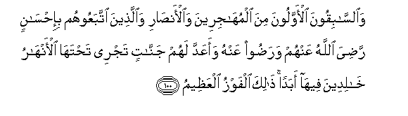
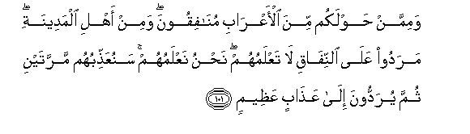
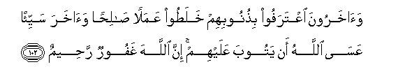
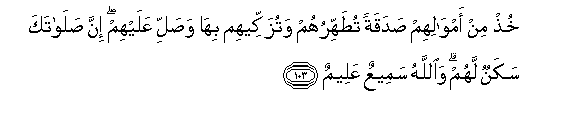
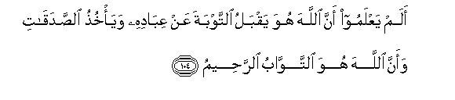
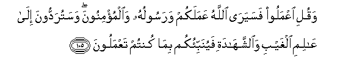
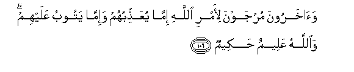
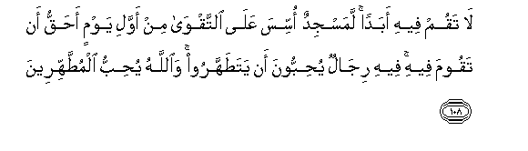
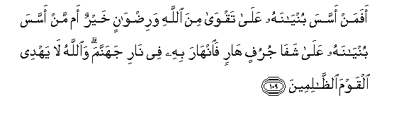
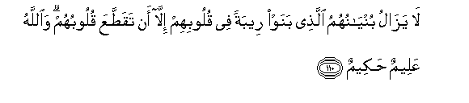

  
[Intangible Textual Heritage](../../index)  [Islam](../index) 
[Index](index)   
[Hypertext Qur'an](../htq/index)  [Unicode](../uq/009.htm#009_100) 
[Palmer](../sbe06/009)  [Pickthall](../pick/009.htm#009_100)  [Yusuf Ali
English](../yaq/yaq009)  [Rodwell](../qr/009)   
  
[Sūra IX.: Tauba (Repentance) or Barāat (Immunity). Index](009)  
  [Previous](00912)  [Next](00914) 

------------------------------------------------------------------------

  
*The Holy Quran*, tr. by Yusuf Ali, \[1934\], at Intangible Textual
Heritage

------------------------------------------------------------------------

# Sūra IX.: Tauba (Repentance) or Barāat (Immunity).

### Section 13

------------------------------------------------------------------------

100. Wa**al**ss<u>a</u>biqoona al-awwaloona mina almuh<u>a</u>jireena
wa**a**l-an<u>sa</u>ri wa**a**lla<u>th</u>eena ittabaAAoohum
bi-i<u>h</u>s<u>a</u>nin ra<u>d</u>iya All<u>a</u>hu AAanhum
wara<u>d</u>oo AAanhu waaAAadda lahum jann<u>a</u>tin tajree
ta<u>h</u>tah<u>a</u> al-anh<u>a</u>ru kh<u>a</u>lideena feeh<u>a</u>
abadan <u>tha</u>lika alfawzu alAAa*<u>th</u>*eem**u**

100\. The vanguard (of Islam)—  
The first of those who forsook  
(Their homes) and of those  
Who gave them aid, and (also)  
Those who follow them  
In (all) good deeds,—  
Well-pleased is God with them,  
As are they with Him:  
For them hath He prepared  
Gardens under which rivers flow,  
To dwell therein for ever:  
That is the supreme Felicity.

------------------------------------------------------------------------

101. Wamimman <u>h</u>awlakum mina al-aAAr<u>a</u>bi mun<u>a</u>fiqoona
wamin ahli almadeenati maradoo AAal<u>a</u> a**l**nnif<u>a</u>qi
l<u>a</u> taAAlamuhum na<u>h</u>nu naAAlamuhum sanuAAa<u>thth</u>ibuhum
marratayni thumma yuraddoona il<u>a</u> AAa<u>tha</u>bin
AAa*<u>th</u>*eem**in**

101\. Certain of the desert Arabs  
Round about you are Hypocrites,  
As well as (desert Arabs) among  
The Medina folk: they are  
Obstinate in hypocrisy: thou  
Knowest them not: We know them:  
Twice shall We punish them:  
And in addition shall they be  
Sent to a grievous Penalty.

------------------------------------------------------------------------

102. Wa<u>a</u>kharoona iAAtarafoo bi<u>th</u>unoobihim khala<u>t</u>oo
AAamalan <u>sa</u>li<u>h</u>an wa<u>a</u>khara sayyi-an AAas<u>a</u>
All<u>a</u>hu an yatooba AAalayhim inna All<u>a</u>ha ghafoorun
ra<u>h</u>eem**un**

102\. Others (there are who) have  
Acknowledged their wrong-doings:  
They have mixed an act  
That was good with another  
That was evil. Perhaps God  
Will turn unto them (in mercy):  
For God is Oft-Forgiving,  
Most Merciful.

------------------------------------------------------------------------

103. Khu<u>th</u> min amw<u>a</u>lihim <u>s</u>adaqatan
tu<u>t</u>ahhiruhum watuzakkeehim bih<u>a</u> wa<u>s</u>alli AAalayhim
inna <u>s</u>al<u>a</u>taka sakanun lahum wa**A**ll<u>a</u>hu sameeAAun
AAaleem**un**

103\. Of their goods take alms,  
That so thou mightest  
Purify and sanctify them;  
And pray on their behalf.  
Verily thy prayers are a source  
Of security for them:  
And God is One  
Who heareth and knoweth.

------------------------------------------------------------------------

104. Alam yaAAlamoo anna All<u>a</u>ha huwa yaqbalu a**l**ttawbata AAan
AAib<u>a</u>dihi waya/khu<u>th</u>u a**l**<u>ss</u>adaq<u>a</u>ti waanna
All<u>a</u>ha huwa a**l**ttaww<u>a</u>bu a**l**rra<u>h</u>eem**u**

104\. Know they not that God  
Doth accept repentance from  
His votaries and receives  
Their gifts of charity, and that  
God is verily He,  
The Oft-Returning, Most Merciful?

------------------------------------------------------------------------

105. Waquli iAAmaloo fasayar<u>a</u> All<u>a</u>hu AAamalakum
warasooluhu wa**a**lmu/minoona wasaturaddoona il<u>a</u> AA<u>a</u>limi
alghaybi wa**al**shshah<u>a</u>dati fayunabbi-okum bim<u>a</u> kuntum
taAAmaloon**a**

105\. And say: "Work (righteousness):  
Soon will God observe your work,  
And His Apostle, and the Believers:  
Soon will ye be brought back  
To the Knower of what is  
Hidden and what is open:  
Then will He show you  
The truth of all that ye did."

------------------------------------------------------------------------

106. Wa<u>a</u>kharoona murjawna li-amri All<u>a</u>hi imm<u>a</u>
yuAAa<u>thth</u>ibuhum wa-imm<u>a</u> yatoobu AAalayhim
wa**A**ll<u>a</u>hu AAaleemun <u>h</u>akeem**un**

106\. There are (yet) others,  
Held in suspense for the command  
Of God, whether He will  
Punish them, or turn in mercy  
To them: and God  
Is All-Knowing, Wise.

------------------------------------------------------------------------

107. Wa**a**lla<u>th</u>eena ittakha<u>th</u>oo masjidan
<u>d</u>ir<u>a</u>ran wakufran watafreeqan bayna almu/mineena
wa-ir<u>sa</u>dan liman <u>ha</u>raba All<u>a</u>ha warasoolahu min
qablu walaya<u>h</u>lifunna in aradn<u>a</u> ill<u>a</u>
al<u>h</u>usn<u>a</u> wa**A**ll<u>a</u>hu yashhadu innahum
lak<u>ath</u>iboon**a**

107\. And there are those  
Who put up a mosque  
By way of mischief and infidelity—  
To disunite the Believers  
And in preparation for one  
Who warred against God  
And His Apostle aforetime.  
They will indeed swear  
That their intention is nothing  
But good; but God doth declare  
That they are certainly liars.

------------------------------------------------------------------------

108. L<u>a</u> taqum feehi abadan lamasjidun ossisa AAal<u>a</u>
a**l**ttaqw<u>a</u> min awwali yawmin a<u>h</u>aqqu an taqooma feehi
feehi rij<u>a</u>lun yu<u>h</u>ibboona an yata<u>t</u>ahharoo
wa**A**ll<u>a</u>hu yu<u>h</u>ibbu almu<u>tt</u>ahhireen**a**

108\. Never stand thou forth therein.  
There is a mosque whose foundation  
Was laid from the first day  
On piety; it is more worthy  
Of thy standing forth (for prayer)  
Therein. In it are men who  
Love to be purified; and God  
Loveth those who make themselves pure.

------------------------------------------------------------------------

109. Afaman assasa buny<u>a</u>nahu AAal<u>a</u> taqw<u>a</u> mina
All<u>a</u>hi wari<u>d</u>w<u>a</u>nin khayrun am man assasa
buny<u>a</u>nahu AAal<u>a</u> shaf<u>a</u> jurufin h<u>a</u>rin
fa**i**nh<u>a</u>ra bihi fee n<u>a</u>ri jahannama wa**A**ll<u>a</u>hu
l<u>a</u> yahdee alqawma a**l***<u>thth</u>*<u>a</u>limeen**a**

109\. Which then is best?—he that  
Layeth his foundation  
On piety to God  
And His Good Pleasure?—or he  
That layeth his foundation  
On an undermined sand-cliff  
Ready to crumble to pieces?  
And it doth crumble to pieces  
With him, into the fire  
Of Hell. And God guideth not  
People that do wrong.

------------------------------------------------------------------------

110. L<u>a</u> yaz<u>a</u>lu buny<u>a</u>nuhumu alla<u>th</u>ee banaw
reebatan fee quloobihim ill<u>a</u> an taqa<u>tt</u>aAAa quloobuhum
wa**A**ll<u>a</u>hu AAaleemun <u>h</u>akeem**un**

110\. The foundation of those  
Who so build is never free  
From suspicion and shakiness  
In their hearts, until  
Their hearts are cut to pieces.  
And God is All-Knowing, Wise.

------------------------------------------------------------------------

[Next: Section 14 (111-118)](00914)

