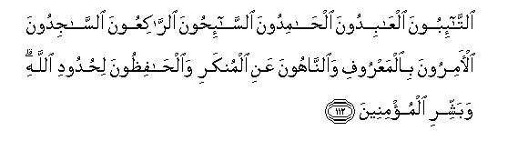

  
[Intangible Textual Heritage](../../index)  [Islam](../index.md) 
[Index](index.md)   
[Hypertext Qur'an](../htq/index)  [Unicode](../uq/009.htm#009_111.md) 
[Palmer](../sbe06/009)  [Pickthall](../pick/009.htm#009_111.md)  [Yusuf Ali
English](../yaq/yaq009)  [Rodwell](../qr/009.md)   
  
[Sūra IX.: Tauba (Repentance) or Barāat (Immunity). Index](009.md)  
  [Previous](00913)  [Next](00915.md) 

------------------------------------------------------------------------

  
*The Holy Quran*, tr. by Yusuf Ali, \[1934\], at Intangible Textual
Heritage

------------------------------------------------------------------------

# Sūra IX.: Tauba (Repentance) or Barāat (Immunity).

### Section 14

------------------------------------------------------------------------

111. Inna All<u>a</u>ha ishtar<u>a</u> mina almu/mineena anfusahum
waamw<u>a</u>lahum bi-anna lahumu aljannata yuq<u>a</u>tiloona fee
sabeeli All<u>a</u>hi fayaqtuloona wayuqtaloona waAAdan AAalayhi
<u>h</u>aqqan fee a**l**ttawr<u>a</u>ti wa**a**l-injeeli
wa**a**lqur-<u>a</u>ni waman awf<u>a</u> biAAahdihi mina All<u>a</u>hi
fa**i**stabshiroo bibayAAikumu alla<u>th</u>ee b<u>a</u>yaAAtum bihi
wa<u>tha</u>lika huwa alfawzu alAAa*<u>th</u>*eem**u**

111\. God hath purchased of the Believers  
Their persons and their goods;  
For theirs (in return)  
Is the Garden (of Paradise):  
They fight in His Cause,  
And slay and are slain:  
A promise binding on Him  
In Truth, through the Law,  
The Gospel, and the Qur-ān:  
And who is more faithful  
To his Covenant than God?  
Then rejoice in the bargain  
Which ye have concluded:  
That is the achievement supreme.

------------------------------------------------------------------------

112. A**l**tt<u>a</u>-iboona alAA<u>a</u>bidoona al<u>ha</u>midoona
a**l**ss<u>a</u>-i<u>h</u>oona a**l**rr<u>a</u>kiAAoona
a**l**ss<u>a</u>jidoona al-<u>a</u>miroona bi**a**lmaAAroofi
wa**al**nn<u>a</u>hoona AAani almunkari
wa**a**l<u>ha</u>fi*<u>th</u>*oona li<u>h</u>udoodi All<u>a</u>hi
wabashshiri almu/mineen**a**

112\. Those that turn (to God)  
In repentance; that serve Him,  
And praise Him; that wander  
In devotion to the Cause of God;  
That bow down and prostrate themselves  
In prayer; that enjoin good  
And forbid evil; and observe  
The limits set by God;—  
(These do rejoice). So proclaim  
The glad tidings to the Believers.

------------------------------------------------------------------------

113. M<u>a</u> k<u>a</u>na li**l**nnabiyyi wa**a**lla<u>th</u>eena
<u>a</u>manoo an yastaghfiroo lilmushrikeena walaw k<u>a</u>noo olee
qurb<u>a</u> min baAAdi m<u>a</u> tabayyana lahum annahum
a<u>s</u>-<u>ha</u>bu alja<u>h</u>eem**i**

113\. It is not fitting,  
For the Prophet and those  
Who believe, that they should  
Pray for forgiveness  
For Pagans, even though  
They be of kin, after it is  
Clear to them that they  
Are companions of the Fire.

------------------------------------------------------------------------

114. Wam<u>a</u> k<u>a</u>na istighf<u>a</u>ru ibr<u>a</u>heema
li-abeehi ill<u>a</u> AAan mawAAidatin waAAadah<u>a</u> iyy<u>a</u>hu
falamm<u>a</u> tabayyana lahu annahu AAaduwwun lill<u>a</u>hi tabarraa
minhu inna ibr<u>a</u>heema laaww<u>a</u>hun <u>h</u>aleem**un**

114\. And Abraham prayed  
For his father's forgiveness  
Only because of a promise  
He had made to him.  
But when it became clear  
To him that he was  
An enemy to God, he  
Dissociated himself from him:  
For Abraham was most  
Tender-hearted, forbearing.

------------------------------------------------------------------------

115. Wam<u>a</u> k<u>a</u>na All<u>a</u>hu liyu<u>d</u>illa qawman
baAAda i<u>th</u> had<u>a</u>hum <u>h</u>att<u>a</u> yubayyina lahum
m<u>a</u> yattaqoona inna All<u>a</u>ha bikulli shay-in AAaleem**un**

115\. And God will not mislead  
A people after He hath  
Guided them, in order that  
He may make clear to them  
What to fear (and avoid)—  
For God hath knowledge  
Of all things.

------------------------------------------------------------------------

116. Inna All<u>a</u>ha lahu mulku a**l**ssam<u>a</u>w<u>a</u>ti
wa**a**l-ar<u>d</u>i yu<u>h</u>yee wayumeetu wam<u>a</u> lakum min dooni
All<u>a</u>hi min waliyyin wal<u>a</u> na<u>s</u>eer**in**

116\. Unto God belongeth  
The dominion of the heavens  
And the earth. He giveth life  
And He taketh it. Except for Him  
Ye have no protector  
Nor helper.

------------------------------------------------------------------------

117. Laqad t<u>a</u>ba All<u>a</u>hu AAal<u>a</u> a**l**nnabiyyi
wa**a**lmuh<u>a</u>jireena wa**a**l-an<u>sa</u>ri alla<u>th</u>eena
ittabaAAoohu fee s<u>a</u>AAati alAAusrati min baAAdi m<u>a</u>
k<u>a</u>da yazeeghu quloobu fareeqin minhum thumma t<u>a</u>ba
AAalayhim innahu bihim raoofun ra<u>h</u>eem**un**

117\. God turned with favour  
To the Prophet, the Muhājirs,  
And the Anṣār,—who followed  
Him in a time of distress,  
After that the hearts of a part  
Of them had nearly swerved  
(From duty); but He turned  
To them (also): for He is  
Unto them Most Kind,  
Most Merciful.

------------------------------------------------------------------------

118. WaAAal<u>a</u> a**l**ththal<u>a</u>thati alla<u>th</u>eena
khullifoo <u>h</u>att<u>a</u> i<u>tha</u> <u>da</u>qat AAalayhimu
al-ar<u>d</u>u bim<u>a</u> ra<u>h</u>ubat wa<u>da</u>qat AAalayhim
anfusuhum wa*<u>th</u>*annoo an l<u>a</u> maljaa mina All<u>a</u>hi
ill<u>a</u> ilayhi thumma t<u>a</u>ba AAalayhim liyatooboo inna
All<u>a</u>ha huwa a**l**ttaww<u>a</u>bu a**l**rra<u>h</u>eem**u**

118\. (He turned in mercy also)  
To the three who were left  
Behind; (they felt guilty)  
To such a degree that the earth  
Seemed constrained to them,  
For all its speciousness,  
And their (very) Souls seemed  
Straitened to them,  
And they perceived that  
There is no fleeing from God  
(And no refuge) but to Himself.  
Then He turned to them,  
That they might repent:  
For God is Oft-Returning,  
Most Merciful.

------------------------------------------------------------------------

[Next: Section 15 (119-122)](00915.md)

