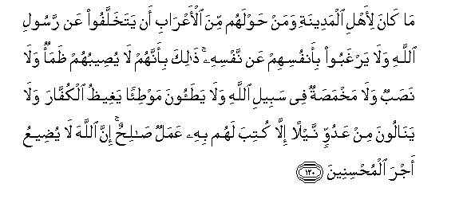
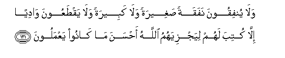
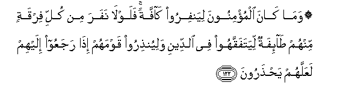

  
[Intangible Textual Heritage](../../index)  [Islam](../index.md) 
[Index](index.md)   
[Hypertext Qur'an](../htq/index)  [Unicode](../uq/009.htm#009_119.md) 
[Palmer](../sbe06/009)  [Pickthall](../pick/009.htm#009_119.md)  [Yusuf Ali
English](../yaq/yaq009)  [Rodwell](../qr/009.md)   
  
[Sūra IX.: Tauba (Repentance) or Barāat (Immunity). Index](009.md)  
  [Previous](00914)  [Next](00916.md) 

------------------------------------------------------------------------

  
*The Holy Quran*, tr. by Yusuf Ali, \[1934\], at Intangible Textual
Heritage

------------------------------------------------------------------------

# Sūra IX.: Tauba (Repentance) or Barāat (Immunity).

### Section 15

------------------------------------------------------------------------

119. Y<u>a</u> ayyuh<u>a</u> alla<u>th</u>eena <u>a</u>manoo ittaqoo
All<u>a</u>ha wakoonoo maAAa a**l**<u>ssa</u>diqeen**a**

119\. O ye who believe! Fear God  
And be with those  
Who are true (in word and deed).

------------------------------------------------------------------------

120. M<u>a</u> k<u>a</u>na li-ahli almadeenati waman <u>h</u>awlahum
mina al-aAAr<u>a</u>bi an yatakhallafoo AAan rasooli All<u>a</u>hi
wal<u>a</u> yarghaboo bi-anfusihim AAan nafsihi <u>tha</u>lika
bi-annahum l<u>a</u> yu<u>s</u>eebuhum *<u>th</u>*amaon wal<u>a</u>
na<u>s</u>abun wal<u>a</u> makhma<u>s</u>atun fee sabeeli All<u>a</u>hi
wal<u>a</u> ya<u>t</u>aoona maw<u>t</u>i-an yaghee*<u>th</u>*u
alkuff<u>a</u>ra wal<u>a</u> yan<u>a</u>loona min AAaduwwin naylan
ill<u>a</u> kutiba lahum bihi AAamalun <u>sa</u>li<u>h</u>un inna
All<u>a</u>ha l<u>a</u> yu<u>d</u>eeAAu ajra almu<u>h</u>sineen**a**

120\. It was not fitting  
For the people of Medina  
And the Bedouin Arabs  
Of the neighbourhood, to refuse  
To follow God's Apostle,  
Nor to prefer their own lives  
To his: because nothing  
Could they suffer or do,  
But was reckoned to their credit  
As a deed of righteousness,—  
Whether they suffered thirst,  
Or fatigue, or hunger, in the Cause  
Of God, or trod paths  
To raise the ire of the Unbelievers,  
Or received any injury  
Whatever from an enemy:  
For God suffereth not  
The reward to be lost  
Of those who do good;—

------------------------------------------------------------------------

121. Wal<u>a</u> yunfiqoona nafaqatan <u>s</u>agheeratan wal<u>a</u>
kabeeratan wal<u>a</u> yaq<u>t</u>aAAoona w<u>a</u>diyan ill<u>a</u>
kutiba lahum liyajziyahumu All<u>a</u>hu a<u>h</u>sana m<u>a</u>
k<u>a</u>noo yaAAmaloon**a**

121\.

------------------------------------------------------------------------

122. Wam<u>a</u> k<u>a</u>na almu/minoona liyanfiroo k<u>a</u>ffatan
falawl<u>a</u> nafara min kulli firqatin minhum <u>ta</u>-ifatun
liyatafaqqahoo fee a**l**ddeeni waliyun<u>th</u>iroo qawmahum
i<u>tha</u> rajaAAoo ilayhim laAAallahum ya<u>hth</u>aroon**a**

122\. Nor should the Believers  
All go forth together:  
If a contingent  
From every expedition  
Remained behind,  
They could devote themselves  
To studies in religion,  
And admonish the people  
When they return to them,—  
That thus they (may learn)  
To guard themselves (against evil)

------------------------------------------------------------------------

[Next: Section 16 (123-129)](00916.md)

