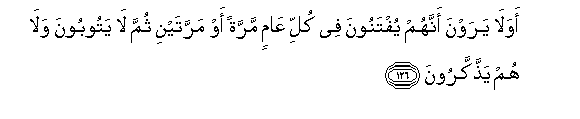

  
[Intangible Textual Heritage](../../index)  [Islam](../index) 
[Index](index)   
[Hypertext Qur'an](../htq/index)  [Unicode](../uq/009.htm#009_123) 
[Palmer](../sbe06/009)  [Pickthall](../pick/009.htm#009_123)  [Yusuf Ali
English](../yaq/yaq009)  [Rodwell](../qr/009)   
  
[Sūra IX.: Tauba (Repentance) or Barāat (Immunity). Index](009)  
  [Previous](00915)  [Next](01001) 

------------------------------------------------------------------------

  
*The Holy Quran*, tr. by Yusuf Ali, \[1934\], at Intangible Textual
Heritage

------------------------------------------------------------------------

# Sūra IX.: Tauba (Repentance) or Barāat (Immunity).

### Section 16

------------------------------------------------------------------------

123. Y<u>a</u> ayyuh<u>a</u> alla<u>th</u>eena <u>a</u>manoo
q<u>a</u>tiloo alla<u>th</u>eena yaloonakum mina alkuff<u>a</u>ri
walyajidoo feekum ghil*<u>th</u>*atan wa**i**AAlamoo anna All<u>a</u>ha
maAAa almuttaqeen**a**

123\. O ye who believe! Fight  
The Unbelievers who gird you about,  
And let them find firmness  
In you: and know that God  
Is with those who fear Him.

------------------------------------------------------------------------

124. Wa-i<u>tha</u> m<u>a</u> onzilat sooratun faminhum man yaqoolu
ayyukum z<u>a</u>dat-hu h<u>ath</u>ihi eem<u>a</u>nan faamm<u>a</u>
alla<u>th</u>eena <u>a</u>manoo faz<u>a</u>dat-hum eem<u>a</u>nan wahum
yastabshiroon**a**

124\. Whenever there cometh down'  
A Sūra, some of them say:  
"Which of you has had  
His faith increased by it?"  
Yea, those who believe,—  
Their faith is increased,  
And they do rejoice.

------------------------------------------------------------------------

125. Waamm<u>a</u> alla<u>th</u>eena fee quloobihim mara<u>d</u>un
faz<u>a</u>dat-hum rijsan il<u>a</u> rijsihim wam<u>a</u>too wahum
k<u>a</u>firoon**a**

125\. But those in whose hearts  
Is a disease,—it will add doubt  
To their doubt, and they will die  
In a state of Unbelief.

------------------------------------------------------------------------

126. Awa l<u>a</u> yarawna annahum yuftanoona fee kulli AA<u>a</u>min
marratan aw marratayni thumma l<u>a</u> yatooboona wal<u>a</u> hum
ya<u>thth</u>akkaroon**a**

126\. See they not that they  
Are tried every year  
Once or twice? Yet they  
Turn not in repentance,  
And they take no heed.

------------------------------------------------------------------------

127. Wa-i<u>tha</u> m<u>a</u> onzilat sooratun na*<u>th</u>*ara
baAA<u>d</u>uhum il<u>a</u> baAA<u>d</u>in hal yar<u>a</u>kum min
a<u>h</u>adin thumma in<u>s</u>arafoo <u>s</u>arafa All<u>a</u>hu
quloobahum bi-annahum qawmun l<u>a</u> yafqahoon**a**

127\. Whenever there cometh down  
A Sūra, they look at each other,  
(Saying), "Doth anyone see you?"  
Then they turn aside:  
God hath turned their hearts  
(From the light); for they  
Are a people that understand not.

------------------------------------------------------------------------

128. Laqad j<u>a</u>akum rasoolun min anfusikum AAazeezun AAalayhi
m<u>a</u> AAanittum <u>h</u>aree<u>s</u>un AAalaykum bi**a**lmu/mineena
raoofun ra<u>h</u>eem**un**

128\. Now hath come unto you  
An Apostle from amongst  
Yourselves: it grieves him  
That ye should perish:  
Ardently anxious is he  
Over you: to the Believers  
Is he most kind and merciful.

------------------------------------------------------------------------

129. Fa-in tawallaw faqul <u>h</u>asbiya All<u>a</u>hu l<u>a</u>
il<u>a</u>ha ill<u>a</u> huwa AAalayhi tawakkaltu wahuwa rabbu alAAarshi
alAAa*<u>th</u>*eem**i**

129\. But if they turn away,  
Say: "God sufficeth me:  
There is no god but He:  
On Him is my trust,  
He the Lord of the Throne  
(Of Glory) Supreme!

------------------------------------------------------------------------

[Next: Section 1 (1-10)](01001)

