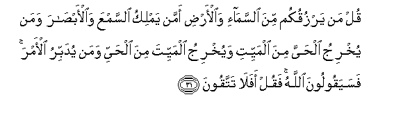
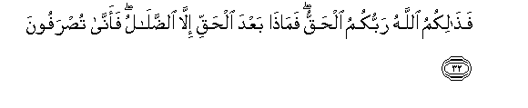
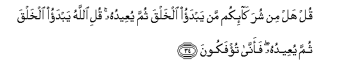
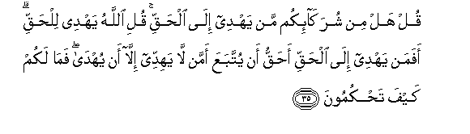
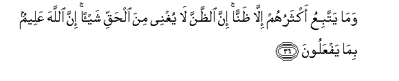
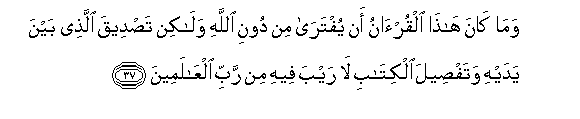
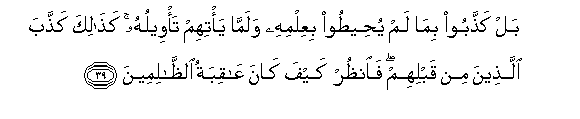
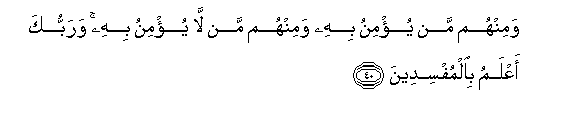

  
[Intangible Textual Heritage](../../index)  [Islam](../index.md) 
[Index](index.md)   
[Hypertext Qur'an](../htq/index)  [Unicode](../uq/010.htm#010_031.md) 
[Palmer](../sbe06/010)  [Pickthall](../pick/010.htm#010_031.md)  [Yusuf Ali
English](../yaq/yaq010)  [Rodwell](../qr/010.md)   
  
[Sūra X.: Yūnus, or Jonah. Index](010.md)  
  [Previous](01003)  [Next](01005.md) 

------------------------------------------------------------------------

  
*The Holy Quran*, tr. by Yusuf Ali, \[1934\], at Intangible Textual
Heritage

------------------------------------------------------------------------

# Sūra X.: Yūnus, or Jonah.

### Section 4

------------------------------------------------------------------------

31. Qul man yarzuqukum mina a**l**ssam<u>a</u>-i wa**a**l-ar<u>d</u>i
amman yamliku a**l**ssamAAa wa**a**l-ab<u>sa</u>ra waman yukhriju
al<u>h</u>ayya mina almayyiti wayukhriju almayyita mina al<u>h</u>ayyi
waman yudabbiru al-amra fasayaqooloona All<u>a</u>hu faqul afal<u>a</u>
tattaqoon**a**

31\. Say: "Who is it that  
Sustains you (in life)  
From the sky and from the earth?  
Or who is it that  
Has power over hearing  
And sight? And who  
Is it that brings out  
The living from the dead  
And the dead from the living?  
And who is it that  
Rules and regulates all affairs?"  
They will soon say, "God".  
Say, "Will ye not then  
Show piety (to Him)?"

------------------------------------------------------------------------

32. Fa<u>tha</u>likumu All<u>a</u>hu rabbukumu al<u>h</u>aqqu
fam<u>atha</u> baAAda al<u>h</u>aqqi ill<u>a</u>
a**l**<u>dd</u>al<u>a</u>lu faann<u>a</u> tu<u>s</u>rafoon**a**

32\. Such is God, your real  
Cherisher and Sustainer:  
Apart from Truth,  
What (remains) but error?  
How then are ye turned away?

------------------------------------------------------------------------

33. Ka<u>tha</u>lika <u>h</u>aqqat kalimatu rabbika AAal<u>a</u>
alla<u>th</u>eena fasaqoo annahum l<u>a</u> yu/minoon**a**

33\. Thus is the Word  
Of thy Lord proved true  
Against those who rebel:  
Verily they will not believe.

------------------------------------------------------------------------

34. Qul hal min shurak<u>a</u>-ikum man yabdao alkhalqa thumma
yuAAeeduhu quli All<u>a</u>hu yabdao alkhalqa thumma yuAAeeduhu
faann<u>a</u> tu/fakoon**a**

34\. Say: "Of your 'partners',  
Can any originate creation  
And repeat it?" Say:  
"It is God Who originates  
Creation and repeats it:  
Then how are ye deluded  
Away (from the truth)?"

------------------------------------------------------------------------

35. Qul hal min shurak<u>a</u>-ikum man yahdee il<u>a</u> al<u>h</u>aqqi
quli All<u>a</u>hu yahdee lil<u>h</u>aqqi afaman yahdee il<u>a</u>
al<u>h</u>aqqi a<u>h</u>aqqu an yuttabaAAa amman l<u>a</u> yahiddee
ill<u>a</u> an yuhd<u>a</u> fam<u>a</u> lakum kayfa
ta<u>h</u>kumoon**a**

35\. Say: "Of your "partners"  
Is there any that  
Can give any guidance  
Towards Truth?" Say: "It is God  
Who gives guidance  
Towards Truth. Is then He  
Who gives guidance to Truth  
More worthy to be followed,  
Or he who finds not guidance  
(Himself) unless he is guided?  
What then is the matter  
With you? How judge ye?"

------------------------------------------------------------------------

36. Wam<u>a</u> yattabiAAu aktharuhum ill<u>a</u> *<u>th</u>*annan inna
a**l***<u>thth</u>*anna l<u>a</u> yughnee mina al<u>h</u>aqqi shay-an
inna All<u>a</u>ha AAaleemun bim<u>a</u> yafAAaloon**a**

36\. But most of them follow  
Nothing but fancy: truly  
Fancy can be of no avail  
Against Truth. Verily God  
Is well aware of all  
That they do.

------------------------------------------------------------------------

37. Wam<u>a</u> k<u>a</u>na h<u>atha</u> alqur-<u>a</u>nu an
yuftar<u>a</u> min dooni All<u>a</u>hi wal<u>a</u>kin ta<u>s</u>deeqa
alla<u>th</u>ee bayna yadayhi wataf<u>s</u>eela alkit<u>a</u>bi
l<u>a</u> rayba feehi min rabbi alAA<u>a</u>lameen**a**

37\. This Qur-ān is not such  
As can be produced  
By other than God;  
On the contrary it is  
A confirmation of (revelations)  
That went before it,  
And a fuller explanation  
Of the Book—wherein  
There is no doubt  
From the Lord of the Worlds.

------------------------------------------------------------------------

38. Am yaqooloona iftar<u>a</u>hu qul fa/too bisooratin mithlihi
wa**o**dAAoo mani ista<u>t</u>aAAtum min dooni All<u>a</u>hi in kuntum
<u>sa</u>diqeen**a**

38\. Or do they say,  
"He forged it"?  
Say: "Bring then  
A Sūra like unto it,  
And call (to your aid)  
Anyone you can,  
Besides God, if it be  
Ye speak the truth!"

------------------------------------------------------------------------

39. Bal ka<u>thth</u>aboo bim<u>a</u> lam yu<u>h</u>ee<u>t</u>oo
biAAilmihi walamm<u>a</u> ya/tihim ta/weeluhu ka<u>tha</u>lika
ka<u>thth</u>aba alla<u>th</u>eena min qablihim fa**o**n*<u>th</u>*ur
kayfa k<u>a</u>na AA<u>a</u>qibatu
a**l***<u>thth</u>*<u>a</u>limeen**a**

39\. Nay, they charge with falsehood  
That whose knowledge they  
Cannot compass, even before  
The elucidation thereof"  
Hath reached them: thus  
Did those before them  
Make charges of falsehood:  
But see what was the end  
Of those who did wrong!

------------------------------------------------------------------------

40. Waminhum man yu/minu bihi waminhum man l<u>a</u> yu/minu bihi
warabbuka aAAlamu bi**a**lmufsideen**a**

40\. Of them there are some  
Who believe therein,  
And some who do not:  
And thy Lord knoweth best  
Those who are out for mischief.

------------------------------------------------------------------------

[Next: Section 5 (41-53)](01005.md)

