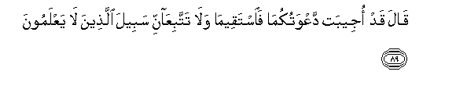
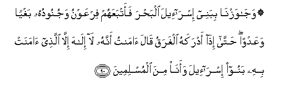

  
[Intangible Textual Heritage](../../index)  [Islam](../index) 
[Index](index)   
[Hypertext Qur'an](../htq/index)  [Unicode](../uq/010.htm#010_083) 
[Palmer](../sbe06/010)  [Pickthall](../pick/010.htm#010_083)  [Yusuf Ali
English](../yaq/yaq010)  [Rodwell](../qr/010)   
  
[Sūra X.: Yūnus, or Jonah. Index](010)  
  [Previous](01008)  [Next](01010) 

------------------------------------------------------------------------

  
*The Holy Quran*, tr. by Yusuf Ali, \[1934\], at Intangible Textual
Heritage

------------------------------------------------------------------------

# Sūra X.: Yūnus, or Jonah.

### Section 9

------------------------------------------------------------------------

83. Fam<u>a</u> <u>a</u>mana limoos<u>a</u> ill<u>a</u>
<u>th</u>urriyyatun min qawmihi AAal<u>a</u> khawfin min firAAawna
wamala-ihim an yaftinahum wa-inna firAAawna laAA<u>a</u>lin fee
al-ar<u>d</u>i wa-innahu lamina almusrifeen**a**

83\. But none believed in Moses  
Except some children of his People,  
Because of the fear of Pharaoh  
And his chiefs, lest they  
Should persecute them; and certainly  
Pharaoh was mighty on the earth  
And one who transgressed all bounds.

------------------------------------------------------------------------

84. Waq<u>a</u>la moos<u>a</u> y<u>a</u> qawmi in kuntum <u>a</u>mantum
bi**A**ll<u>a</u>hi faAAalayhi tawakkaloo in kuntum muslimeen**a**

84\. Moses said: "O my People!  
If ye do (really) believe  
In God, then in Him  
Put your trust if ye  
Submit (your will to His)."

------------------------------------------------------------------------

85. Faq<u>a</u>loo AAal<u>a</u> All<u>a</u>hi tawakkaln<u>a</u>
rabban<u>a</u> l<u>a</u> tajAAaln<u>a</u> fitnatan lilqawmi
a**l***<u>thth</u>*<u>a</u>limeen**a**

85\. They said: "In God  
Do we put our trust.  
Our Lord! make us not  
A trial for those  
Who practise oppression;

------------------------------------------------------------------------

86. Wanajjin<u>a</u> bira<u>h</u>matika mina alqawmi
alk<u>a</u>fireen**a**

86\. "And deliver us by Thy Mercy  
From those who reject (Thee)."

------------------------------------------------------------------------

87. Waaw<u>h</u>ayn<u>a</u> il<u>a</u> moos<u>a</u> waakheehi an
tabawwa<u>a</u> liqawmikum<u>a</u> bimi<u>s</u>ra buyootan
wa**i**jAAaloo buyootakum qiblatan waaqeemoo a**l**<u>ss</u>al<u>a</u>ta
wabashshiri almu/mineen**a**

87\. We inspired Moses and his brother  
With this Message: "Provide  
Dwellings for your People  
In Egypt, make your dwellings  
Into places of worship,  
And establish regular prayers:  
And give Glad Tidings  
To those who believe!"

------------------------------------------------------------------------

88. Waq<u>a</u>la moos<u>a</u> rabban<u>a</u> innaka <u>a</u>tayta
firAAawna wamalaahu zeenatan waamw<u>a</u>lan fee al<u>h</u>ay<u>a</u>ti
a**l**dduny<u>a</u> rabban<u>a</u> liyu<u>d</u>illoo AAan sabeelika
rabban<u>a</u> i<u>t</u>mis AAal<u>a</u> amw<u>a</u>lihim wa**o**shdud
AAal<u>a</u> quloobihim fal<u>a</u> yu/minoo <u>h</u>att<u>a</u> yarawoo
alAAa<u>tha</u>ba al-aleem**a**

88\. Moses prayed: "Our Lord!  
Thou hast indeed bestowed  
On Pharaoh and his Chiefs  
Splendour and wealth in the life  
Of the Present, and so,  
Our Lord, they mislead (men)  
From Thy Path. Deface.  
Our Lord, the features of their wealth,  
And send hardness to their hearts,  
So they will not believe  
Until they see  
The grievous Penalty."

------------------------------------------------------------------------

89. Q<u>a</u>la qad ojeebat daAAwatukum<u>a</u> fa**i**staqeem<u>a</u>
wal<u>a</u> tattabiAA<u>a</u>nni sabeela alla<u>th</u>eena l<u>a</u>
yaAAlamoon**a**

89\. God said: "Accepted is  
Your prayer (O Moses and Aaron)  
So stand ye straight,  
And follow not the path  
Of those who know not.

------------------------------------------------------------------------

90. Waj<u>a</u>wazn<u>a</u> bibanee isr<u>a</u>-eela alba<u>h</u>ra
faatbaAAahum firAAawnu wajunooduhu baghyan waAAadwan <u>h</u>att<u>a</u>
i<u>tha</u> adrakahu algharaqu q<u>a</u>la <u>a</u>mantu annahu
l<u>a</u> il<u>a</u>ha ill<u>a</u> alla<u>th</u>ee <u>a</u>manat bihi
banoo isr<u>a</u>-eela waan<u>a</u> mina almuslimeen**a**

90\. We took the Children  
Of Israel across the sea:  
Pharaoh and his hosts followed them  
In insolence and spite.  
At length, when overwhelmed  
With the flood, he said:  
"I believe that there is no god  
Except Him Whom the Children  
Of Israel believe in:  
I am of those who submit  
(To God in Islām)."

------------------------------------------------------------------------

91. <u>A</u>l-<u>a</u>na waqad AAa<u>s</u>ayta qablu wakunta mina
almufsideen**a**

91\. (It was said to him:)  
"Ah now!—But a little while  
Before, wast thou in rebellion!—  
And thou didst mischief (and violence)!

------------------------------------------------------------------------

92. Fa**a**lyawma nunajjeeka bibadanika litakoona liman khalfaka
<u>a</u>yatan wa-inna katheeran mina a**l**nn<u>a</u>si AAan
<u>a</u>y<u>a</u>tin<u>a</u> lagh<u>a</u>filoon**a**

92\. "This day shall We save thee  
In thy body, that thou  
Mayest be a Sign to those  
Who come after thee!  
But verily, many among mankind  
Are heedless of Our Signs!"

------------------------------------------------------------------------

[Next: Section 10 (93-103)](01010)

