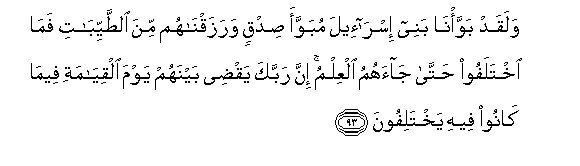
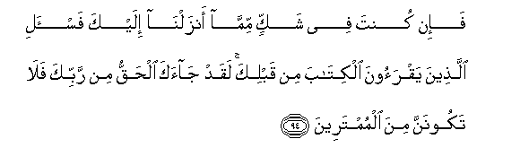
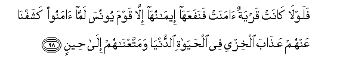
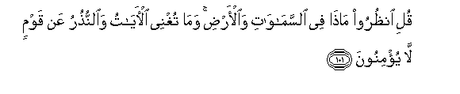
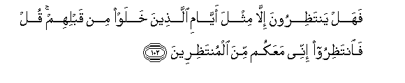

  
[Intangible Textual Heritage](../../index)  [Islam](../index.md) 
[Index](index.md)   
[Hypertext Qur'an](../htq/index)  [Unicode](../uq/010.htm#010_093.md) 
[Palmer](../sbe06/010)  [Pickthall](../pick/010.htm#010_093.md)  [Yusuf Ali
English](../yaq/yaq010)  [Rodwell](../qr/010.md)   
  
[Sūra X.: Yūnus, or Jonah. Index](010.md)  
  [Previous](01009)  [Next](01011.md) 

------------------------------------------------------------------------

  
*The Holy Quran*, tr. by Yusuf Ali, \[1934\], at Intangible Textual
Heritage

------------------------------------------------------------------------

# Sūra X.: Yūnus, or Jonah.

### Section 10

------------------------------------------------------------------------

93. Walaqad bawwa/n<u>a</u> banee isr<u>a</u>-eela mubawwaa
<u>s</u>idqin warazaqn<u>a</u>hum mina a**l**<u>tt</u>ayyib<u>a</u>ti
fam<u>a</u> ikhtalafoo <u>h</u>att<u>a</u> j<u>a</u>ahumu alAAilmu inna
rabbaka yaq<u>d</u>ee baynahum yawma alqiy<u>a</u>mati feem<u>a</u>
k<u>a</u>noo feehi yakhtalifoon**a**

93\. We settled the Children  
Of Israel in a beautiful  
Dwelling-place, and provided  
For them sustenance of the best:  
It was after knowledge had been  
Granted to them, that they  
Fell into schisms. Verily  
God will judge between them  
As to the schisms amongst them,  
On the Day of Judgment.

------------------------------------------------------------------------

94. Fa-in kunta fee shakkin mimm<u>a</u> anzalnn<u>a</u> ilayka
fa**i**s-ali alla<u>th</u>eena yaqraoona alkit<u>a</u>ba min qablika
laqad j<u>a</u>aka al<u>h</u>aqqu min rabbika fal<u>a</u> takoonanna
mina almumtareen**a**

94\. If thou wert in doubt  
As to what We have revealed  
Unto thee, then ask those  
Who have been reading  
The Book from before thee:  
The Truth hath indeed come  
To thee from thy Lord:  
So be in no wise  
Of those in doubt.

------------------------------------------------------------------------

95. Wal<u>a</u> takoonanna mina alla<u>th</u>eena ka<u>thth</u>aboo
bi-<u>a</u>y<u>a</u>ti All<u>a</u>hi fatakoona mina
alkh<u>a</u>sireen**a**

95\. Nor be of those who reject  
The Signs of God,  
Or thou shalt be of those  
Who perish.

------------------------------------------------------------------------

96. Inna alla<u>th</u>eena <u>h</u>aqqat AAalayhim kalimatu rabbika
l<u>a</u> yu/minoon**a**

96\. Whose against whom the Word  
Of thy Lord hath been verified  
Would not believe—

------------------------------------------------------------------------

97. Walaw j<u>a</u>at-hum kullu <u>a</u>yatin <u>h</u>att<u>a</u>
yarawoo alAAa<u>tha</u>ba al-aleem**a**

97\. Even if every Sign was brought  
Unto them,—until they see  
(For themselves) the Penalty Grievous.

------------------------------------------------------------------------

98. Falawl<u>a</u> k<u>a</u>nat qaryatun <u>a</u>manat
fanafaAAah<u>a</u> eem<u>a</u>nuh<u>a</u> ill<u>a</u> qawma yoonusa
lamm<u>a</u> <u>a</u>manoo kashafn<u>a</u> AAanhum AAa<u>tha</u>ba
alkhizyi fee al<u>h</u>ay<u>a</u>ti a**l**dduny<u>a</u>
wamattaAAn<u>a</u>hum il<u>a</u> <u>h</u>een**in**

98\. Why was there not  
A single township (among those  
We warned), which believed,—  
So its Faith should have  
Profited it,—except the People  
Of Jonah? When they believed,  
We removed from them  
The Penalty of Ignominy  
In the life of the Present,  
And permitted them to enjoy  
(Their life) for a while.

------------------------------------------------------------------------

99. Walaw sh<u>a</u>a rabbuka la<u>a</u>mana man fee al-ar<u>d</u>i
kulluhum jameeAAan afaanta tukrihu a**l**nn<u>a</u>sa
<u>h</u>att<u>a</u> yakoonoo mu/mineen**a**

99\. If it had been thy Lord's Will,  
They would all have believed,—  
All who are on earth!  
Wilt thou then compel mankind,  
Against their will, to believe!

------------------------------------------------------------------------

100. Wam<u>a</u> k<u>a</u>na linafsin an tu/mina ill<u>a</u>
bi-i<u>th</u>ni All<u>a</u>hi wayajAAalu a**l**rrijsa AAal<u>a</u>
alla<u>th</u>eena l<u>a</u> yaAAqiloon**a**

100\. No soul can believe, except  
By the Will of God,  
And He will place Doubt  
(Or obscurity) on those  
Who will not understand.

------------------------------------------------------------------------

101. Quli on*<u>th</u>*uroo m<u>atha</u> fee
a**l**ssam<u>a</u>w<u>a</u>ti wa**a**l-ar<u>d</u>i wam<u>a</u> tughnee
al-<u>a</u>y<u>a</u>tu wa**al**nnu<u>th</u>uru AAan qawmin l<u>a</u>
yu/minoon**a**

101\. Say: "Behold all that is  
In the heavens and on earth ";  
But neither Signs nor Warners  
Profit those who believe not.

------------------------------------------------------------------------

102. Fahal yanta*<u>th</u>*iroona ill<u>a</u> mithla ayy<u>a</u>mi
alla<u>th</u>eena khalaw min qablihim qul fa**i**nta*<u>th</u>*iroo
innee maAAakum mina almunta*<u>th</u>*ireen**a**

102\. Do they then expect  
(Any thing) but (what happened  
In) the days of the men  
Who passed away before them?  
Say: "Wait ye then:  
For I, too, will wait with you."

------------------------------------------------------------------------

103. Thumma nunajjee rusulan<u>a</u> wa**a**lla<u>th</u>eena
<u>a</u>manoo ka<u>tha</u>lika <u>h</u>aqqan AAalayn<u>a</u> nunjee
almu/mineen**a**

103\. In the end We deliver  
Our apostles and those who believe:  
Thus is it fitting on Our part  
That We should deliver  
Those who believe!

------------------------------------------------------------------------

[Next: Section 11 (104-109)](01011.md)

