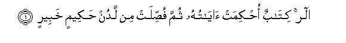
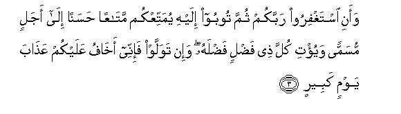
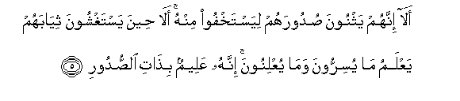
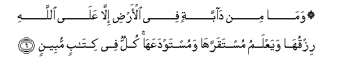
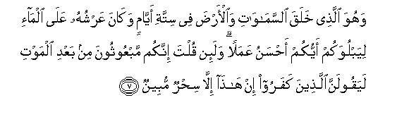
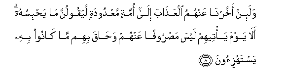

  
[Intangible Textual Heritage](../../index)  [Islam](../index.md) 
[Index](index.md)   
[Hypertext Qur'an](../htq/index)  [Unicode](../uq/011.htm#011_001.md) 
[Palmer](../sbe06/011)  [Pickthall](../pick/011.htm#011_001.md)  [Yusuf Ali
English](../yaq/yaq011)  [Rodwell](../qr/011.md)   
  
[Sūra XI.: Hūd (The Prophet Hūd). Index](011.md)  
  [Previous](01011)  [Next](01102.md) 

------------------------------------------------------------------------

  
*The Holy Quran*, tr. by Yusuf Ali, \[1934\], at Intangible Textual
Heritage

------------------------------------------------------------------------

# Sūra XI.: Hūd (The Prophet Hūd).

### Section 1

1. Alif-l<u>a</u>m-r<u>a</u> kit<u>a</u>bun o<u>h</u>kimat
<u>a</u>y<u>a</u>tuhu thumma fu<u>ss</u>ilat min ladun <u>h</u>akeemin
khabeer**in**

1\. A. L. R.  
(This is) a Book,  
With verses basic or fundamental  
(Of established meaning),  
Further explained in detail,—  
From One Who is Wise  
And Well-Acquainted (with al\] things):

------------------------------------------------------------------------

2. All<u>a</u> taAAbudoo ill<u>a</u> All<u>a</u>ha innanee lakum minhu
na<u>th</u>eerun wabasheer**un**

2\. (It teacheth) that ye should  
Worship none but God.  
(Say:) "Verily I am  
(Sent) unto you from Him  
To warn and to bring  
Glad tidings:

------------------------------------------------------------------------

3. Waani istaghfiroo rabbakum thumma tooboo ilayhi yumattiAAkum
mat<u>a</u>AAan <u>h</u>asanan il<u>a</u> ajalin musamman wayu/ti kulla
<u>th</u>ee fa<u>d</u>lin fa<u>d</u>lahu wa-in tawallaw fa-inee
akh<u>a</u>fu AAalaykum AAa<u>tha</u>ba yawmin kabeer**in**

3\. "(And to preach thus), "Seek ye  
The forgiveness of your Lord,  
And turn to Him in repentance;  
That He may grant you  
Enjoyment, good (and true),  
For a term appointed,  
And bestow His abounding grace  
On all who abound in merit!  
But if ye turn away,  
Then I fear for you  
The Penalty of a Great Day:

------------------------------------------------------------------------

4. Il<u>a</u> All<u>a</u>hi marjiAAukum wahuwa AAal<u>a</u> kulli
shay-in qadeer**un**

4\. "'To God is your return,  
And He hath power  
Over all things.'"

------------------------------------------------------------------------

5. Al<u>a</u> innahum yathnoona <u>s</u>udoorahum liyastakhfoo minhu
al<u>a</u> <u>h</u>eena yastaghshoona thiy<u>a</u>bahum yaAAlamu
m<u>a</u> yusirroona wam<u>a</u> yuAAlinoona innahu AAaleemun
bi<u>tha</u>ti a**l**<u>ss</u>udoor**i**

5\. Behold! they fold up  
Their hearts, that they may lie  
Hid from Him! Ah! even  
When they cover themselves  
With their garments, He knoweth  
What they conceal, and what  
They reveal: for He knoweth  
Well the (inmost secrets)  
Of the hearts

------------------------------------------------------------------------

6. Wam<u>a</u> min d<u>a</u>bbatin fee al-ar<u>d</u>i ill<u>a</u>
AAal<u>a</u> All<u>a</u>hi rizquh<u>a</u> wayaAAlamu mustaqarrah<u>a</u>
wamustawdaAAah<u>a</u> kullun fee kit<u>a</u>bin mubeen**in**

6\. Where is no moving creature  
On earth but its sustenance  
Dependeth on God: He knoweth  
The time and place of its  
Definite abode and its  
Temporary deposit:  
All is in a clear Record.

------------------------------------------------------------------------

7. Wahuwa alla<u>th</u>ee khalaqa a**l**ssam<u>a</u>w<u>a</u>ti
wa**a**l-ar<u>d</u>a fee sittati ayy<u>a</u>min wak<u>a</u>na AAarshuhu
AAal<u>a</u> alm<u>a</u>-i liyabluwakum ayyukum a<u>h</u>sanu AAamalan
wala-in qulta innakum mabAAoothoona min baAAdi almawti layaqoolanna
alla<u>th</u>eena kafaroo in h<u>atha</u> ill<u>a</u> si<u>h</u>run
mubeen**un**

7\. He it is Who created  
The heavens and the earth  
In six Days—and His Throne  
Was over the Waters—  
That He might try you,  
Which of you is best  
In conduct. But if  
Thou wert to say to them,  
"Ye shall indeed be raised up  
After death", the Unbelievers  
Would be sure to say,  
"This is nothing but  
Obvious sorcery!"

------------------------------------------------------------------------

8. Wala-in akhkharn<u>a</u> AAanhumu alAAa<u>tha</u>ba il<u>a</u>
ommatin maAAdoodatin layaqoolunna m<u>a</u> ya<u>h</u>bisuhu al<u>a</u>
yawma ya/teehim laysa ma<u>s</u>roofan AAanhum wa<u>ha</u>qa bihim
m<u>a</u> k<u>a</u>noo bihi yastahzi-oon**a**

8\. If We delay the penalty  
For them for a definite term,  
They are sure to say,  
"What keeps it back?"  
Ah! On the day it (actually)  
Reaches them, nothing will.  
Turn it away from them,  
And they will be completely  
Encircled by that which  
They used to mock at!

------------------------------------------------------------------------

[Next: Section 2 (9-24)](01102.md)

