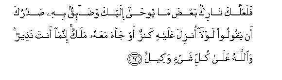
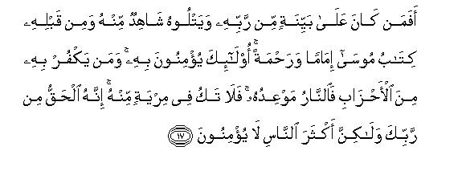
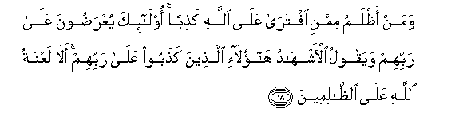
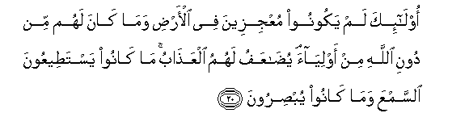
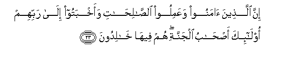
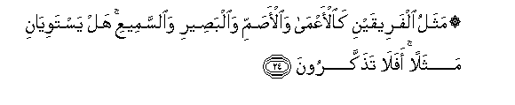

  
[Intangible Textual Heritage](../../index)  [Islam](../index) 
[Index](index)   
[Hypertext Qur'an](../htq/index)  [Unicode](../uq/011.htm#011_009) 
[Palmer](../sbe06/011)  [Pickthall](../pick/011.htm#011_009)  [Yusuf Ali
English](../yaq/yaq011)  [Rodwell](../qr/011)   
  
[Sūra XI.: Hūd (The Prophet Hūd). Index](011)  
  [Previous](01101)  [Next](01103) 

------------------------------------------------------------------------

  
*The Holy Quran*, tr. by Yusuf Ali, \[1934\], at Intangible Textual
Heritage

------------------------------------------------------------------------

# Sūra XI.: Hūd (The Prophet Hūd).

### Section 2

------------------------------------------------------------------------

9. Wala-in a<u>th</u>aqn<u>a</u> al-ins<u>a</u>na minn<u>a</u>
ra<u>h</u>matan thumma nazaAAn<u>a</u>h<u>a</u> minhu innahu layaoosun
kafoor**un**

9\. If We give man a taste  
Of Mercy from Ourselves,  
And then withdraw it from him,  
Behold! he is in despair  
And (falls into) blasphemy.

------------------------------------------------------------------------

10. Wala-in a<u>th</u>aqn<u>a</u>hu naAAm<u>a</u>a baAAda
<u>d</u>arr<u>a</u>a massat-hu layaqoolanna <u>th</u>ahaba
a**l**ssayyi-<u>a</u>tu AAannee innahu lafari<u>h</u>un fakhoor**un**

10\. But if We give hint a taste  
Of (Our) favours after  
Adversity hath touched him,  
He is sure to say,  
"All evil has departed from me:  
Behold! he falls into exultation  
And pride.

------------------------------------------------------------------------

11. Ill<u>a</u> alla<u>th</u>eena <u>s</u>abaroo waAAamiloo
a**l**<u>ssa</u>li<u>ha</u>ti ol<u>a</u>-ika lahum maghfiratun waajrun
kabeer**un**

11\. Not so do those who show  
Patience and constancy, and work  
Righteousness; for them  
Is forgiveness (of sins)  
And a great reward.

------------------------------------------------------------------------

12. FalaAAallaka t<u>a</u>rikun baAA<u>d</u>a m<u>a</u> yoo<u>ha</u>
ilayka wa<u>da</u>-iqun bihi <u>s</u>adruka an yaqooloo lawl<u>a</u>
onzila AAalayhi kanzun aw j<u>a</u>a maAAahu malakun innam<u>a</u> anta
na<u>th</u>eerun wa**A**ll<u>a</u>hu AAal<u>a</u> kulli shay-in
wakeel**un**

12\. Perchance thou mayest (feel  
The inclination) to give up  
A part of what is revealed  
Unto thee, and thy heart  
Feeleth straitened lest they say,  
"Why is not a treasure sent down  
Unto him, or why does not  
An angel come down with him?"  
But thou art there only to warn!  
It is God that arrangeth  
All affairs!

------------------------------------------------------------------------

13. Am yaqooloona iftar<u>a</u>hu qul fa/too biAAashri suwarin mithlihi
muftaray<u>a</u>tin wa**o**dAAoo mani ista<u>t</u>aAAtum min dooni
All<u>a</u>hi in kuntum <u>sa</u>diqeen**a**

13\. Or they may say, "He forged it."  
Say, "Bring ye then ten Sūras  
Forged, like unto it, and call  
(To your aid) whomsoever  
Ye can, other than God!—  
If ye speak the truth!

------------------------------------------------------------------------

14. Fa-illam yastajeeboo lakum fa**i**AAlamoo annam<u>a</u> onzila
biAAilmi All<u>a</u>hi waan l<u>a</u> il<u>a</u>ha ill<u>a</u> huwa
fahal antum muslimoon**a**

14\. "If then they (your false gods)  
Answer not your (call),  
Know ye that this Revelation  
Is sent down (replete) with the knowledge  
Of God, and that there is  
No god but He! Will ye  
Even then submit (to Islam)?"

------------------------------------------------------------------------

15. Man k<u>a</u>na yureedu al<u>h</u>ay<u>a</u>ta a**l**dduny<u>a</u>
wazeenatah<u>a</u> nuwaffi ilayhim aAAm<u>a</u>lahum feeh<u>a</u> wahum
feeh<u>a</u> l<u>a</u> yubkhasoon**a**

15\. Those who desire  
The life of the Present  
And its glitter,—to them  
We shall pay (the price  
Of) their deeds therein,—  
Without diminution.

------------------------------------------------------------------------

16. Ol<u>a</u>-ika alla<u>th</u>eena laysa lahum fee al-<u>a</u>khirati
ill<u>a</u> a**l**nn<u>a</u>ru wa<u>h</u>abi<u>t</u>a m<u>a</u>
<u>s</u>anaAAoo feeh<u>a</u> wab<u>at</u>ilun m<u>a</u> k<u>a</u>noo
yaAAmaloon**a**

16\. They are those for whom  
There is nothing in the Hereafter  
But the Fire: vain  
Are the designs they frame therein,  
And of no effect  
Are the deeds that they do!

------------------------------------------------------------------------

17. Afaman k<u>a</u>na AAal<u>a</u> bayyinatin min rabbihi wayatloohu
sh<u>a</u>hidun minhu wamin qablihi kit<u>a</u>bu moos<u>a</u>
im<u>a</u>man wara<u>h</u>matan ol<u>a</u>-ika yu/minoona bihi waman
yakfur bihi mina al-a<u>h</u>z<u>a</u>bi fa**al**nn<u>a</u>ru mawAAiduhu
fal<u>a</u> taku fee miryatin minhu innahu al<u>h</u>aqqu min rabbika
wal<u>a</u>kinna akthara a**l**nn<u>a</u>si l<u>a</u> yu/minoon**a**

17\. Can they be (like) those  
Who accept a Clear (Sign)  
From their Lord, and whom  
A witness from Himself  
Doth teach, as did the Book  
Of Moses before it,—a guide  
And a mercy? They believe  
Therein; but those of the Sects  
That reject it,—the Fire  
Will be their promised  
Meeting-place. Be not then  
In doubt thereon: for it is  
The Truth from thy Lord:  
Yet many among men  
Do not believe!

------------------------------------------------------------------------

18. Waman a*<u>th</u>*lamu mimmani iftar<u>a</u> AAal<u>a</u>
All<u>a</u>hi ka<u>th</u>iban ol<u>a</u>-ika yuAAra<u>d</u>oona
AAal<u>a</u> rabbihim wayaqoolu al-ashh<u>a</u>du h<u>a</u>ol<u>a</u>-i
alla<u>th</u>eena ka<u>th</u>aboo AAal<u>a</u> rabbihim al<u>a</u>
laAAnatu All<u>a</u>hi AAal<u>a</u>
a**l***<u>thth</u>*<u>a</u>limeen**a**

18\. Who doth more wrong  
Than those who invent a lie  
Against God? They will be  
Turned back to the presence  
Of their Lord, and the witnesses  
Will say, "These are the ones  
Who lied against their Lord!  
Behold! the Curse of God  
Is on those who do wrong!—

------------------------------------------------------------------------

19. Alla<u>th</u>eena ya<u>s</u>uddoona AAan sabeeli All<u>a</u>hi
wayabghoonah<u>a</u> AAiwajan wahum bi**a**l-<u>a</u>khirati hum
k<u>a</u>firoon**a**

19\. "Those who would hinder (men)  
From the path of God  
And would seek in it  
Something crooked: these were  
They who denied the Hereafter!"

------------------------------------------------------------------------

20. Ol<u>a</u>-ika lam yakoonoo muAAjizeena fee al-ar<u>d</u>i
wam<u>a</u> k<u>a</u>na lahum min dooni All<u>a</u>hi min awliy<u>a</u>a
yu<u>da</u>AAafu lahumu alAAa<u>tha</u>bu m<u>a</u> k<u>a</u>noo
yasta<u>t</u>eeAAoona a**l**ssamAAa wam<u>a</u> k<u>a</u>noo
yub<u>s</u>iroon**a**

20\. They will in no wise  
Frustrate (His design) on earth,  
Nor have they protectors  
Besides God! Their penalty  
Will be doubled! They lost  
The power to hear,  
And they did not see!

------------------------------------------------------------------------

21. Ol<u>a</u>-ika alla<u>th</u>eena khasiroo anfusahum wa<u>d</u>alla
AAanhum m<u>a</u> k<u>a</u>noo yaftaroon**a**

21\. They are the ones who  
Have lost their own souls:  
And the (fancies) they invented  
Have left them in the lurch!

------------------------------------------------------------------------

22. L<u>a</u> jarama annahum fee al-<u>a</u>khirati humu
al-akhsaroon**a**

22\. Without a doubt, these  
Are the very ones who  
Will lose most in the Hereafter!

------------------------------------------------------------------------

23. Inna alla<u>th</u>eena <u>a</u>manoo waAAamiloo
a**l**<u>sa</u>li<u>ha</u>ti waakhbatoo il<u>a</u> rabbihim
ol<u>a</u>-ika a<u>s</u>-<u>ha</u>bu aljannati hum feeh<u>a</u>
kh<u>a</u>lidoon**a**

23\. But those who believe  
And work righteousness,  
And humble themselves  
Before their Lord,—  
They will be Companions  
Of the Garden, to dwell  
Therein for aye!

------------------------------------------------------------------------

24. Mathalu alfareeqayni ka**a**l**-**aAAm<u>a</u>
wa**a**l-a<u>s</u>ammi wa**a**lba<u>s</u>eeri wa**al**ssameeAAi hal
yastawiy<u>a</u>ni mathalan afal<u>a</u> ta<u>th</u>akkaroon**a**

24\. These two kinds (of men)  
May be compared to  
The blind and deaf,  
And those who can see  
And hear well. Are they  
Equal when compared?  
Will ye not then take heed?

------------------------------------------------------------------------

[Next: Section 3 (25-35)](01103)

