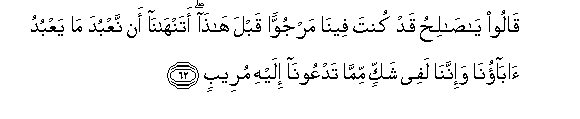
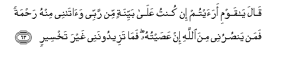
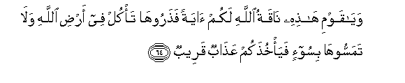
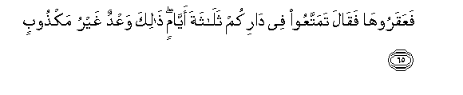
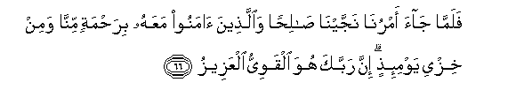

  
[Intangible Textual Heritage](../../index)  [Islam](../index) 
[Index](index)   
[Hypertext Qur'an](../htq/index)  [Unicode](../uq/011.htm#011_061) 
[Palmer](../sbe06/011)  [Pickthall](../pick/011.htm#011_061)  [Yusuf Ali
English](../yaq/yaq011)  [Rodwell](../qr/011)   
  
[Sūra XI.: Hūd (The Prophet Hūd). Index](011)  
  [Previous](01105)  [Next](01107) 

------------------------------------------------------------------------

  
*The Holy Quran*, tr. by Yusuf Ali, \[1934\], at Intangible Textual
Heritage

------------------------------------------------------------------------

# Sūra XI.: Hūd (The Prophet Hūd).

### Section 6

------------------------------------------------------------------------

61. Wa-il<u>a</u> thamooda akh<u>a</u>hum <u>sa</u>li<u>h</u>an
q<u>a</u>la y<u>a</u> qawmi oAAbudoo All<u>a</u>ha m<u>a</u> lakum min
il<u>a</u>hin ghayruhu huwa anshaakum mina al-ar<u>d</u>i
wa**i**staAAmarakum feeh<u>a</u> fa**i**staghfiroohu thumma tooboo
ilayhi inna rabbee qareebun mujeeb**un**

61\. To the Thamūd People  
(We sent) Sālih, one  
Of their own brethren.  
He said: "O my People!  
Worship God: ye have  
No other God but Him.  
It is He Who hath produced you  
From the earth and settled you  
Therein: then ask forgiveness  
Of Him, and turn to Him  
(In repentance): for my Lord  
Is (always) near, ready  
To answer."

------------------------------------------------------------------------

62. Q<u>a</u>loo y<u>a</u> <u>sa</u>li<u>h</u>u qad kunta feen<u>a</u>
marjuwwan qabla h<u>atha</u> atanh<u>a</u>n<u>a</u> an naAAbuda
m<u>a</u> yaAAbudu <u>a</u>b<u>a</u>on<u>a</u> wa-innan<u>a</u> lafee
shakkin mimm<u>a</u> tadAAoon<u>a</u> ilayhi mureeb**un**

62\. They said: "O Sālib!  
Thou hast been of us!—  
A centre of our hopes  
Hitherto! Dost thou (now)  
Forbid us the worship  
Of what our fathers worshipped?  
But we are really  
In suspicious (disquieting)  
Doubt as to that to which  
Thou invitest us."

------------------------------------------------------------------------

63. Q<u>a</u>la y<u>a</u> qawmi araaytum in kuntu AAal<u>a</u>
bayyinatin min rabbee wa<u>a</u>t<u>a</u>nee minhu ra<u>h</u>matan faman
yan<u>s</u>urunee mina All<u>a</u>hi in AAa<u>s</u>aytuhu fam<u>a</u>
tazeedoonanee ghayra takhseer**in**

63\. He said: "O my people!  
Do ye see?—If I have  
A Clear (Sign) from my Lord  
And He hath sent Mercy  
Unto me from Himself,—who  
Then can help me  
Against God if I were  
To disobey Him? What  
Then would ye add  
To my (portion) but perdition?

------------------------------------------------------------------------

64. Way<u>a</u> qawmi h<u>ath</u>ihi n<u>a</u>qatu All<u>a</u>hi lakum
<u>a</u>yatan fa<u>th</u>arooh<u>a</u> ta/kul fee ar<u>d</u>i
All<u>a</u>hi wal<u>a</u> tamassooh<u>a</u> bisoo-in
faya/khu<u>th</u>akum AAa<u>tha</u>bun qareeb**un**

64\. "And O my people!  
This she-camel of God is  
A symbol to you:  
Leave her to feed  
On God's (free) earth,  
And inflict no harm  
On her, or a swift Penalty  
Will seize you!"

------------------------------------------------------------------------

65. FaAAaqarooh<u>a</u> faq<u>a</u>la tamattaAAoo fee d<u>a</u>rikum
thal<u>a</u>thata ayy<u>a</u>min <u>tha</u>lika waAAdun ghayru
mak<u>th</u>oob**in**

65\. But they did ham-string her.  
So he said: "Enjoy yourselves  
In your homes for three days:  
(Then will be your ruin):  
(Behold) there a promise  
Not to be belied!"

------------------------------------------------------------------------

66. Falamm<u>a</u> j<u>a</u>a amrun<u>a</u> najjayn<u>a</u>
<u>sa</u>li<u>h</u>an wa**a**lla<u>th</u>eena <u>a</u>manoo maAAahu
bira<u>h</u>matin minn<u>a</u> wamin khizyi yawmi-i<u>th</u>in inna
rabbaka huwa alqawiyyu alAAazeez**u**

66\. When Our Decree issued,  
We saved Sālib and those  
Who believed with him,  
By (special) Grace from  
Ourselves—  
And from the Ignominy  
Of that Day. For thy Lord—  
He is the Strong One, and Able  
To enforce His Will.

------------------------------------------------------------------------

67. Waakha<u>th</u>a alla<u>th</u>eena *<u>th</u>*alamoo
a**l**<u>ss</u>ay<u>h</u>atu faa<u>s</u>ba<u>h</u>oo fee
diy<u>a</u>rihim j<u>a</u>thimeen**a**

67\. The (mighty) Blast overtook  
The wrong-doers, and they  
Lay prostrate in their homes  
Before the morning,—

------------------------------------------------------------------------

68. Kaan lam yaghnaw feeh<u>a</u> al<u>a</u> inna thamooda kafaroo
rabbahum al<u>a</u> buAAdan lithamood**a**

68\. As if they had never  
Dwelt and flourished there.  
Ah! Behold! For the Thamūd  
Rejected their Lord and Cherisher!  
Ah! Behold! Removed  
(From sight) were the Thamūd!

------------------------------------------------------------------------

[Next: Section 7 (69-83)](01107)

