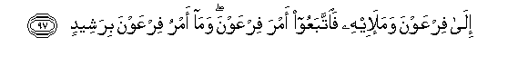
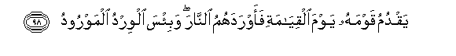
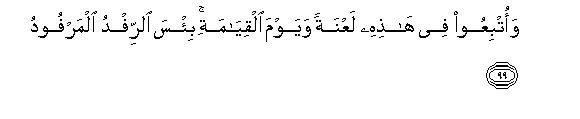
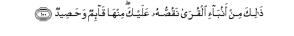
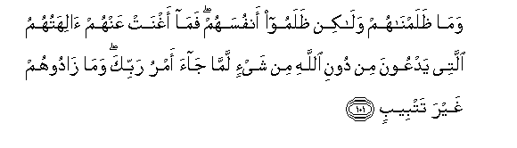
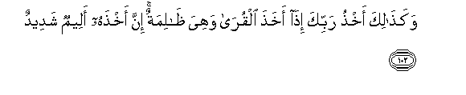
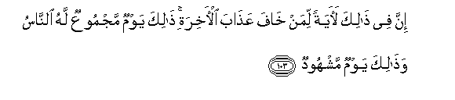
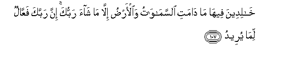
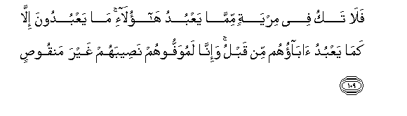

  
[Intangible Textual Heritage](../../index)  [Islam](../index) 
[Index](index)   
[Hypertext Qur'an](../htq/index)  [Unicode](../uq/011.htm#011_096) 
[Palmer](../sbe06/011)  [Pickthall](../pick/011.htm#011_096)  [Yusuf Ali
English](../yaq/yaq011)  [Rodwell](../qr/011)   
  
[Sūra XI.: Hūd (The Prophet Hūd). Index](011)  
  [Previous](01108)  [Next](01110) 

------------------------------------------------------------------------

  
*The Holy Quran*, tr. by Yusuf Ali, \[1934\], at Intangible Textual
Heritage

------------------------------------------------------------------------

# Sūra XI.: Hūd (The Prophet Hūd).

### Section 9

------------------------------------------------------------------------

96. Walaqad arsaln<u>a</u> moos<u>a</u> bi-<u>a</u>y<u>a</u>tin<u>a</u>
wasul<u>ta</u>nin mubeen**in**

96\. And we sent Moses,  
With our Clear (signs)  
And an authority manifest,

------------------------------------------------------------------------

97. Il<u>a</u> firAAawna wamala-ihi fa**i**ttabaAAoo amra firAAawna
wam<u>a</u> amru firAAawna birasheed**in**

97\. Unto Pharaoh and his Chiefs:  
But they followed the command  
Of Pharaoh, and the command  
Of Pharaoh was no right (guide).

------------------------------------------------------------------------

98. Yaqdumu qawmahu yawma alqiy<u>a</u>mati faawradahumu
a**l**nn<u>a</u>ra wabi/sa alwirdu almawrood**u**

98\. He will go before his people  
On the Day of Judgment,  
And lead them into the Fire  
(As cattle are led to water):  
But woeful indeed will be  
The place to which they are led!

------------------------------------------------------------------------

99. WaotbiAAoo fee h<u>ath</u>ihi laAAnatan wayawma alqiy<u>a</u>mati
bi/sa a**l**rrifdu almarfood**u**

99\. And they are followed  
By a curse in this (life)  
And on the Day of Judgment:  
And woeful is the gift  
Which shall be given  
(Unto them)!

------------------------------------------------------------------------

100. <u>Tha</u>lika min anb<u>a</u>-i alqur<u>a</u> naqu<u>ss</u>uhu
AAalayka minh<u>a</u> q<u>a</u>-imun wa<u>h</u>a<u>s</u>eed**un**

100\. These are some of the stories  
Of communities which We  
Relate unto thee: of them  
Some are standing, and some  
Have been mown down  
(By the sickle of time.

------------------------------------------------------------------------

101. Wam<u>a</u> *<u>th</u>*alamn<u>a</u>hum wal<u>a</u>kin
*<u>th</u>*alamoo anfusahum fam<u>a</u> aghnat AAanhum
<u>a</u>lihatuhumu allatee yadAAoona min dooni All<u>a</u>hi min shay-in
lamm<u>a</u> j<u>a</u>a amru rabbika wam<u>a</u> z<u>a</u>doohum ghayra
tatbeeb**in**

101\. It was not We that wronged them:  
They wronged their own souls:  
The deities, other than God,  
Whom they invoked, profited them  
No whit when there issued  
The decree of thy Lord:  
Nor did they add aught  
(To their lot) but perdition!

------------------------------------------------------------------------

102. Waka<u>tha</u>lika akh<u>th</u>u rabbika i<u>tha</u> akha<u>th</u>a
alqur<u>a</u> wahiya *<u>th</u>*<u>a</u>limatun inna akh<u>th</u>ahu
aleemun shadeed**un**

102\. Such is the chastisement  
Of thy Lord when He chastises  
Communities in the midst of  
Their wrong: grievous, indeed,  
And severe is His chastisement.

------------------------------------------------------------------------

103. Inna fee <u>tha</u>lika la<u>a</u>yatan liman kh<u>a</u>fa
AAa<u>tha</u>ba al-<u>a</u>khirati <u>tha</u>lika yawmun majmooAAun lahu
a**l**nn<u>a</u>su wa<u>tha</u>lika yawmun mashhoodun

103\. In that is a Sign  
For those who fear  
The Penalty of the Hereafter:  
That is a Day for which mankind  
Will be gathered together:  
That will be a Day  
Of Testimony.

------------------------------------------------------------------------

104. Wam<u>a</u> nu-akhkhiruhu ill<u>a</u> li-ajalin maAAdood**in**

104\. Nor shall We delay it  
But for a term appointed.

------------------------------------------------------------------------

105. Yawma ya/ti l<u>a</u> takallamu nafsun ill<u>a</u>
bi-i<u>th</u>nihi faminhum shaqiyyun wasaAAeed**in**

105\. The day it arrives,  
No soul shall speak  
Except by His leave:  
Of those (gathered) some  
Will be wretched and some  
Will be blessed.

------------------------------------------------------------------------

106. Faamm<u>a</u> alla<u>th</u>eena shaqoo fafee a**l**nn<u>a</u>ri
lahum feeh<u>a</u> zafeerun washaheeq**un**

106\. Those who are wretched  
Shall be in the Fire:  
There will be for them  
Therein (nothing but) the heaving  
Of sighs and sobs:

------------------------------------------------------------------------

107. Kh<u>a</u>lideena feeh<u>a</u> m<u>a</u> d<u>a</u>mati
a**l**ssam<u>a</u>w<u>a</u>tu wa**a**l-ar<u>d</u>u ill<u>a</u> m<u>a</u>
sh<u>a</u>a rabbuka inna rabbaka faAAAA<u>a</u>lun lim<u>a</u>
yureed**u**

107\. They will dwell therein  
For all the time that  
The heavens and the earth  
Endure, except as thy Lord  
Willeth: for thy Lord  
Is the (sure) Accomplisher  
Of what He planneth.

------------------------------------------------------------------------

108. Waamm<u>a</u> alla<u>th</u>eena suAAidoo fafee aljannati
kh<u>a</u>lideena feeh<u>a</u> m<u>a</u> d<u>a</u>mati
a**l**ssam<u>a</u>w<u>a</u>tu wa**a**l-ar<u>d</u>u ill<u>a</u> m<u>a</u>
sh<u>a</u>a rabbuka AAa<u>ta</u>an ghayra maj<u>th</u>oo<u>th</u>**in**

108\. And those who are blessed  
Shall be in the Garden:  
They will dwell therein  
For all the time that  
The heavens and the earth  
Endure, except as thy Lord  
Willeth: a gift without break.

------------------------------------------------------------------------

109. Fal<u>a</u> taku fee miryatin mimm<u>a</u> yaAAbudu
h<u>a</u>ol<u>a</u>-i m<u>a</u> yaAAbudoona ill<u>a</u> kam<u>a</u>
yaAAbudu <u>a</u>b<u>a</u>ohum min qablu wa-inn<u>a</u> lamuwaffoohum
na<u>s</u>eebahum ghayra manqoo<u>s</u>**in**

109\. Be not then in doubt  
As to what these men  
Worship. They worship nothing  
But what their fathers worshipped  
Before (them): but verily  
We shall pay them back  
(In full) their portion  
Without (the least) abatement.

------------------------------------------------------------------------

[Next: Section 10 (110-123)](01110)

