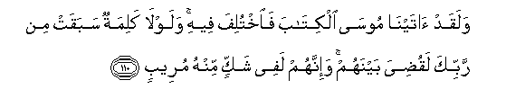
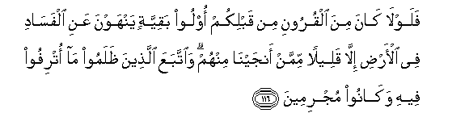

  
[Intangible Textual Heritage](../../index)  [Islam](../index.md) 
[Index](index.md)   
[Hypertext Qur'an](../htq/index)  [Unicode](../uq/011.htm#011_110.md) 
[Palmer](../sbe06/011)  [Pickthall](../pick/011.htm#011_110.md)  [Yusuf Ali
English](../yaq/yaq011)  [Rodwell](../qr/011.md)   
  
[Sūra XI.: Hūd (The Prophet Hūd). Index](011.md)  
  [Previous](01109)  [Next](01201.md) 

------------------------------------------------------------------------

  
*The Holy Quran*, tr. by Yusuf Ali, \[1934\], at Intangible Textual
Heritage

------------------------------------------------------------------------

# Sūra XI.: Hūd (The Prophet Hūd).

### Section 10

------------------------------------------------------------------------

110. Walaqad <u>a</u>tayn<u>a</u> moos<u>a</u> alkit<u>a</u>ba
fa**i**khtulifa feehi walawl<u>a</u> kalimatun sabaqat min rabbika
laqu<u>d</u>iya baynahum wa-innahum lafee shakkin minhu mureeb**un**

110\. We certainly gave the Book  
To Moses, but differences  
Arose therein: had it not been  
That a Word had gone forth  
Before from thy Lord, the matter  
Would have been decided  
Between them: but they  
Are in suspicious doubt  
Concerning it.

------------------------------------------------------------------------

111. Wa-inna kullan lamm<u>a</u> layuwaffiyannahum rabbuka
aAAm<u>a</u>lahum innahu bim<u>a</u> yaAAmaloona khabeer**un**

111\. And, of a surety, to all  
Will your Lord pay back  
(In full the recompense)  
Of their deeds: for He  
Knoweth well all that they do.

------------------------------------------------------------------------

112. Fa**i**staqim kam<u>a</u> omirta waman t<u>a</u>ba maAAaka
wal<u>a</u> ta<u>t</u>ghaw innahu bim<u>a</u> taAAmaloona
ba<u>s</u>eer**un**

112\. Therefore stand firm (in the straight  
Path) as thou art commanded,—  
Thou and those who with thee  
Turn (unto God); and transgress not  
(From the Path): for He seeth  
Well all that ye do.

------------------------------------------------------------------------

113. Wal<u>a</u> tarkanoo il<u>a</u> alla<u>th</u>eena *<u>th</u>*alamoo
fatamassakumu a**l**nn<u>a</u>ru wam<u>a</u> lakum min dooni
All<u>a</u>hi min awliy<u>a</u>a thumma l<u>a</u> tun<u>s</u>aroon**a**

113\. And incline not to those  
Who do wrong, or the Fire  
Will seize you; and ye have  
No protectors other than God,  
Nor shall ye be helped.

------------------------------------------------------------------------

114. Waaqimi a**l**<u>ss</u>al<u>a</u>ta <u>t</u>arafayi
a**l**nnah<u>a</u>ri wazulafan mina allayli inna
al<u>h</u>asan<u>a</u>ti yu<u>th</u>hibna a**l**ssayyi-<u>a</u>ti
<u>tha</u>lika <u>th</u>ikr<u>a</u> li**l**<u>ththa</u>kireen**a**

114\. And establish regular prayers  
At the two ends of the day  
And at the approaches of the night:  
For those things that are good  
Remove those that are evil:  
Be that the word of remembrance  
To those who remember (their Lord):

------------------------------------------------------------------------

115. Wa**i**<u>s</u>bir fa-inna All<u>a</u>ha l<u>a</u> yu<u>d</u>eeAAu
ajra almu<u>h</u>sineen**a**

115\. And be steadfast in patience;  
For verily God will not suffer  
The reward of the righteous  
To perish.

------------------------------------------------------------------------

116. Falawl<u>a</u> k<u>a</u>na mina alqurooni min qablikum oloo
baqiyyatin yanhawna AAani alfas<u>a</u>di fee al-ar<u>d</u>i ill<u>a</u>
qaleelan mimman anjayn<u>a</u> minhum wa**i**ttabaAAa alla<u>th</u>eena
*<u>th</u>*alamoo m<u>a</u> otrifoo feehi wak<u>a</u>noo mujrimeen**a**

116\. Why were there not,  
Among the generations before you,  
Persons possessed of balanced  
Good sense, prohibiting (men)  
From mischief in the earth—  
Except a few among them  
Whom We saved (from harm)?  
But the wrong-doers pursued  
The enjoyment of the good things  
Of life which were given them,  
And persisted in sin.

------------------------------------------------------------------------

117. Wam<u>a</u> k<u>a</u>na rabbuka liyuhlika alqur<u>a</u>
bi*<u>th</u>*ulmin waahluh<u>a</u> mu<u>s</u>li<u>h</u>oon**a**

117\. Nor would thy Lord be  
The One to destroy  
Communities for a single wrong-doing,  
If its members were likely  
To mend.

------------------------------------------------------------------------

118. Walaw sh<u>a</u>a rabbuka lajaAAala a**l**nn<u>a</u>sa ommatan
w<u>ah</u>idatan wal<u>a</u> yaz<u>a</u>loona mukhtalifeen**a**

118\. If thy Lord had so willed,  
He could have made mankind  
One People: but they  
Will not cease to dispute,

------------------------------------------------------------------------

119. Ill<u>a</u> man ra<u>h</u>ima rabbuka wali<u>tha</u>lika khalaqahum
watammat kalimatu rabbika laamlaanna jahannama mina aljinnati
wa**al**nn<u>a</u>si ajmaAAeen**a**

119\. Except those on whom thy Lord  
Hath bestowed His Mercy:  
And for this did He create  
Them: and the Word  
Of thy Lord shall be fulfilled:  
"I will fill Hell with jinns  
And men all together."

------------------------------------------------------------------------

120. Wakullan naqu<u>ss</u>u AAalayka min anb<u>a</u>-i a**l**rrusuli
m<u>a</u> nuthabbitu bihi fu-<u>a</u>daka waj<u>a</u>aka fee
h<u>ath</u>ihi al<u>h</u>aqqu wamawAAi*<u>th</u>*atun
wa<u>th</u>ikr<u>a</u> lilmu/mineen**a**

120\. All that we relate to thee  
Of the stories of the apostles,—  
With it We make firm  
Thy heart: in them there cometh  
To thee the Truth, as well as  
An exhortation and a message  
Of remembrance to those who believe.

------------------------------------------------------------------------

121. Waqul lilla<u>th</u>eena l<u>a</u> yu/minoona iAAmaloo AAal<u>a</u>
mak<u>a</u>natikum inn<u>a</u> AA<u>a</u>miloon**a**

121\. Say to those who do not  
Believe: "Do whatever ye can:  
We shall do our part;

------------------------------------------------------------------------

122. Wa**i**nta*<u>th</u>*iroo inn<u>a</u> munta*<u>th</u>*iroon**a**

122\. "And wait ye!  
We too shall wait."

------------------------------------------------------------------------

123. Walill<u>a</u>hi ghaybu a**l**ssam<u>a</u>w<u>a</u>ti
wa**a**l-ar<u>d</u>i wa-ilayhi yurjaAAu al-amru kulluhu fa**o**AAbudhu
watawakkal AAalayhi wam<u>a</u> rabbuka bigh<u>a</u>filin AAamm<u>a</u>
taAAmaloon**a**

123\. To God do belong  
The unseen (secrets)  
Of the heavens and the earth,  
And to Him goeth back  
Every affair (for decision)  
Then worship Him,  
And put thy trust in Him .  
And thy Lord is not  
Unmindful of aught  
That ye do.

------------------------------------------------------------------------

[Next: Section 1 (1-6)](01201.md)

