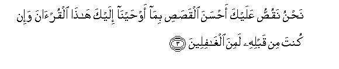
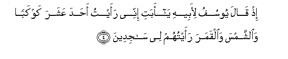
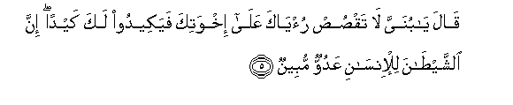
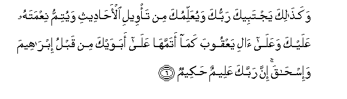

  
[Intangible Textual Heritage](../../index)  [Islam](../index.md) 
[Index](index.md)   
[Hypertext Qur'an](../htq/index)  [Unicode](../uq/012.htm#012_001.md) 
[Palmer](../sbe06/012)  [Pickthall](../pick/012.htm#012_001.md)  [Yusuf Ali
English](../yaq/yaq012)  [Rodwell](../qr/012.md)   
  
[Sūra XII.: Yūsuf, or Joseph. Index](012.md)  
  [Previous](01110)  [Next](01202.md) 

------------------------------------------------------------------------

  
*The Holy Quran*, tr. by Yusuf Ali, \[1934\], at Intangible Textual
Heritage

------------------------------------------------------------------------

# Sūra XII.: Yūsuf, or Joseph.

### Section 1

1. Alif-l<u>a</u>m-r<u>a</u> tilka <u>a</u>y<u>a</u>tu alkit<u>a</u>bi
almubeen**u**

1\. A. L. R. These are  
The Symbols (or Verses)  
Of the Perspicuous Book.

------------------------------------------------------------------------

2. Inn<u>a</u> anzaln<u>a</u>hu qur-<u>a</u>nan AAarabiyyan laAAallakum
taAAqiloon**a**

2\. We have sent it down  
As an Arabic Qur-ān,  
In order that ye may  
Learn wisdom.

------------------------------------------------------------------------

3. Na<u>h</u>nu naqu<u>ss</u>u AAalayka a<u>h</u>sana
alqa<u>s</u>a<u>s</u>i bim<u>a</u> aw<u>h</u>ayn<u>a</u> ilayka
h<u>atha</u> alqur-<u>a</u>na wa-in kunta min qablihi lamina
algh<u>a</u>fileen**a**

3\. We do relate unto thee  
The most beautiful of stories,  
In that We reveal to thee  
This (portion of the) Qur-ān:  
Before this, thou too  
Was among those  
Who knew it not.

------------------------------------------------------------------------

4. I<u>th</u> q<u>a</u>la yoosufu li-abeehi y<u>a</u> abati innee raaytu
a<u>h</u>ada AAashara kawkaban wa**al**shshamsa wa**a**lqamara raaytuhum
lee s<u>a</u>jideen**a**

4\. Behold, Joseph said  
To his father: "O my father!  
I did see eleven stars  
And the sun and the moon:  
I saw them prostrate themselves  
To me!"

------------------------------------------------------------------------

5. Q<u>a</u>la y<u>a</u> bunayya l<u>a</u> taq<u>s</u>u<u>s</u>
ru/y<u>a</u>ka AAal<u>a</u> ikhwatika fayakeedoo laka kaydan inna
a**l**shshay<u>ta</u>na lil-ins<u>a</u>ni AAaduwwun mubeen**un**

5\. Said (the father):  
"My (dear) little son!  
Relate not thy vision  
To thy brothers, lest they  
Concoct a plot against thee:  
For Satan is to man  
An avowed enemy!

------------------------------------------------------------------------

6. Waka<u>tha</u>lika yajtabeeka rabbuka wayuAAallimuka min ta/weeli
al-a<u>ha</u>deethi wayutimmu niAAmatahu AAalayka waAAal<u>a</u>
<u>a</u>li yaAAqooba kam<u>a</u> atammah<u>a</u> AAal<u>a</u> abawayka
min qablu ibr<u>a</u>heema wa-is<u>ha</u>qa inna rabbaka AAaleemun
<u>h</u>akeem**un**

6\. "Thus will thy Lord  
Choose thee and teach thee  
The interpretation of stories (and events)  
And perfect His favour  
To thee and to the posterity  
Of Jacob—even as He  
Perfected it to thy fathers  
Abraham and Isaac aforetime!  
For God is full of knowledge  
And wisdom."

------------------------------------------------------------------------

[Next: Section 2 (7-20)](01202.md)

