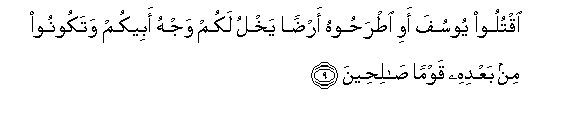
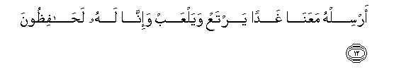
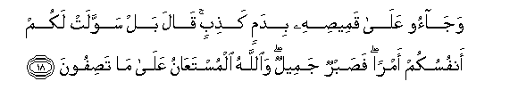
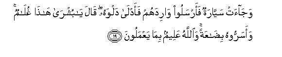

  
[Intangible Textual Heritage](../../index)  [Islam](../index) 
[Index](index)   
[Hypertext Qur'an](../htq/index)  [Unicode](../uq/012.htm#012_007) 
[Palmer](../sbe06/012)  [Pickthall](../pick/012.htm#012_007)  [Yusuf Ali
English](../yaq/yaq012)  [Rodwell](../qr/012)   
  
[Sūra XII.: Yūsuf, or Joseph. Index](012)  
  [Previous](01201)  [Next](01203) 

------------------------------------------------------------------------

  
*The Holy Quran*, tr. by Yusuf Ali, \[1934\], at Intangible Textual
Heritage

------------------------------------------------------------------------

# Sūra XII.: Yūsuf, or Joseph.

### Section 2

------------------------------------------------------------------------

7. Laqad k<u>a</u>na fee yoosufa wa-ikhwatihi <u>a</u>y<u>a</u>tun
li**l**ss<u>a</u>-ileen**a**

7\. Verily in Joseph and his brethren  
Are Signs (or Symbols)  
For Seekers (after Truth).

------------------------------------------------------------------------

8. I<u>th</u> q<u>a</u>loo layoosufu waakhoohu a<u>h</u>abbu il<u>a</u>
abeen<u>a</u> minn<u>a</u> wana<u>h</u>nu AAu<u>s</u>batun inna
ab<u>a</u>n<u>a</u> lafee <u>d</u>al<u>a</u>lin mubeen**in**

8\. They said: "Truly Joseph  
And his brother are loved  
More by our father than we:  
But we are a goodly body!  
Really our father is obviously  
Wandering (in his mind)!

------------------------------------------------------------------------

9. Oqtuloo yoosufa awi i<u>t</u>ra<u>h</u>oohu ar<u>d</u>an yakhlu lakum
wajhu abeekum watakoonoo min baAAdihi qawman <u>sa</u>li<u>h</u>een**a**

9\. "Slay ye Joseph or cast him out  
To some (unknown) land,  
That so the favour  
Of your father may be  
Given to you alone:  
(There will be time enough)  
For you to be righteous after that!"

------------------------------------------------------------------------

10. Q<u>a</u>la q<u>a</u>-ilun minhum l<u>a</u> taqtuloo yoosufa
waalqoohu fee ghay<u>a</u>bati aljubbi yaltaqi<u>t</u>hu baAA<u>d</u>u
a**l**ssayy<u>a</u>rati in kuntum f<u>a</u>AAileen**a**

10\. Said one of them: "Slay not  
Joseph, but if ye must  
Do something, throw him down  
To the bottom of the well:  
He will be picked up  
By some caravan of travellers."

------------------------------------------------------------------------

11. Q<u>a</u>loo y<u>a</u> ab<u>a</u>n<u>a</u> m<u>a</u> laka l<u>a</u>
ta/mann<u>a</u> AAal<u>a</u> yoosufa wa-inn<u>a</u> lahu
lan<u>as</u>i<u>h</u>oon**a**

11\. They said: "O our father!  
Why dost thou not  
Trust us with Joseph,  
Seeing we are indeed  
His sincere well-wishers?

------------------------------------------------------------------------

12. Arsilhu maAAan<u>a</u> ghadan yartaAA wayalAAab wa-inn<u>a</u> lahu
la<u>ha</u>fi*<u>th</u>*oon**a**

12\. "Send him with us tomorrow  
To enjoy himself and play,  
And we shall take  
Every care of him."

------------------------------------------------------------------------

13. Q<u>a</u>la innee laya<u>h</u>zununee an tha<u>th</u>haboo bihi
waakh<u>a</u>fu an ya/kulahu a**l**<u>thth</u>i/bu waantum AAanhu
gh<u>a</u>filoon**a**

13\. (Jacob) said: "Really  
It saddens me that ye  
Should take him away:  
I fear lest the wolf  
Should devour him  
While ye attend not  
To him."

------------------------------------------------------------------------

14. Q<u>a</u>loo la-in akalahu a**l**<u>thth</u>i/bu wana<u>h</u>nu
AAu<u>s</u>batun inn<u>a</u> i<u>th</u>an lakh<u>a</u>siroon**a**

14\. They said: "If the wolf  
Were to devour him  
While we are (so large) a party,  
Then should we indeed  
(First) have perished ourselves!"

------------------------------------------------------------------------

15. Falamm<u>a</u> <u>th</u>ahaboo bihi waajmaAAoo an yajAAaloohu fee
ghay<u>a</u>bati aljubbi waaw<u>h</u>ayn<u>a</u> ilayhi latunabi-annahum
bi-amrihim h<u>atha</u> wahum l<u>a</u> yashAAuroon**a**

15\. So they did take him away,  
And they all agreed  
To throw him down  
To the bottom of the well:  
And We put into his heart  
(This Message): "Of a surety  
Thou shalt (one day)  
Tell them the truth  
Of this their affair  
While they know (thee) not"

------------------------------------------------------------------------

16. Waj<u>a</u>oo ab<u>a</u>hum AAish<u>a</u>an yabkoon**a**

16\. Then they came  
To their father  
In the early part  
Of the night,  
Weeping.

------------------------------------------------------------------------

17. Q<u>a</u>loo y<u>a</u> ab<u>a</u>n<u>a</u> inn<u>a</u>
<u>th</u>ahabn<u>a</u> nastabiqu watarakn<u>a</u> yoosufa AAinda
mat<u>a</u>AAin<u>a</u> faakalahu a**l**<u>thth</u>i/bu wam<u>a</u> anta
bimu/minin lan<u>a</u> walaw kunn<u>a</u> <u>sa</u>diqeen**a**

17\. They said: "O our father!  
We went racing with one another,  
And left Joseph with our things;  
And the wolf devoured him.…  
But thou wilt never believe us  
Even though we tell the truth.

------------------------------------------------------------------------

18. Waj<u>a</u>oo AAal<u>a</u> qamee<u>s</u>ihi bidamin ka<u>th</u>ibin
q<u>a</u>la bal sawwalat lakum anfusukum amran fa<u>s</u>abrun jameelun
wa**A**ll<u>a</u>hu almustaAA<u>a</u>nu AAal<u>a</u> m<u>a</u>
ta<u>s</u>ifoon**a**

18\. They stained his shirt  
With false blood. He said:  
"Nay, but your minds  
Have made up a tale  
(That may pass) with you.  
(For me) patience is most fitting:  
Against that which ye assert,  
It is God (alone)  
Whose help can be sought"…

------------------------------------------------------------------------

19. Waj<u>a</u>at sayy<u>a</u>ratun faarsaloo w<u>a</u>ridahum
faadl<u>a</u> dalwahu q<u>a</u>la y<u>a</u> bushr<u>a</u> h<u>atha</u>
ghul<u>a</u>mun waasarroohu bi<u>da</u>AAatan wa**A**ll<u>a</u>hu
AAaleemun bim<u>a</u> yaAAmaloon**a**

19\. Then there came a caravan  
Of travellers: they sent  
Their water-carrier (for water),  
And he let down his bucket  
(Into the well)… He said:  
"Ah there! Good news!  
Here is a (fine) young man!"  
So they concealed him  
As a treasure! But God  
Knoweth well all that they do!

------------------------------------------------------------------------

20. Washarawhu bithamanin bakhsin dar<u>a</u>hima maAAdoodatin
wak<u>a</u>noo feehi mina a**l**zz<u>a</u>hideen**a**

20\. The (Brethren) sold him  
For a miserable price,—  
For a few dirhams counted out:  
In such low estimation  
Did they hold him!

------------------------------------------------------------------------

[Next: Section 3 (21-29)](01203)

