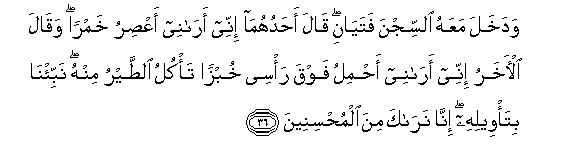
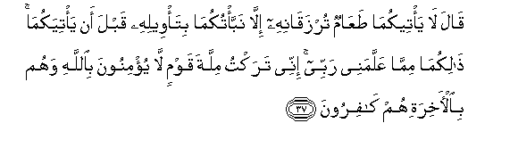
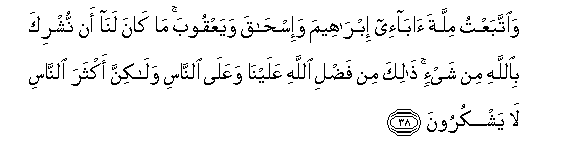
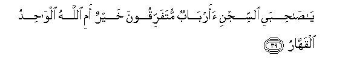
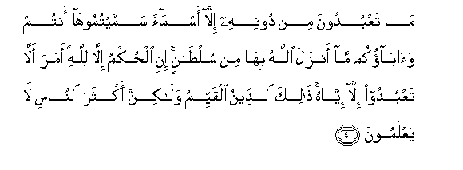
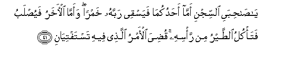
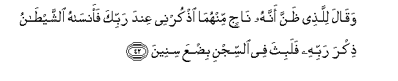

  
[Intangible Textual Heritage](../../index)  [Islam](../index) 
[Index](index)   
[Hypertext Qur'an](../htq/index)  [Unicode](../uq/012.htm#012_036) 
[Palmer](../sbe06/012)  [Pickthall](../pick/012.htm#012_036)  [Yusuf Ali
English](../yaq/yaq012)  [Rodwell](../qr/012)   
  
[Sūra XII.: Yūsuf, or Joseph. Index](012)  
  [Previous](01204)  [Next](01206) 

------------------------------------------------------------------------

  
*The Holy Quran*, tr. by Yusuf Ali, \[1934\], at Intangible Textual
Heritage

------------------------------------------------------------------------

# Sūra XII.: Yūsuf, or Joseph.

### Section 5

------------------------------------------------------------------------

36. Wadakhala maAAahu a**l**ssijna fatay<u>a</u>ni q<u>a</u>la
a<u>h</u>aduhum<u>a</u> innee ar<u>a</u>nee aAA<u>s</u>iru khamran
waq<u>a</u>la al-<u>a</u>kharu innee ar<u>a</u>nee a<u>h</u>milu fawqa
ra/see khubzan ta/kulu a**l**<u>tt</u>ayru minhu nabbi/n<u>a</u>
bita/weelihi inn<u>a</u> nar<u>a</u>ka mina almu<u>h</u>sineen**a**

36\. Now with him there came  
Into the prison two young men.  
Said one of them: "I see  
Myself (in a dream)  
Pressing wine." Said the other:  
"I see myself (in a dream)  
Carrying bread on my head,  
And birds are eating thereof."  
"Tell us" (they said) "the truth  
And meaning thereof: for we  
See thou art one  
That doth good (to all)."

------------------------------------------------------------------------

37. Q<u>a</u>la l<u>a</u> ya/teekum<u>a</u> <u>t</u>aAA<u>a</u>mun
turzaq<u>a</u>nihi ill<u>a</u> nabba/tukum<u>a</u> bita/weelihi qabla an
ya/tiyakum<u>a</u> <u>tha</u>likum<u>a</u> mimm<u>a</u> AAallamanee
rabbee innee taraktu millata qawmin l<u>a</u> yu/minoona
bi**A**ll<u>a</u>hi wahum bi**a**l-<u>a</u>khirati hum
k<u>a</u>firoon**a**

37\. He said: "Before any food  
Comes (in due course)  
To feed either of you,  
I will surely reveal  
To you the truth  
And meaning of this  
Ere it befall you  
That is part of the (Duty)  
Which my Lord hath taught me.  
I have (I assure you)  
Abandoned the ways  
Of a people that believe not  
In God and that (even)  
Deny the Hereafter.

------------------------------------------------------------------------

38. Wa**i**ttabaAAtu millata <u>a</u>b<u>a</u>-ee ibr<u>a</u>heema
wa-is<u>ha</u>qa wayaAAqooba m<u>a</u> k<u>a</u>na lan<u>a</u> an
nushrika bi**A**ll<u>a</u>hi min shay-in <u>tha</u>lika min fa<u>d</u>li
All<u>a</u>hi AAalayn<u>a</u> waAAal<u>a</u> a**l**nn<u>a</u>si
wal<u>a</u>kinna akthara a**l**nn<u>a</u>si l<u>a</u> yashkuroon**a**

38\. "And I follow the ways  
Of my fathers,—Abraham,  
Isaac, and Jacob; and never  
Could we attribute any partners  
Whatever to God: that (comes)  
Of the grace of God to us  
And to mankind: yet  
Most men are not grateful

------------------------------------------------------------------------

39. Y<u>a</u> <u>sah</u>ibayi a**l**ssijni aarb<u>a</u>bun
mutafarriqoona khayrun ami All<u>a</u>hu alw<u>ah</u>idu
alqahh<u>a</u>r**u**

39\. "O my two companions.  
Of the prison! (I ask you):  
Are many lords differing  
Among themselves better,  
Or the One God,  
Supreme and Irresistible?

------------------------------------------------------------------------

40. M<u>a</u> taAAbudoona min doonihi ill<u>a</u> asm<u>a</u>an
sammaytumooh<u>a</u> antum wa<u>a</u>b<u>a</u>okum m<u>a</u> anzala
All<u>a</u>hu bih<u>a</u> min sul<u>ta</u>nin ini al<u>h</u>ukmu
ill<u>a</u> lill<u>a</u>hi amara all<u>a</u> taAAbudoo ill<u>a</u>
iyy<u>a</u>hu <u>tha</u>lika a**l**ddeenu alqayyimu wal<u>a</u>kinna
akthara a**l**nn<u>a</u>si l<u>a</u> yaAAlamoon**a**

40\. "If not Him, ye worship nothing  
But names which ye have named,—  
Ye and your fathers,—  
For which God hath sent down  
No authority: the Command  
Is for none but God: He  
Hath commanded that ye worship  
None but Him: that is  
The right religion, but  
Most men understand not…

------------------------------------------------------------------------

41. Y<u>a</u> <u>sah</u>ibayi a**l**ssijni amm<u>a</u>
a<u>h</u>adukum<u>a</u> fayasqee rabbahu khamran waamm<u>a</u>
al-<u>a</u>kharu fayu<u>s</u>labu fata/kulu a**l**<u>tt</u>ayru min
ra/sihi qu<u>d</u>iya al-amru alla<u>th</u>ee feehi
tastaftiy<u>a</u>n**i**

41\. "O my two companions  
Of the prison! As to one  
Of you, he will pour out  
The wine for his lord to drink:  
As for the other, he will  
Hang from the cross, and the birds  
Will eat from off his head.  
(So) hath been decreed  
That matter whereof  
Ye twain do enquire"…

------------------------------------------------------------------------

42. Waq<u>a</u>la lilla<u>th</u>ee *<u>th</u>*anna annahu n<u>a</u>jin
minhum<u>a</u> o<u>th</u>kurnee AAinda rabbika faans<u>a</u>hu
a**l**shshay<u>ta</u>nu <u>th</u>ikra rabbihi falabitha fee a**l**ssijni
bi<u>d</u>AAa sineen**a**

42\. And of the two,  
To that one whom he considered  
About to be saved, he said:  
"Mention me to thy lord."  
But Satan made him forget  
To mention him to his lord:  
And (Joseph) lingered in prison  
A few (more) years.

------------------------------------------------------------------------

[Next: Section 6 (43-49)](01206)

