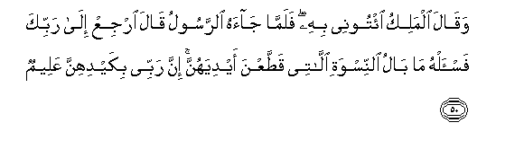
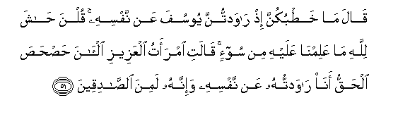
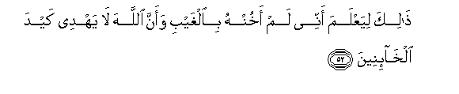
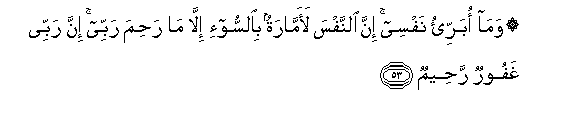

  
[Intangible Textual Heritage](../../index)  [Islam](../index) 
[Index](index)   
[Hypertext Qur'an](../htq/index)  [Unicode](../uq/012.htm#012_050) 
[Palmer](../sbe06/012)  [Pickthall](../pick/012.htm#012_050)  [Yusuf Ali
English](../yaq/yaq012)  [Rodwell](../qr/012)   
  
[Sūra XII.: Yūsuf, or Joseph. Index](012)  
  [Previous](01206)  [Next](01208) 

------------------------------------------------------------------------

  
*The Holy Quran*, tr. by Yusuf Ali, \[1934\], at Intangible Textual
Heritage

------------------------------------------------------------------------

# Sūra XII.: Yūsuf, or Joseph.

### Section 7

------------------------------------------------------------------------

50. Waq<u>a</u>la almaliku i/toonee bihi falamm<u>a</u> j<u>a</u>ahu
a**l**rrasoolu q<u>a</u>la irjiAA il<u>a</u> rabbika fa**i**s-alhu
m<u>a</u> b<u>a</u>lu a**l**nniswati all<u>a</u>tee qa<u>tt</u>aAAna
aydiyahunna inna rabbee bikaydihinna AAaleem**un**

50\. So the king said:  
"Bring ye him unto me."  
But when the messenger  
Came to him, (Joseph) said:  
"Go thou back to thy lord,  
And ask him, "What is  
The state of mind  
Of the ladies  
Who cut their hands?"  
For my Lord is  
Certainly well aware  
Of their snare."

------------------------------------------------------------------------

51. Q<u>a</u>la m<u>a</u> kha<u>t</u>bukunna i<u>th</u>
r<u>a</u>wadtunna yoosufa AAan nafsihi qulna <u>ha</u>sha lill<u>a</u>hi
m<u>a</u> AAalimn<u>a</u> AAalayhi min soo-in q<u>a</u>lati imraatu
alAAazeezi al-<u>a</u>na <u>h</u>a<u>sh</u>a<u>s</u>a al<u>h</u>aqqu
an<u>a</u> r<u>a</u>wadtuhu AAan nafsihi wa-innahu lamina
a**l**<u>ssa</u>diqeen**a**

51\. (The king) said (to the ladies):  
"What was your affair  
When ye did seek to seduce  
Joseph from his (true) self?"  
The ladies said: "God  
Preserve us! no evil  
Know we against him!"  
Said the ’Azīz's wife:  
"Now is the truth manifest  
(To all): it was I  
Who sought to seduce him  
From his (true) self:  
He is indeed of those  
Who are (ever) true (and virtuous).

------------------------------------------------------------------------

52. <u>Tha</u>lika liyaAAlama annee lam akhunhu bi**a**lghaybi waanna
All<u>a</u>ha l<u>a</u> yahdee kayda alkh<u>a</u>-ineen**a**

52\. "This (say I), in order that  
He may know that I  
Have never been false  
To him in his absence,  
And that God will never  
Guide the snare of the false ones.

------------------------------------------------------------------------

53. Wam<u>a</u> obarri-o nafsee inna a**l**nnafsa laamm<u>a</u>ratun
bi**al**ssoo-i ill<u>a</u> m<u>a</u> ra<u>h</u>ima rabbee inna rabbee
ghafoorun ra<u>h</u>eem**un**

53\. "Nor do I absolve my own self  
(Of blame): the (human) soul  
Is certainly prone to evil,  
Unless my Lord do bestow  
His Mercy: but surely  
My Lord is Oft-Forgiving,  
Most Merciful."

------------------------------------------------------------------------

54. Waq<u>a</u>la almaliku i/toonee bihi astakhli<u>s</u>hu linafsee
falamm<u>a</u> kallamahu q<u>a</u>la innaka alyawma ladayn<u>a</u>
makeenun ameen**un**

54\. So the king said:  
"Bring him unto me;  
I will take him specially  
To serve about my own person."  
Therefore when he had spoken  
To him, he said:  
"Be assured this day,  
Thou art, before our own Presence,  
With rank firmly established,  
And fidelity fully proved!

------------------------------------------------------------------------

55. Q<u>a</u>la ijAAalnee AAal<u>a</u> khaz<u>a</u>-ini al-ar<u>d</u>i
innee <u>h</u>afee*<u>th</u>*un AAaleem**un**

55\. (Joseph) said: "Set me  
Over the store-houses  
Of the land: I will  
Indeed guard them,  
As one that knows  
(Their importance)."

------------------------------------------------------------------------

56. Waka<u>tha</u>lika makann<u>a</u> liyoosufa fee al-ar<u>d</u>i
yatabawwao minh<u>a</u> <u>h</u>aythu yash<u>a</u>o nu<u>s</u>eebu
bira<u>h</u>matin<u>a</u> man nash<u>a</u>o wal<u>a</u> nu<u>d</u>eeAAu
ajra almu<u>h</u>sineen**a**

56\. "Thus did we give  
Established power to Joseph  
In the land, to take possession  
Therein as, when, or where  
He pleased. We bestow  
Of Our mercy on whom  
We please, and We suffer not,  
To be lost, the reward  
Of those who do good.

------------------------------------------------------------------------

57. Walaajru al-<u>a</u>khirati khayrun lilla<u>th</u>eena <u>a</u>manoo
wak<u>a</u>noo yattaqoon**a**

57\. But verily the reward  
Of the Hereafter  
Is the best, for those  
Who believe, and are constant  
In righteousness.

------------------------------------------------------------------------

[Next: Section 8 (58-68)](01208)

