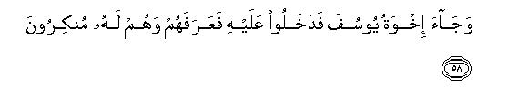
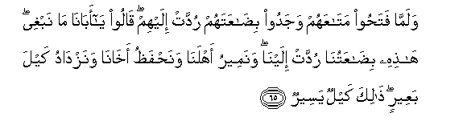
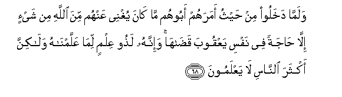

  
[Intangible Textual Heritage](../../index)  [Islam](../index.md) 
[Index](index.md)   
[Hypertext Qur'an](../htq/index)  [Unicode](../uq/012.htm#012_058.md) 
[Palmer](../sbe06/012)  [Pickthall](../pick/012.htm#012_058.md)  [Yusuf Ali
English](../yaq/yaq012)  [Rodwell](../qr/012.md)   
  
[Sūra XII.: Yūsuf, or Joseph. Index](012.md)  
  [Previous](01207)  [Next](01209.md) 

------------------------------------------------------------------------

  
*The Holy Quran*, tr. by Yusuf Ali, \[1934\], at Intangible Textual
Heritage

------------------------------------------------------------------------

# Sūra XII.: Yūsuf, or Joseph.

### Section 8

------------------------------------------------------------------------

58. Waj<u>a</u>a ikhwatu yoosufa fadakhaloo AAalayhi faAAarafahum wahum
lahu munkiroon**a**

58\. Then came Joseph's brethren:  
They entered his presence,  
And he knew them,  
But they knew him not.

------------------------------------------------------------------------

59. Walamm<u>a</u> jahhazahum bijah<u>a</u>zihim q<u>a</u>la i/toonee
bi-akhin lakum min abeekum al<u>a</u> tarawna annee oofee alkayla
waan<u>a</u> khayru almunzileen**a**

59\. And when he had furnished  
Them forth with provisions  
(Suitable) for them, he said:  
"Bring unto me a brother  
Ye have, of the same father  
As yourselves, (but a different mother):  
See ye not that I pay out  
Full measure, and that I  
Do provide the best hospitality?

------------------------------------------------------------------------

60. Fa-in lam ta/toonee bihi fal<u>a</u> kayla lakum AAindee wal<u>a</u>
taqraboon**i**

60\. "Now if ye bring him not  
To me, ye shall have  
No measure (of corn) from me,  
Nor shall ye (even) come  
Near me."

------------------------------------------------------------------------

61. Q<u>a</u>loo sanur<u>a</u>widu AAanhu ab<u>a</u>hu wa-inn<u>a</u>
laf<u>a</u>AAiloon**a**

61\. They said: "We shall  
Certainly seek to get  
Our wish about him  
From his father:  
Indeed we shall do it."

------------------------------------------------------------------------

62. Waq<u>a</u>la lifity<u>a</u>nihi ijAAaloo bi<u>da</u>AAatahum fee
ri<u>ha</u>lihim laAAallahum yaAArifoonah<u>a</u> i<u>tha</u> inqalaboo
il<u>a</u> ahlihim laAAallahum yarjiAAoon**a**

62\. And (Joseph) told his servants  
To put their stock-in-trade  
(With which they had bartered)  
Into their saddle-bags,  
So they should know it only  
When they returned to their people,  
In order that they  
Might come back.

------------------------------------------------------------------------

63. Falamm<u>a</u> rajaAAoo il<u>a</u> abeehim q<u>a</u>loo y<u>a</u>
ab<u>a</u>n<u>a</u> muniAAa minn<u>a</u> alkaylu faarsil maAAan<u>a</u>
akh<u>a</u>n<u>a</u> naktal wa-inn<u>a</u> lahu
la<u>ha</u>fi*<u>th</u>*oon**a**

63\. Now when they returned  
To their father, they said:  
"O our father! No more  
Measure of grain shall we get  
(Unless we take our brother):  
So send our brother with us,  
That we may get our measure;  
And we will indeed  
Take every care of him."

------------------------------------------------------------------------

64. Q<u>a</u>la hal <u>a</u>manukum AAalayhi ill<u>a</u> kam<u>a</u>
amintukum AAal<u>a</u> akheehi min qablu fa**A**ll<u>a</u>hu khayrun
<u>ha</u>fi*<u>th</u>*an wahuwa ar<u>h</u>amu
a**l**rr<u>ah</u>imeen**a**

64\. He said: "Shall I trust you  
With him with any result  
Other than when I trusted you  
With his brother aforetime?  
But God is the best  
To take care (of him),  
And He is the Most Merciful  
Of those who show mercy!"

------------------------------------------------------------------------

65. Walamm<u>a</u> fata<u>h</u>oo mat<u>a</u>AAahum wajadoo
bi<u>da</u>AAatahum ruddat ilayhim q<u>a</u>loo y<u>a</u>
ab<u>a</u>n<u>a</u> m<u>a</u> nabghee h<u>ath</u>ihi
bi<u>da</u>AAatun<u>a</u> ruddat ilayn<u>a</u> wanameeru ahlan<u>a</u>
wana<u>h</u>fa*<u>th</u>*u akh<u>a</u>n<u>a</u> wanazd<u>a</u>du kayla
baAAeerin <u>tha</u>lika kaylun yaseer**un**

65\. Then when they opened  
Their baggage, they found  
Their stock-in-trade had been  
Returned to them. They said:  
"O our father! What (more)  
Can we desire? This our  
Stock-in-trade has been returned  
To us: so we shall get  
(More) food for our family;  
We shall take care of our brother;  
And add (at the same time)  
A full camel's load (of grain  
To our provisions).  
This is but a small quantity.

------------------------------------------------------------------------

66. Q<u>a</u>la lan orsilahu maAAakum <u>h</u>att<u>a</u> tu/tooni
mawthiqan mina All<u>a</u>hi lata/tunnanee bihi ill<u>a</u> an
yu<u>hat</u>a bikum falamm<u>a</u> <u>a</u>tawhu mawthiqahum q<u>a</u>la
All<u>a</u>hu AAal<u>a</u> m<u>a</u> naqoolu wakeel**un**

66\. (Jacob) said: "Never will I  
Send him with you until  
Ye swear a solemn oath to me,  
In God's name, that ye  
Will be sure to bring him back  
To me unless ye are yourselves  
Hemmed in (and made powerless)."  
And when they had sworn  
Their solemn oath,  
He said: "Over all  
That we say, be God  
The Witness and Guardian!"

------------------------------------------------------------------------

67. Waq<u>a</u>la y<u>a</u> baniyya l<u>a</u> tadkhuloo min b<u>a</u>bin
w<u>ah</u>idin wa**o**dkhuloo min abw<u>a</u>bin mutafarriqatin
wam<u>a</u> oghnee AAankum mina All<u>a</u>hi min shay-in ini
al<u>h</u>ukmu ill<u>a</u> lill<u>a</u>hi AAalayhi tawakkaltu waAAalayhi
falyatawakkali almutawakkiloon**a**

67\. Further he said:  
"O my sons! enter not  
All by one gate: enter ye  
By different gates. Not that  
I can profit you aught  
Against God (with my advice):  
None can command except God:  
On Him do I put my trust:  
And let all that trust  
Put their trust on Him."

------------------------------------------------------------------------

68. Walamm<u>a</u> dakhaloo min <u>h</u>aythu amarahum aboohum m<u>a</u>
k<u>a</u>na yughnee AAanhum mina All<u>a</u>hi min shay-in ill<u>a</u>
<u>ha</u>jatan fee nafsi yaAAqooba qa<u>da</u>h<u>a</u> wa-innahu
la<u>th</u>oo AAilmin lim<u>a</u> AAallamn<u>a</u>hu wal<u>a</u>kinna
akthara a**l**nn<u>a</u>si l<u>a</u> yaAAlamoon**a**

68\. And when they entered  
In the manner their father  
Had enjoined, it did not  
Profit them in the least  
Against (the Plan of) God:  
It was but a necessity  
Of Jacob's soul, which he  
Discharged. For he was,  
By Our instruction, full  
Of knowledge (and experience):  
But most men know not.

------------------------------------------------------------------------

[Next: Section 9 (69-79)](01209.md)

