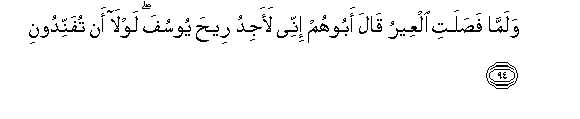
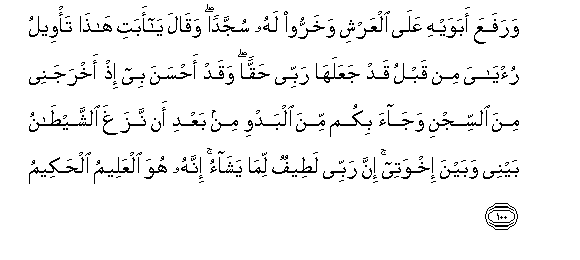
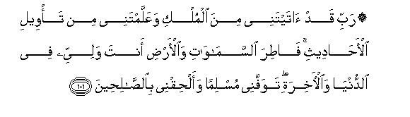
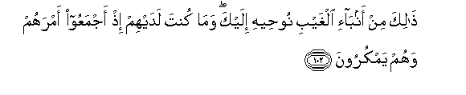
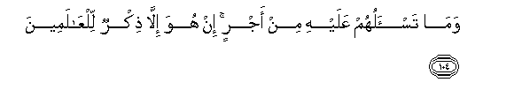

  
[Intangible Textual Heritage](../../index)  [Islam](../index) 
[Index](index)   
[Hypertext Qur'an](../htq/index)  [Unicode](../uq/012.htm#012_094) 
[Palmer](../sbe06/012)  [Pickthall](../pick/012.htm#012_094)  [Yusuf Ali
English](../yaq/yaq012)  [Rodwell](../qr/012)   
  
[Sūra XII.: Yūsuf, or Joseph. Index](012)  
  [Previous](01210)  [Next](01212) 

------------------------------------------------------------------------

  
*The Holy Quran*, tr. by Yusuf Ali, \[1934\], at Intangible Textual
Heritage

------------------------------------------------------------------------

# Sūra XII.: Yūsuf, or Joseph.

### Section 11

------------------------------------------------------------------------

94. Walamm<u>a</u> fa<u>s</u>alati alAAeeru q<u>a</u>la aboohum innee
laajidu ree<u>h</u>a yoosufa lawl<u>a</u> an tufannidoon**i**

94\. When the Caravan left (Egypt),  
Their father said: "I do indeed  
Scent the presence of Joseph:  
Nay, think me not a dotard."

------------------------------------------------------------------------

95. Q<u>a</u>loo ta**A**ll<u>a</u>hi innaka lafee <u>d</u>al<u>a</u>lika
alqadeem**i**

95\. They said: "By God!  
Truly thou art in  
Thine old wandering mind."

------------------------------------------------------------------------

96. Falamm<u>a</u> an j<u>a</u>a albasheeru alq<u>a</u>hu AAal<u>a</u>
wajhihi fa**i**rtadda ba<u>s</u>eeran q<u>a</u>la alam aqul lakum innee
aAAlamu mina All<u>a</u>hi m<u>a</u> l<u>a</u> taAAlamoon**a**

96\. Then when the bearer  
Of the good news came,  
He cast (the shirt)  
Over his face, and he  
Forthwith regained clear sight.  
He said: "Did I not say  
To you, "I know from God  
That which ye know not?"

------------------------------------------------------------------------

97. Q<u>a</u>loo y<u>a</u> ab<u>a</u>n<u>a</u> istaghfir lan<u>a</u>
<u>th</u>unooban<u>a</u> inn<u>a</u> kunn<u>a</u> kh<u>at</u>i-een**a**

97\. They said: "O our father!  
Ask for us forgiveness  
For our sins, for we  
Were truly at fault."

------------------------------------------------------------------------

98. Q<u>a</u>la sawfa astaghfiru lakum rabbee innahu huwa alghafooru
a**l**rra<u>h</u>eem**u**

98\. He said: "Soon will I  
Ask my Lord for forgiveness  
For you: for He is indeed  
Oft-Forgiving, Most Merciful."

------------------------------------------------------------------------

99. Falamm<u>a</u> dakhaloo AAal<u>a</u> yoosufa <u>a</u>w<u>a</u>
ilayhi abawayhi waq<u>a</u>la odkhuloo mi<u>s</u>ra in sh<u>a</u>a
All<u>a</u>hu <u>a</u>mineen**a**

99\. Then when they entered  
The presence of Joseph,  
He provided a home  
For his parents with himself,  
And said: "Enter ye  
Egypt (all) in safety  
If it please God."

------------------------------------------------------------------------

100. WarafaAAa abawayhi AAal<u>a</u> alAAarshi wakharroo lahu sujjadan
waq<u>a</u>la y<u>a</u> abati h<u>atha</u> ta/weelu ru/y<u>a</u>ya min
qablu qad jaAAalah<u>a</u> rabbee <u>h</u>aqqan waqad a<u>h</u>sana bee
i<u>th</u> akhrajanee mina a**l**ssijni waj<u>a</u>a bikum mina albadwi
min baAAdi an nazagha a**l**shshay<u>ta</u>nu baynee wabayna ikhwatee
inna rabbee la<u>t</u>eefun lim<u>a</u> yash<u>a</u>o innahu huwa
alAAaleemu al<u>h</u>akeem**u**

100\. And he raised his parents  
High on the throne (of dignity),  
And they fell down in prostration,  
(All) before him. He said:  
"O my father! this is  
The fulfilment of my vision  
Of old! God hath made it  
Come true! He was indeed  
Good to me when He  
Took me out of prison  
And brought you (all here)  
Out of the desert,  
(Even) after Satan had sown  
Enmity between me and my brothers.  
Verily my Lord understandeth  
Best the mysteries of all  
that He planneth to do.  
For verily He is full  
Of knowledge and wisdom.

------------------------------------------------------------------------

101. Rabbi qad <u>a</u>taytanee mina almulki waAAallamtanee min ta/weeli
al-a<u>ha</u>deethi f<u>at</u>ira a**l**ssam<u>a</u>w<u>a</u>ti
wa**a**l-ar<u>d</u>i anta waliyyee fee a**l**dduny<u>a</u>
wa**a**l-<u>a</u>khirati tawaffanee musliman waal<u>h</u>iqnee
bi**al**<u>ssa</u>li<u>h</u>een**a**

101\. "O my Lord! Thou hast  
Indeed bestowed on me  
Some power, and taught me  
Something of the interpretation  
Of dreams and events,—O Thou  
Creator of the heavens  
And the earth! Thou art  
My Protector in this world  
And in the Hereafter.  
Take Thou my soul (at death)  
As one submitting to Thy Will  
(As a Muslim), and unite me  
With the righteous."

------------------------------------------------------------------------

102. <u>Tha</u>lika min anb<u>a</u>-i alghaybi noo<u>h</u>eehi ilayka
wam<u>a</u> kunta ladayhim i<u>th</u> ajmaAAoo amrahum wahum
yamkuroon**a**

102\. Such is one of the stories  
Of what happened unseen,  
Which We reveal by inspiration  
Unto thee: nor wast thou  
(Present) with them when they  
Concerted their plans together  
In the process of weaving their plots.

------------------------------------------------------------------------

103. Wam<u>a</u> aktharu a**l**nn<u>a</u>si walaw <u>h</u>ara<u>s</u>ta
bimu/mineen**a**

103\. Yet no faith will  
The greater part of mankind  
Have, however ardently  
Thou dost desire it.

------------------------------------------------------------------------

104. Wam<u>a</u> tas-aluhum AAalayhi min ajrin in huwa ill<u>a</u>
<u>th</u>ikrun lilAA<u>a</u>lameen**a**

104\. And no reward dost thou ask  
Of them for this: it is  
No less than a Message  
For all creatures.

------------------------------------------------------------------------

[Next: Section 12 (105-111)](01212)

