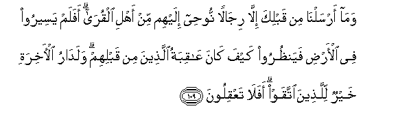
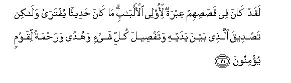

  
[Intangible Textual Heritage](../../index)  [Islam](../index) 
[Index](index)   
[Hypertext Qur'an](../htq/index)  [Unicode](../uq/012.htm#012_105) 
[Palmer](../sbe06/012)  [Pickthall](../pick/012.htm#012_105)  [Yusuf Ali
English](../yaq/yaq012)  [Rodwell](../qr/012)   
  
[Sūra XII.: Yūsuf, or Joseph. Index](012)  
  [Previous](01211)  [Next](01301) 

------------------------------------------------------------------------

  
*The Holy Quran*, tr. by Yusuf Ali, \[1934\], at Intangible Textual
Heritage

------------------------------------------------------------------------

# Sūra XII.: Yūsuf, or Joseph.

### Section 12

------------------------------------------------------------------------

105. Wakaayyin min <u>a</u>yatin fee a**l**ssam<u>a</u>w<u>a</u>ti
wa**a**l-ar<u>d</u>i yamurroona AAalayh<u>a</u> wahum AAanh<u>a</u>
muAAri<u>d</u>oon**a**

105\. And how many Signs  
In the heavens and the earth  
Do they pass by? Yet they  
Turn (their faces) away from them!

------------------------------------------------------------------------

106. Wam<u>a</u> yu/minu aktharuhum bi**A**ll<u>a</u>hi ill<u>a</u>
wahum mushrikoon**a**

106\. And most of them  
Believe not in God  
Without associating (others  
As partners) with Him!

------------------------------------------------------------------------

107. Afaaminoo an ta/tiyahum gh<u>a</u>shiyatun min AAa<u>tha</u>bi
All<u>a</u>hi aw ta/tiyahumu a**l**ss<u>a</u>AAatu baghtatan wahum
l<u>a</u> yashAAuroon**a**

107\. Do they then feel secure  
From the coming against them  
Of the covering veil  
Of the wrath of God,  
Or of the coming against them  
Of the (final) Hour  
All of a sudden  
While they perceive not?

------------------------------------------------------------------------

108. Qul h<u>ath</u>ihi sabeelee adAAoo il<u>a</u> All<u>a</u>hi
AAal<u>a</u> ba<u>s</u>eeratin an<u>a</u> wamani ittabaAAanee
wasub<u>ha</u>na All<u>a</u>hi wam<u>a</u> an<u>a</u> mina
almushrikeen**a**

108\. Say thou: "This is my Way:  
I do invite unto God,  
On evidence clear as  
The seeing with one's eyes,—  
I and whoever follows me.  
Glory to God! and never  
Will I join gods with God!"

------------------------------------------------------------------------

109. Wam<u>a</u> arsaln<u>a</u> min qablika ill<u>a</u> rij<u>a</u>lan
noo<u>h</u>ee ilayhim min ahli alqur<u>a</u> afalam yaseeroo fee
al-ar<u>d</u>i fayan*<u>th</u>*uroo kayfa k<u>a</u>na AA<u>a</u>qibatu
alla<u>th</u>eena min qablihim walad<u>a</u>ru al-<u>a</u>khirati
khayrun lilla<u>th</u>eena ittaqaw afal<u>a</u> taAAqiloon**a**

109\. Nor did We send before thee  
(As apostles) any but men,  
Whom We did inspire,—  
(Men) living in human habitations.  
Do they not travel  
Through the earth, and see  
What was the end  
Of those before them?  
But the home of the Hereafter  
Is best, for those who do right.  
Will ye not then understand?

------------------------------------------------------------------------

110. <u>H</u>att<u>a</u> i<u>tha</u> istay-asa a**l**rrusulu
wa*<u>th</u>*annoo annahum qad ku<u>th</u>iboo j<u>a</u>ahum
na<u>s</u>run<u>a</u> fanujjiya man nash<u>a</u>o wal<u>a</u> yuraddu
ba/sun<u>a</u> AAani alqawmi almujrimeen**a**

110\. (Respite will be granted)  
Until, when the apostles  
Give up hope (of their people)  
And (come to) think that they  
Were treated as liars,  
There reaches them Our help,  
And those whom We will  
Are delivered into safety.  
But never will be warded off  
Our punishment from those  
Who are in sin.

------------------------------------------------------------------------

111. Laqad k<u>a</u>na fee qa<u>s</u>a<u>s</u>ihim AAibratun li-olee
al-alb<u>a</u>bi m<u>a</u> k<u>a</u>na <u>h</u>adeethan yuftar<u>a</u>
wal<u>a</u>kin ta<u>s</u>deeqa alla<u>th</u>ee bayna yadayhi
wataf<u>s</u>eela kulli shay-in wahudan wara<u>h</u>matan liqawmin
yu/minoon**a**

111\. There is, in their stories,  
Instruction for men endued  
With understanding. It is not  
A tale invented, but a confirmation  
Of what went before it,—  
A detailed exposition  
Of all things, and a Guide  
And a Mercy to any such  
As believe.

------------------------------------------------------------------------

[Next: Section 1 (1-7)](01301)

