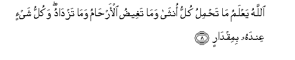
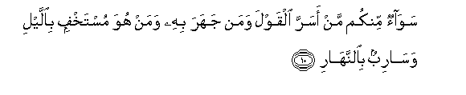
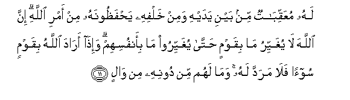
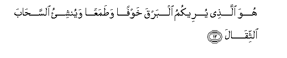
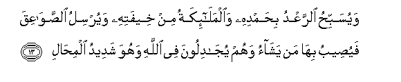
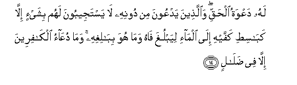
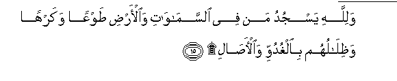
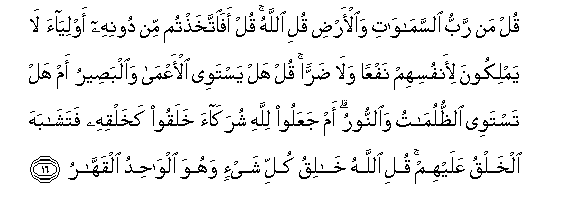
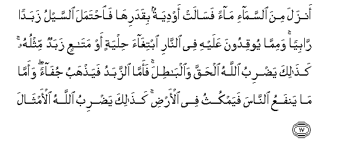
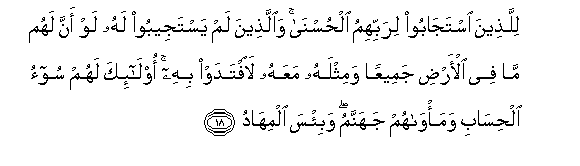

  
[Intangible Textual Heritage](../../index)  [Islam](../index.md) 
[Index](index.md)   
[Hypertext Qur'an](../htq/index)  [Unicode](../uq/013.htm#013_008.md) 
[Palmer](../sbe06/013)  [Pickthall](../pick/013.htm#013_008.md)  [Yusuf Ali
English](../yaq/yaq013)  [Rodwell](../qr/013.md)   
  
[Sūra XIII.: Ra’d, or Thunder. Index](013.md)  
  [Previous](01301)  [Next](01303.md) 

------------------------------------------------------------------------

  
*The Holy Quran*, tr. by Yusuf Ali, \[1934\], at Intangible Textual
Heritage

------------------------------------------------------------------------

# Sūra XIII.: Ra’d, or Thunder.

### Section 2

------------------------------------------------------------------------

8. All<u>a</u>hu yaAAlamu m<u>a</u> ta<u>h</u>milu kullu onth<u>a</u>
wam<u>a</u> taghee<u>d</u>u al-ar<u>ha</u>mu wam<u>a</u> tazd<u>a</u>du
wakullu shay-in AAindahu bimiqd<u>a</u>r**in**

8\. God doth know what  
Every female (womb) doth bear,  
By how much the wombs  
Fall short (of their time  
Or number) or do exceed.  
Every single thing is before  
His sight, in (due) proportion.

------------------------------------------------------------------------

9. AA<u>a</u>limu alghaybi wa**al**shshah<u>a</u>dati alkabeeru
almutaAA<u>a</u>l**i**

9\. He knoweth the Unseen  
And that which is open:  
He is the Great,  
The most High.

------------------------------------------------------------------------

10. Saw<u>a</u>on minkum man asarra alqawla waman jahara bihi waman huwa
mustakhfin bi**a**llayli was<u>a</u>ribun bi**al**nnah<u>a</u>r**i**

10\. It is the same (to Him)  
Whether any of you  
Conceal his speech or  
Declare it openly;  
Whether he lie hid by night  
Or walk forth freely by day.

------------------------------------------------------------------------

11. Lahu muAAaqqib<u>a</u>tun min bayni yadayhi wamin khalfihi
ya<u>h</u>fa*<u>th</u>*oonahu min amri All<u>a</u>hi inna All<u>a</u>ha
l<u>a</u> yughayyiru m<u>a</u> biqawmin <u>h</u>att<u>a</u> yughayyiroo
m<u>a</u> bi-anfusihim wa-i<u>tha</u> ar<u>a</u>da All<u>a</u>hu
biqawmin soo-an fal<u>a</u> maradda lahu wam<u>a</u> lahum min doonihi
min w<u>a</u>l**in**

11\. For each (such person)  
There are (angels) in succession,  
Before and behind him:  
They guard him by command  
Of God. Verily never  
Will God change the condition  
Of a people until they  
Change it themselves  
(With their own souls).  
But when (once) God willeth  
A people's punishment,  
There can be no  
Turning it back, nor  
Will they find, besides Him,  
Any to protect

------------------------------------------------------------------------

12. Huwa alla<u>th</u>ee yureekumu albarqa khawfan wa<u>t</u>amaAAan
wayunshi-o a**l**ssa<u>ha</u>ba a**l**ththiq<u>a</u>l**a**

12\. It is He Who doth show you  
The lightning, by way  
Both of fear and of hope:  
It is He Who doth raise up  
The clouds, heavy  
With (fertilising) rain!

------------------------------------------------------------------------

13. Wayusabbi<u>h</u>u a**l**rraAAdu bi<u>h</u>amdihi
wa**a**lmal<u>a</u>-ikatu min kheefatihi wayursilu
a**l**<u>ss</u>aw<u>a</u>AAiqa fayu<u>s</u>eebu bih<u>a</u> man
yash<u>a</u>o wahum yuj<u>a</u>diloona fee All<u>a</u>hi wahuwa shadeedu
almi<u>ha</u>l**i**

13\. Nay, thunder repeateth His praises,  
And so do the angels, with awe:  
He flingeth the loud-voiced  
Thunder-bolts, and therewith  
He striketh whomsoever He will…  
Yet these (are the men)  
Who (dare to) dispute  
About God, with the strength  
Of His power (supreme)!

------------------------------------------------------------------------

14. Lahu daAAwatu al<u>h</u>aqqi wa**a**lla<u>th</u>eena yadAAoona min
doonihi l<u>a</u> yastajeeboona lahum bishay-in ill<u>a</u>
kab<u>a</u>si<u>t</u>i kaffayhi il<u>a</u> alm<u>a</u>-i liyablugha
f<u>a</u>hu wam<u>a</u> huwa bib<u>a</u>lighihi wam<u>a</u>
duAA<u>a</u>o alk<u>a</u>fireena ill<u>a</u> fee
<u>d</u>al<u>a</u>l**in**

14\. For Him (alone) is prayer  
In Truth: any others that they  
Call upon besides Him hear them  
No more than if they were  
To stretch forth their hands  
For water to reach their mouths  
But it reaches them not:  
For the prayer of those  
Without Faith is nothing  
But (futile) wandering (in the mind).

------------------------------------------------------------------------

15. Walill<u>a</u>hi yasjudu man fee a**l**ssam<u>a</u>w<u>a</u>ti
wa**a**l-ar<u>d</u>i <u>t</u>awAAan wakarhan
wa*<u>th</u>*il<u>a</u>luhum bi**a**lghuduwwi wa**a**l-<u>asa</u>l**i**

15\. Whatever beings there are  
In the heavens and the earth  
Do prostrate themselves to God  
(Acknowledging subjection),—with good-will  
Or in spite of themselves:  
So do their shadows  
In the mornings and evenings.

------------------------------------------------------------------------

16. Qul man rabbu a**l**ssam<u>a</u>w<u>a</u>ti wa**a**l-ar<u>d</u>i
quli All<u>a</u>hu qul afa**i**ttakha<u>th</u>tum min doonihi
awliy<u>a</u>a l<u>a</u> yamlikoona li-anfusihim nafAAan wal<u>a</u>
<u>d</u>arran qul hal yastawee al-aAAm<u>a</u> wa**a**lba<u>s</u>eeru am
hal tastawee a**l***<u>thth</u>*ulum<u>a</u>tu wa**al**nnooru am
jaAAaloo lill<u>a</u>hi shurak<u>a</u>a khalaqoo kakhalqihi
fatash<u>a</u>baha alkhalqu AAalayhim quli All<u>a</u>hu kh<u>a</u>liqu
kulli shay-in wahuwa alw<u>ah</u>idu alqahh<u>a</u>r**u**

16\. Say: "Who is the Lord and Sustainer  
Of the heavens and the earth?"  
Say: "(It is) God."  
Say: "Do ye then take  
(For worship) protectors other  
Than Him, such as have  
No power either for good  
Or for harm to themselves?"  
Say: "Are the blind equal  
With those who see?  
Or the depths of darkness  
Equal with Light?"  
Or do they assign to God  
Partners who have created  
(Anything) as He has created,  
So that the creation seemed  
To them similar?  
Say: "God is the Creator  
Of all things: He is  
The One, the Supreme and  
Irresistible."

------------------------------------------------------------------------

17. Anzala mina a**l**ssam<u>a</u>-i m<u>a</u>an fas<u>a</u>lat
awdiyatun biqadarih<u>a</u> fa**i**<u>h</u>tamala a**l**ssaylu zabadan
r<u>a</u>biyan wamimm<u>a</u> yooqidoona AAalayhi fee a**l**nn<u>a</u>ri
ibtigh<u>a</u>a <u>h</u>ilyatin aw mat<u>a</u>AAin zabadun mithluhu
ka<u>tha</u>lika ya<u>d</u>ribu All<u>a</u>hu al<u>h</u>aqqa
wa**a**lb<u>at</u>ila faamm<u>a</u> a**l**zzabadu faya<u>th</u>habu
juf<u>a</u>an waamm<u>a</u> m<u>a</u> yanfaAAu a**l**nn<u>a</u>sa
fayamkuthu fee al-ar<u>d</u>i ka<u>tha</u>lika ya<u>d</u>ribu
All<u>a</u>hu al-amth<u>a</u>l**a**

17\. He sends down water  
From the sides, and the channels  
Flow, each according to its measure:  
But the torrent bears away  
The foam that mounts up  
To the surface. Even so,  
Form that (ore) which they heat  
In the fire, to make ornaments  
Or utensils therewith,  
There is a scum likewise.  
Thus doth God (by parables)  
Show forth Truth and Vanity.  
For the scum disappears  
Like froth cast out;  
While that which is for the good  
Of mankind remains  
On the earth. Thus doth God  
Set forth parables.

------------------------------------------------------------------------

18. Lilla<u>th</u>eena istaj<u>a</u>boo lirabbihimu
al<u>h</u>usn<u>a</u> wa**a**lla<u>th</u>eena lam yastajeeboo lahu law
anna lahum m<u>a</u> fee al-ar<u>d</u>i jameeAAan wamithlahu maAAahu
la**i**ftadaw bihi ol<u>a</u>-ika lahum soo-o al<u>h</u>is<u>a</u>bi
wama/w<u>a</u>hum jahannamu wabi/sa almih<u>a</u>d**u**

18\. For those who respond  
To their Lord, are (all)  
Good things. But those  
Who respond not to Him,  
Even if they had all  
That is in the heavens  
And on earth, and as much more,  
(In vain) would they offer it  
For ransom. For them  
Will the reckoning be terrible:  
Their abode will be Hell,——  
What a bed of misery!

------------------------------------------------------------------------

[Next: Section 3 (19-26)](01303.md)

