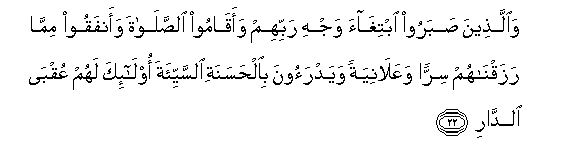

  
[Intangible Textual Heritage](../../index)  [Islam](../index.md) 
[Index](index.md)   
[Hypertext Qur'an](../htq/index)  [Unicode](../uq/013.htm#013_019.md) 
[Palmer](../sbe06/013)  [Pickthall](../pick/013.htm#013_019.md)  [Yusuf Ali
English](../yaq/yaq013)  [Rodwell](../qr/013.md)   
  
[Sūra XIII.: Ra’d, or Thunder. Index](013.md)  
  [Previous](01302)  [Next](01304.md) 

------------------------------------------------------------------------

  
*The Holy Quran*, tr. by Yusuf Ali, \[1934\], at Intangible Textual
Heritage

------------------------------------------------------------------------

# Sūra XIII.: Ra’d, or Thunder.

### Section 3

------------------------------------------------------------------------

19. Afaman yaAAlamu annam<u>a</u> onzila ilayka min rabbika
al<u>h</u>aqqu kaman huwa aAAm<u>a</u> innam<u>a</u> yata<u>th</u>akkaru
oloo al-alb<u>a</u>b**i**

19\. Is then one who doth know  
That that which hath been  
Revealed unto thee  
From thy Lord is the Truth,  
Like one who is blind?  
It is those who are  
Endued with understanding  
That receive admonition;—

------------------------------------------------------------------------

20. Alla<u>th</u>eena yoofoona biAAahdi All<u>a</u>hi wal<u>a</u>
yanqu<u>d</u>oona almeeth<u>a</u>q**a**

20\. Those who fulfil the Covenant  
Of God and fail not  
In their plighted word;

------------------------------------------------------------------------

21. Wa**a**lla<u>th</u>eena ya<u>s</u>iloona m<u>a</u> amara
All<u>a</u>hu bihi an yoo<u>s</u>ala wayakhshawna rabbahum
wayakh<u>a</u>foona soo-a al<u>h</u>is<u>a</u>b**i**

21\. Those who join together  
Those things which God  
Hath commanded to be joined,  
Hold their Lord in awe,  
And fear the terrible reckoning;

------------------------------------------------------------------------

22. Wa**a**lla<u>th</u>eena <u>s</u>abaroo ibtigh<u>a</u>a wajhi
rabbihim waaq<u>a</u>moo a**l**<u>ss</u>al<u>a</u>ta waanfaqoo
mimm<u>a</u> razaqn<u>a</u>hum sirran waAAal<u>a</u>niyatan wayadraoona
bi**a**l<u>h</u>asanati a**l**ssayyi-ata ol<u>a</u>-ika lahum
AAuqb<u>a</u> a**l**dd<u>a</u>r**i**

22\. Those who patiently persevere,  
Seeking the countenance of their Lord;  
Establish regular prayers; spend,  
Out of (the gifts) We have bestowed  
For their sustenance, secretly  
And openly; and turn off Evil  
With good: for such there is  
The final attainment  
Of the (Eternal) Home,—

------------------------------------------------------------------------

23. Jann<u>a</u>tu AAadnin yadkhuloonah<u>a</u> waman
<u>s</u>ala<u>h</u>a min <u>a</u>b<u>a</u>-ihim waazw<u>a</u>jihim
wa<u>th</u>urriyy<u>a</u>tihim wa**a**lmal<u>a</u>-ikatu yadkhuloona
AAalayhim min kulli b<u>a</u>b**in**

23\. Gardens of perpetual bliss:  
They shall enter there,  
As well as the righteous  
Among their fathers, their spouses,  
And their offspring:  
And angels shall enter unto them  
From every gate (with the salutation):

------------------------------------------------------------------------

24. Sal<u>a</u>mun AAalaykum bim<u>a</u> <u>s</u>abartum faniAAma
AAuqb<u>a</u> a**l**dd<u>a</u>r**i**

24\. "Peace unto you for that ye  
Persevered in patience! Now  
How excellent is the final Home!"

------------------------------------------------------------------------

25. Wa**a**lla<u>th</u>eena yanqu<u>d</u>oona AAahda All<u>a</u>hi min
baAAdi meeth<u>a</u>qihi wayaq<u>t</u>aAAoona m<u>a</u> amara
All<u>a</u>hu bihi an yoo<u>s</u>ala wayufsidoona fee al-ar<u>d</u>i
ol<u>a</u>-ika lahumu allaAAnatu walahum soo-o a**l**dd<u>a</u>r**i**

25\. But those who break  
The Covenant of God, after  
Having plighted their word thereto,  
And cut asunder those things  
Which God has commanded  
To be joined, and work mischief  
In the land;—on them  
Is the Curse; for them  
Is the terrible Home!

------------------------------------------------------------------------

26. All<u>a</u>hu yabsu<u>t</u>u a**l**rrizqa liman yash<u>a</u>o
wayaqdiru wafari<u>h</u>oo bi**a**l<u>h</u>ay<u>a</u>ti
a**l**dduny<u>a</u> wam<u>a</u> al<u>h</u>ay<u>a</u>tu
a**l**dduny<u>a</u> fee al-<u>a</u>khirati ill<u>a</u>
mat<u>a</u>AA**un**

26\. God doth enlarge, or grant  
By (strict) measure, the Sustenance  
(Which He giveth) to whomso  
He pleaseth. (The worldly) rejoice  
In the life of this world:  
But the life of this world  
Is but little comfort  
In the Hereafter.

------------------------------------------------------------------------

[Next: Section 4 (27-31)](01304.md)

