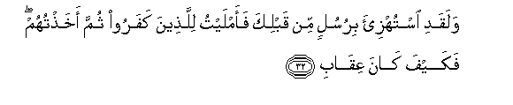
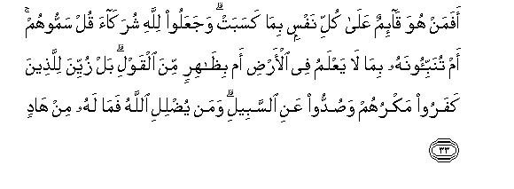
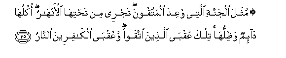
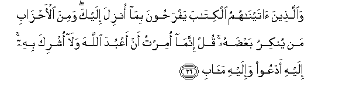
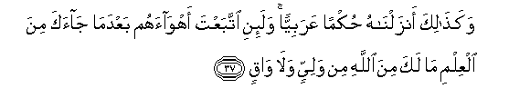

  
[Intangible Textual Heritage](../../index)  [Islam](../index.md) 
[Index](index.md)   
[Hypertext Qur'an](../htq/index)  [Unicode](../uq/013.htm#013_032.md) 
[Palmer](../sbe06/013)  [Pickthall](../pick/013.htm#013_032.md)  [Yusuf Ali
English](../yaq/yaq013)  [Rodwell](../qr/013.md)   
  
[Sūra XIII.: Ra’d, or Thunder. Index](013.md)  
  [Previous](01304)  [Next](01306.md) 

------------------------------------------------------------------------

  
*The Holy Quran*, tr. by Yusuf Ali, \[1934\], at Intangible Textual
Heritage

------------------------------------------------------------------------

# Sūra XIII.: Ra’d, or Thunder.

### Section 5

------------------------------------------------------------------------

32. Walaqadi istuhzi-a birusulin min qablika faamlaytu
lilla<u>th</u>eena kafaroo thumma akha<u>th</u>tuhum fakayfa k<u>a</u>na
AAiq<u>a</u>b**i**

32\. Mocked were (many) apostles  
Before thee: but I granted  
Respite to the Unbelievers,  
And finally I punished them:  
Then how (terrible) was My requital!

------------------------------------------------------------------------

33. Afaman huwa q<u>a</u>-imun AAal<u>a</u> kulli nafsin bim<u>a</u>
kasabat wajaAAaloo lill<u>a</u>hi shurak<u>a</u>a qul sammoohum am
tunabbi-oonahu bim<u>a</u> l<u>a</u> yaAAlamu fee al-ar<u>d</u>i am
bi*<u>th</u>*<u>a</u>hirin mina alqawli bal zuyyina lilla<u>th</u>eena
kafaroo makruhum wa<u>s</u>uddoo AAani a**l**ssabeeli waman
yu<u>d</u>lili All<u>a</u>hu fam<u>a</u> lahu min h<u>a</u>d**in**

33\. Is then He Who standeth  
Over every soul (and knoweth)  
All that it doth,  
(Like any others)? And yet  
They ascribe partners to God.  
Say: "But name them!  
Is it that ye will  
Inform Him of something  
He knoweth not on earth,  
Or is it (just) a show  
Of words?" Nay! to those  
Who believe not, their pretence  
seems pleasing, but they are  
Kept back (thereby) from the Path.  
And those whom God leaves  
To stray, no one can guide.

------------------------------------------------------------------------

34. Lahum AAa<u>tha</u>bun fee al<u>h</u>ay<u>a</u>ti
a**l**dduny<u>a</u> walaAAa<u>tha</u>bu al-<u>a</u>khirati ashaqqu
wam<u>a</u> lahum mina All<u>a</u>hi min w<u>a</u>q**in**

34\. For them is a Penalty  
In the life of this world,  
But harder, truly, is the Penalty  
Of the Hereafter: and defender  
Have they none against God.

------------------------------------------------------------------------

35. Mathalu aljannati allatee wuAAida almuttaqoona tajree min
ta<u>h</u>tih<u>a</u> al-anh<u>a</u>ru okuluh<u>a</u> d<u>a</u>-imun
wa*<u>th</u>*illuh<u>a</u> tilka AAuqb<u>a</u> alla<u>th</u>eena ittaqaw
waAAuqb<u>a</u> alk<u>a</u>fireena a**l**nn<u>a</u>r**u**

35\. The parable of the Garden  
Which the righteous are promised!—  
Beneath it flow rivers:  
Perpetual is the enjoyment thereof  
And the shade therein:  
Such is the End  
Of the Righteous; and the End  
Of Unbelievers is the Fire.

------------------------------------------------------------------------

36. Wa**a**lla<u>th</u>eena <u>a</u>tayn<u>a</u>humu alkit<u>a</u>ba
yafra<u>h</u>oona bim<u>a</u> onzila ilayka wamina
al-a<u>h</u>z<u>a</u>bi man yunkiru baAA<u>d</u>ahu qul innam<u>a</u>
omirtu an aAAbuda All<u>a</u>ha wal<u>a</u> oshrika bihi ilayhi adAAoo
wa-ilayhi ma<u>a</u>b**i**

36\. Those to whom We have  
Given the Book rejoice  
At what hath been revealed  
Unto thee: but there are  
Among the clans those who reject  
A part thereof. Say:  
"I am commanded to worship  
God, and not to join partners  
With Him. Unto him  
Do I call, and  
Unto Him is my return."

------------------------------------------------------------------------

37. Waka<u>tha</u>lika anzaln<u>a</u>hu <u>h</u>ukman AAarabiyyan
wala-ini ittabaAAta ahw<u>a</u>ahum baAAda m<u>a</u> j<u>a</u>aka mina
alAAilmi m<u>a</u> laka mina All<u>a</u>hi min waliyyin wal<u>a</u>
w<u>a</u>q**in**

37\. Thus have We revealed it  
To be a judgment of authority  
In Arabic. Wert thou to follow  
Their (vain) desires after the knowledge  
Which hath reached thee,  
Then wouldst thou find  
Neither protector nor defender  
Against God.

------------------------------------------------------------------------

[Next: Section 6 (38-43)](01306.md)

