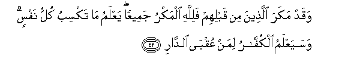

  
[Intangible Textual Heritage](../../index)  [Islam](../index.md) 
[Index](index.md)   
[Hypertext Qur'an](../htq/index)  [Unicode](../uq/013.htm#013_038.md) 
[Palmer](../sbe06/013)  [Pickthall](../pick/013.htm#013_038.md)  [Yusuf Ali
English](../yaq/yaq013)  [Rodwell](../qr/013.md)   
  
[Sūra XIII.: Ra’d, or Thunder. Index](013.md)  
  [Previous](01305)  [Next](01401.md) 

------------------------------------------------------------------------

  
*The Holy Quran*, tr. by Yusuf Ali, \[1934\], at Intangible Textual
Heritage

------------------------------------------------------------------------

# Sūra XIII.: Ra’d, or Thunder.

### Section 6

------------------------------------------------------------------------

38. Walaqad arsaln<u>a</u> rusulan min qablika wajaAAaln<u>a</u> lahum
azw<u>a</u>jan wa<u>th</u>urriyyatan wam<u>a</u> k<u>a</u>na lirasoolin
an ya/tiya bi-<u>a</u>yatin ill<u>a</u> bi-i<u>th</u>ni All<u>a</u>hi
likulli ajalin kit<u>a</u>b**un**

38\. We did send apostles  
Before thee, and appointed  
For them wives and children:  
And it was never the part  
Of an apostle to bring a Sign  
Except as God permitted  
(Or commanded). For each period  
Is a Book (revealed).

------------------------------------------------------------------------

39. Yam<u>h</u>oo All<u>a</u>hu m<u>a</u> yash<u>a</u>o wayuthbitu
waAAindahu ommu alkit<u>a</u>b**i**

39\. God doth blot out  
Or confirm what He pleaseth:  
With Him is  
The Mother of the Book.

------------------------------------------------------------------------

40. Wa-in m<u>a</u> nuriyannaka baAA<u>d</u>a alla<u>th</u>ee naAAiduhum
aw natawaffayannaka fa-innam<u>a</u> AAalayka albal<u>a</u>ghu
waAAalayn<u>a</u> al<u>h</u>is<u>a</u>b**u**

40\. Whether We shall show thee  
(Within thy life-time)  
Part of what We promised them  
Or take to ourselves thy soul  
(Before it is all accomplished),—  
Thy duty is to make  
(The Message) reach them:  
It is Our part  
To call them to account.

------------------------------------------------------------------------

41. Awa lam yaraw ann<u>a</u> na/tee al-ar<u>d</u>a
nanqu<u>s</u>uh<u>a</u> min a<u>t</u>r<u>a</u>fih<u>a</u>
wa**A**ll<u>a</u>hu ya<u>h</u>kumu l<u>a</u> muAAaqqiba li<u>h</u>ukmihi
wahuwa sareeAAu al<u>h</u>is<u>a</u>b**i**

41\. See they not that We  
Gradually reduce the land  
(In their control) from its  
Outlying borders ? (Where) God  
Commands, there is none  
To put back His command:  
And He is Swift  
In calling to account.

------------------------------------------------------------------------

42. Waqad makara alla<u>th</u>eena min qablihim falill<u>a</u>hi almakru
jameeAAan yaAAlamu m<u>a</u> taksibu kullu nafsin wasayaAAlamu
alkuff<u>a</u>ru liman AAuqb<u>a</u> a**l**dd<u>a</u>r**i**

42\. Those before them did (also)  
Devise plots; but in all things  
The master-planning is God's.  
He knoweth the doings  
Of every soul: and soon  
Will the Unbelievers know  
Who gets home in the End.

------------------------------------------------------------------------

43. Wayaqoolu alla<u>th</u>eena kafaroo lasta mursalan qul kaf<u>a</u>
bi**A**ll<u>a</u>hi shaheedan baynee wabaynakum waman AAindahu AAilmu
alkit<u>a</u>b**i**

43\. The Unbelievers say: "No apostle  
Art thou." Say: "Enough  
For a witness between me  
And you is God, and such  
As have knowledge of the Book."

------------------------------------------------------------------------

[Next: Section 1 (1-6)](01401.md)

