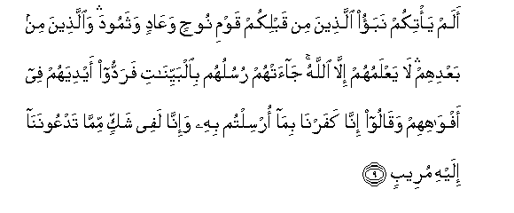
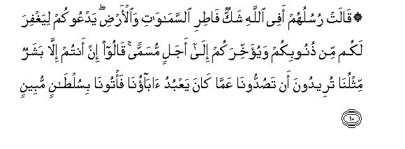

  
[Intangible Textual Heritage](../../index)  [Islam](../index) 
[Index](index)   
[Hypertext Qur'an](../htq/index)  [Unicode](../uq/014.htm#014_007) 
[Palmer](../sbe06/014)  [Pickthall](../pick/014.htm#014_007)  [Yusuf Ali
English](../yaq/yaq014)  [Rodwell](../qr/014)   
  
[Sūra XIV.: Ibrāhīm, or Abraham. Index](014)  
  [Previous](01401)  [Next](01403) 

------------------------------------------------------------------------

  
*The Holy Quran*, tr. by Yusuf Ali, \[1934\], at Intangible Textual
Heritage

------------------------------------------------------------------------

# Sūra XIV.: Ibrāhīm, or Abraham.

### Section 2

------------------------------------------------------------------------

7. Wa-i<u>th</u> taa<u>thth</u>ana rabbukum la-in shakartum
laazeedannakum wala-in kafartum inna AAa<u>tha</u>bee lashadeed**un**

7\. And remember! your Lord  
Caused to be declared (publicly):  
"If ye are grateful, I will  
Add more (favours) unto you;  
But if ye show ingratitude,  
Truly my punishment  
Is terrible indeed."

------------------------------------------------------------------------

8. Waq<u>a</u>la moos<u>a</u> in takfuroo antum waman fee al-ar<u>d</u>i
jameeAAan fa-inna All<u>a</u>ha laghaniyyun <u>h</u>ameed**un**

8\. And Moses said: "If ye  
Show ingratitude, ye and all  
On earth together,—yet  
Is God Free of all wants,  
Worthy of all praise.

------------------------------------------------------------------------

9. Alam ya/tikum nabao alla<u>th</u>eena min qablikum qawmi
noo<u>h</u>in waAA<u>a</u>din wathamooda wa**a**lla<u>th</u>eena min
baAAdihim l<u>a</u> yaAAlamuhum ill<u>a</u> All<u>a</u>hu
j<u>a</u>at-hum rusuluhum bi**a**lbayyin<u>a</u>ti faraddoo aydiyahum
fee afw<u>a</u>hihim waq<u>a</u>loo inn<u>a</u> kafarn<u>a</u>
bim<u>a</u> orsiltum bihi wa-inn<u>a</u> lafee shakkin mimm<u>a</u>
tadAAoonan<u>a</u> ilayhi mureeb**un**

9\. Has not the story  
Reached you, (O people!), of those  
Who (went) before you?—  
Of the People of Noah,  
And ’Ād, and <u>Th</u>amūd?—  
And of those who (came)  
After them? None knows them  
But God. To them came  
Apostles with Clear (Signs);  
But they put their hands  
Up to their mouths, and said:  
"We do deny (the mission)  
On which ye have been sent,  
And we are really  
In suspicious (disquieting) doubt  
As to that to which  
Ye invite us."

------------------------------------------------------------------------

10. Q<u>a</u>lat rusuluhum afee All<u>a</u>hi shakkun f<u>at</u>iri
a**l**ssam<u>a</u>w<u>a</u>ti wa**a**l-ar<u>d</u>i yadAAookum liyaghfira
lakum min <u>th</u>unoobikum wayu-akhkhirakum il<u>a</u> ajalin musamman
q<u>a</u>loo in antum ill<u>a</u> basharun mithlun<u>a</u> tureedoona an
ta<u>s</u>uddoon<u>a</u> AAamm<u>a</u> k<u>a</u>na yaAAbudu
<u>a</u>b<u>a</u>on<u>a</u> fa/toon<u>a</u> bisul<u>ta</u>nin
mubeen**in**

10\. Their apostles said: "Is there  
A doubt about God,  
The Creator of the heavens  
And the earth? It is He  
Who invites you, in order  
That He may forgive you  
Your sins and give you  
Respite for a term appointed!"  
They said: "Ah! ye are  
No more than human,  
Like ourselves! Ye wish  
To turn us away from  
The (gods) our fathers  
Used to worship: then  
Bring us some clear authority."

------------------------------------------------------------------------

11. Q<u>a</u>lat lahum rusuluhum in na<u>h</u>nu ill<u>a</u> basharun
mithlukum wal<u>a</u>kinna All<u>a</u>ha yamunnu AAal<u>a</u> man
yash<u>a</u>o min AAib<u>a</u>dihi wam<u>a</u> k<u>a</u>na lan<u>a</u>
an na/tiyakum bisul<u>ta</u>nin ill<u>a</u> bi-i<u>th</u>ni
All<u>a</u>hi waAAal<u>a</u> All<u>a</u>hi falyatawakkali
almu/minoon**a**

11\. Their apostles said to them:  
"True, we are human  
Like yourselves, but God  
Doth grant His grace  
To such of His servants  
As He pleases. It is not  
For us to bring you  
An authority except as God  
Permits. And on God  
Let all men of faith  
Put their trust.

------------------------------------------------------------------------

12. Wam<u>a</u> lan<u>a</u> all<u>a</u> natawakkala AAal<u>a</u>
All<u>a</u>hi waqad had<u>a</u>n<u>a</u> subulan<u>a</u>
walana<u>s</u>biranna AAal<u>a</u> m<u>a</u> <u>ath</u>aytumoon<u>a</u>
waAAal<u>a</u> All<u>a</u>hi falyatawakkali almutawakkiloon**a**

12\. "No reason have we why  
We should not put our trust  
On God. Indeed He  
Has guided us to the Ways  
We (follow). We shall certainly  
Bear with patience all  
The hurt you may cause us.  
For those who put their trust  
Should put their trust on God."

------------------------------------------------------------------------

[Next: Section 3 (13-21)](01403)

