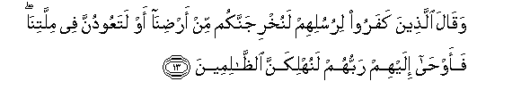
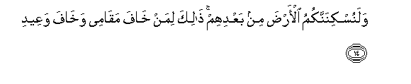
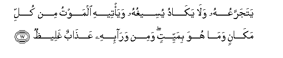
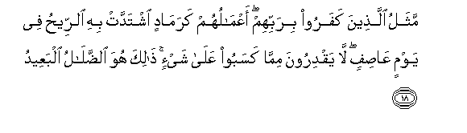
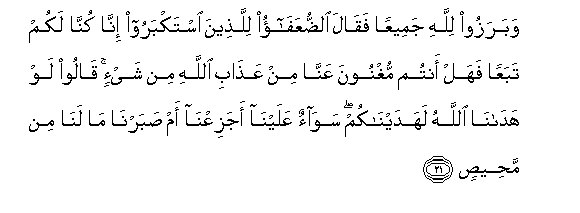

  
[Intangible Textual Heritage](../../index)  [Islam](../index.md) 
[Index](index.md)   
[Hypertext Qur'an](../htq/index)  [Unicode](../uq/014.htm#014_013.md) 
[Palmer](../sbe06/014)  [Pickthall](../pick/014.htm#014_013.md)  [Yusuf Ali
English](../yaq/yaq014)  [Rodwell](../qr/014.md)   
  
[Sūra XIV.: Ibrāhīm, or Abraham. Index](014.md)  
  [Previous](01402)  [Next](01404.md) 

------------------------------------------------------------------------

  
*The Holy Quran*, tr. by Yusuf Ali, \[1934\], at Intangible Textual
Heritage

------------------------------------------------------------------------

# Sūra XIV.: Ibrāhīm, or Abraham.

### Section 3

------------------------------------------------------------------------

13. Waq<u>a</u>la alla<u>th</u>eena kafaroo lirusulihim lanukhrijannakum
min ar<u>d</u>in<u>a</u> aw lataAAoodunna fee millatin<u>a</u>
faaw<u>ha</u> ilayhim rabbuhum lanuhlikanna
a**l***<u>thth</u>*<u>a</u>limeen**a**

13\. And the Unbelievers said  
To their apostles: "Be sure  
We shall drive you out  
Of our land, or ye shall  
Return to our religion."  
But their Lord inspired  
(This Message) to them:  
"Verily We shall cause  
The wrong-doers to perish!

------------------------------------------------------------------------

14. Walanuskinannakumu al-ar<u>d</u>a min baAAdihim <u>tha</u>lika liman
kh<u>a</u>fa maq<u>a</u>mee wakh<u>a</u>fa waAAeed**i**

14\. "And verily We shall  
Cause you to abide  
In the land, and succeed them.  
This for such as fear  
The Time when they shall stand  
Before My tribunal,—such  
As fear the Punishment denounced."

------------------------------------------------------------------------

15. Wa**i**stafta<u>h</u>oo wakh<u>a</u>ba kullu jabb<u>a</u>rin
AAaneed**in**

15\. But they sought victory and decision  
(There and then), and frustration  
Was the lot of every  
Powerful obstinate transgressor.

------------------------------------------------------------------------

16. Min war<u>a</u>-ihi jahannamu wayusq<u>a</u> min m<u>a</u>-in
<u>s</u>adeed**in**

16\. In front of such a one  
Is Hell, and he is given,  
For drink, boiling fetid water.

------------------------------------------------------------------------

17. YatajarraAAuhu wal<u>a</u> yak<u>a</u>du yuseeghuhu waya/teehi
almawtu min kulli mak<u>a</u>nin wam<u>a</u> huwa bimayyitin wamin
war<u>a</u>-ihi AAa<u>tha</u>bun ghalee*<u>th</u>***un**

17\. In gulps will he sip it,  
But never will he be near  
Swallowing it down his throat:  
Death will come to him  
From every quarter, yet  
Will he not die: and  
In front of him will be  
A chastisement unrelenting.

------------------------------------------------------------------------

18. Mathalu alla<u>th</u>eena kafaroo birabbihim aAAm<u>a</u>luhum
karam<u>a</u>din ishtaddat bihi a**l**rree<u>h</u>u fee yawmin
AA<u>as</u>ifin l<u>a</u> yaqdiroona mimm<u>a</u> kasaboo AAal<u>a</u>
shay-in <u>tha</u>lika huwa a**l**<u>dd</u>al<u>a</u>lu albaAAeed**u**

18\. The parable of those who  
Reject their Lord is that  
Their works are as ashes,  
On which the wind blows  
Furiously on a tempestuous day:  
No power have they over  
Aught that they have earned:  
That is the straying  
Far, far (from the goal).

------------------------------------------------------------------------

19. Alam tara anna All<u>a</u>ha khalaqa a**l**ssam<u>a</u>w<u>a</u>ti
wa**a**l-ar<u>d</u>a bi**a**l<u>h</u>aqqi in yasha/ yu<u>th</u>hibkum
waya/ti bikhalqin jadeed**in**

19\. Seest thou not that God  
Created the heavens and the earth  
In Truth? If He so will,  
He can remove you  
And put (in your place)  
A new Creation?

------------------------------------------------------------------------

20. Wam<u>a</u> <u>tha</u>lika AAal<u>a</u> All<u>a</u>hi
biAAazeez**in**

20\. Nor is that for God  
Any great matter.

------------------------------------------------------------------------

21. Wabarazoo lill<u>a</u>hi jameeAAan faq<u>a</u>la
a**l**<u>dd</u>uAAaf<u>a</u>o lilla<u>th</u>eena istakbaroo inn<u>a</u>
kunn<u>a</u> lakum tabaAAan fahal antum mughnoona AAann<u>a</u> min
AAa<u>tha</u>bi All<u>a</u>hi min shay-in q<u>a</u>loo law
had<u>a</u>n<u>a</u> All<u>a</u>hu lahadayn<u>a</u>kum saw<u>a</u>on
AAalayn<u>a</u> ajaziAAn<u>a</u> am <u>s</u>abarn<u>a</u> m<u>a</u>
lan<u>a</u> min ma<u>h</u>ee<u>s</u>**in**

21\. They will all be marshalled  
Before God together: then  
Will the weak say to those  
Who were arrogant, "For us,  
We but followed you; can ye  
Then avail us at all  
Against the Wrath of God?"  
They will reply, "If we  
Had received the guidance  
Of God, we should have  
Given it to you: to us  
It makes no difference (now)  
Whether we rage, or bear  
(These torments) with patience:  
For ourselves there is no way  
Of escape."

------------------------------------------------------------------------

[Next: Section 4 (22-27)](01404.md)

