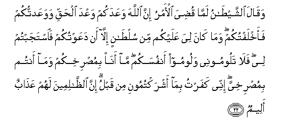

  
[Intangible Textual Heritage](../../index)  [Islam](../index) 
[Index](index)   
[Hypertext Qur'an](../htq/index)  [Unicode](../uq/014.htm#014_022) 
[Palmer](../sbe06/014)  [Pickthall](../pick/014.htm#014_022)  [Yusuf Ali
English](../yaq/yaq014)  [Rodwell](../qr/014)   
  
[Sūra XIV.: Ibrāhīm, or Abraham. Index](014)  
  [Previous](01403)  [Next](01405) 

------------------------------------------------------------------------

  
*The Holy Quran*, tr. by Yusuf Ali, \[1934\], at Intangible Textual
Heritage

------------------------------------------------------------------------

# Sūra XIV.: Ibrāhīm, or Abraham.

### Section 4

------------------------------------------------------------------------

22. Waq<u>a</u>la a**l**shshay<u>ta</u>nu lamm<u>a</u> qu<u>d</u>iya
al-amru inna All<u>a</u>ha waAAadakum waAAda al<u>h</u>aqqi
wawaAAadtukum faakhlaftukum wam<u>a</u> k<u>a</u>na liya AAalaykum min
sul<u>ta</u>nin ill<u>a</u> an daAAawtukum fa**i**stajabtum lee
fal<u>a</u> taloomoonee waloomoo anfusakum m<u>a</u> an<u>a</u>
bimu<u>s</u>rikhikum wam<u>a</u> antum bimu<u>s</u>rikhiyya innee
kafartu bim<u>a</u> ashraktumooni min qablu inna
a**l***<u>thth</u>*<u>a</u>limeena lahum AAa<u>tha</u>bun aleem**un**

22\. And Satan will say  
When the matter is decided:  
"It was God Who gave you  
A promise of Truth: I too  
Promised, but I failed  
In my promise to you.  
I had no authority over you  
Except to call you, but ye  
Listened to me: then  
Reproach not me, but reproach  
Your own souls. I cannot listen  
To your cries, nor can ye  
Listen to mine. I reject  
Your former act in associating  
Me with God.  
For wrong-doers there must be  
A grievous Penalty."

------------------------------------------------------------------------

23. Waodkhila alla<u>th</u>eena <u>a</u>manoo waAAamiloo
a**l**<u>ssa</u>li<u>ha</u>ti jann<u>a</u>tin tajree min
ta<u>h</u>tih<u>a</u> al-anh<u>a</u>ru kh<u>a</u>lideena feeh<u>a</u>
bi-i<u>th</u>ni rabbihim ta<u>h</u>iyyatuhum feeh<u>a</u>
sal<u>a</u>m**un**

23\. But those who believe  
And work righteousness  
Will be admitted to Gardens  
Beneath which rivers flow,—  
To dwell therein for aye  
With the leave of their Lord.  
Their greeting therein  
Will be: "Peace!"

------------------------------------------------------------------------

24. Alam tara kayfa <u>d</u>araba All<u>a</u>hu mathalan kalimatan
<u>t</u>ayyibatan kashajaratin <u>t</u>ayyibatin a<u>s</u>luh<u>a</u>
th<u>a</u>bitun wafarAAuh<u>a</u> fee a**l**ssam<u>a</u>/-**i**

24\. Seest thou not how  
God sets forth a parable?—  
A goodly Word  
Like a goodly tree,  
Whose root is firmly fixed,  
And its branches (reach)  
To the heavens,—

------------------------------------------------------------------------

25. Tu/tee okulah<u>a</u> kulla <u>h</u>eenin bi-i<u>th</u>ni
rabbih<u>a</u> waya<u>d</u>ribu All<u>a</u>hu al-amth<u>a</u>la
li**l**nn<u>a</u>si laAAallahum yata<u>th</u>akkaroon**a**

25\. It brings forth its fruit  
At all times, by the leave  
Of its Lord.  
So God sets forth parables  
For men, in order that  
They may receive admonition.

------------------------------------------------------------------------

26. Wamathalu kalimatin khabeethatin kashajaratin khabeethatin
ijtuththat min fawqi al-ar<u>d</u>i m<u>a</u> lah<u>a</u> min
qar<u>a</u>r**in**

26\. And the parable  
Of an evil Word  
Is that of an evil tree:  
It is torn up by the root  
From the surface of the earth:  
It has no stability.

------------------------------------------------------------------------

27. Yuthabbitu All<u>a</u>hu alla<u>th</u>eena <u>a</u>manoo
bi**a**lqawli a**l**thth<u>a</u>biti fee al<u>h</u>ay<u>a</u>ti
a**l**dduny<u>a</u> wafee al-<u>a</u>khirati wayu<u>d</u>illu
All<u>a</u>hu a**l***<u>thth</u>*<u>a</u>limeena wayafAAalu
All<u>a</u>hu m<u>a</u> yash<u>a</u>/**o**

27\. God will establish in strength  
Those who believe, with the Word  
That stands firm, in this world  
And in the Hereafter; but God  
Will leave, to stray, those  
Who do wrong: God doeth  
What He willeth.

------------------------------------------------------------------------

[Next: Section 5 (28-34)](01405)

