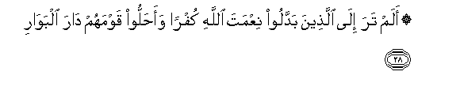
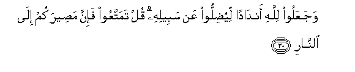
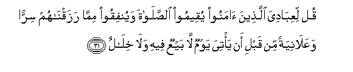
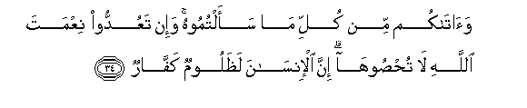

  
[Intangible Textual Heritage](../../index)  [Islam](../index.md) 
[Index](index.md)   
[Hypertext Qur'an](../htq/index)  [Unicode](../uq/014.htm#014_028.md) 
[Palmer](../sbe06/014)  [Pickthall](../pick/014.htm#014_028.md)  [Yusuf Ali
English](../yaq/yaq014)  [Rodwell](../qr/014.md)   
  
[Sūra XIV.: Ibrāhīm, or Abraham. Index](014.md)  
  [Previous](01404)  [Next](01406.md) 

------------------------------------------------------------------------

  
*The Holy Quran*, tr. by Yusuf Ali, \[1934\], at Intangible Textual
Heritage

------------------------------------------------------------------------

# Sūra XIV.: Ibrāhīm, or Abraham.

### Section 5

------------------------------------------------------------------------

28. Alam tara il<u>a</u> alla<u>th</u>eena baddaloo niAAmata
All<u>a</u>hi kufran waa<u>h</u>alloo qawmahum d<u>a</u>ra
albaw<u>a</u>r**i**

28.  
Into blasphemy and caused  
Their people to descend  
To the House of Perdition?—

------------------------------------------------------------------------

29. Jahannama ya<u>s</u>lawnah<u>a</u> wabi/sa alqar<u>a</u>r**u**

29\. Into Hell? They will burn  
Therein,—an evil place  
To stay in!

------------------------------------------------------------------------

30. WajaAAaloo lill<u>a</u>hi and<u>a</u>dan liyu<u>d</u>illoo AAan
sabeelihi qul tamattaAAoo fa-inna ma<u>s</u>eerakum il<u>a</u>
a**l**nn<u>a</u>r**i**

30\. And they set up (idols)  
As equal to God, to mislead  
(Men) from the Path! Say:  
"Enjoy (your brief power)!  
But verily ye are making  
Straightway for Hell!"

------------------------------------------------------------------------

31. Qul liAAib<u>a</u>diya alla<u>th</u>eena <u>a</u>manoo yuqeemoo
a**l**<u>ss</u>al<u>a</u>ta wayunfiqoo mimm<u>a</u> razaqn<u>a</u>hum
sirran waAAal<u>a</u>niyatan min qabli an ya/tiya yawmun l<u>a</u>
bayAAun feehi wal<u>a</u> khil<u>a</u>l**un**

31\. Speak to my servants  
Who have believed,  
That they may establish  
Regular prayers, and spend  
(In charity) out of the Sustenance  
We have given them,  
Secretly and openly, before  
The coming of a Day  
In which there will be  
Neither mutual bargaining  
Nor befriending.

------------------------------------------------------------------------

32. All<u>a</u>hu alla<u>th</u>ee khalaqa a**l**ssam<u>a</u>w<u>a</u>ti
wa**a**l-ar<u>d</u>a waanzala mina a**l**ssam<u>a</u>-i m<u>a</u>an
faakhraja bihi mina a**l**ththamar<u>a</u>ti rizqan lakum wasakhkhara
lakumu alfulka litajriya fee alba<u>h</u>ri bi-amrihi wasakhkhara lakumu
al-anh<u>a</u>r**a**

32\. It is God Who hath created  
The heavens and the earth  
And sendeth down rain  
From the skies, and with it  
Bringeth out fruits wherewith  
To feed you; it is He  
Who hath made the ships subject  
To you, that they may sail  
Through the sea by His Command;  
And the rivers (also)  
Hath He made subject to you.

------------------------------------------------------------------------

33. Wasakhkhara lakumu a**l**shshamsa wa**a**lqamara d<u>a</u>-ibayni
wasakhkhara lakumu allayla wa**al**nnah<u>a</u>r**a**

33\. And He hath made subject  
To you the sun and the moon,  
Both diligently pursuing  
Their courses; and the Night  
And the Day hath He (also)  
Made subject to you.

------------------------------------------------------------------------

34. Wa<u>a</u>t<u>a</u>kum min kulli m<u>a</u> saaltumoohu wa-in
taAAuddoo niAAmata All<u>a</u>hi l<u>a</u> tu<u>hs</u>ooh<u>a</u> inna
al-ins<u>a</u>na la*<u>th</u>*aloomun kaff<u>a</u>r**un**

34\. And He giveth you  
Of all that ye ask for.  
But if ye count the favours  
Of God, never will ye  
Be able to number them.  
Verily, man is given up  
To injustice and ingratitude.

------------------------------------------------------------------------

[Next: Section 6 (35-41)](01406.md)

