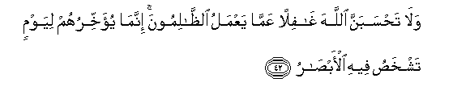
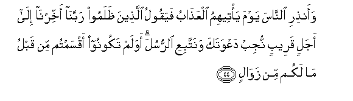
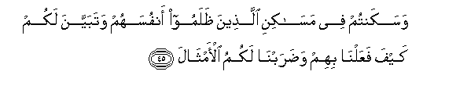
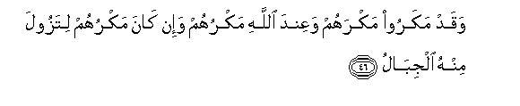
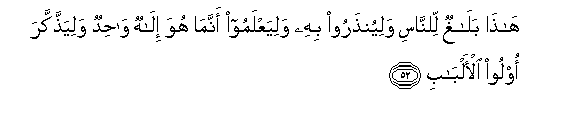

  
[Intangible Textual Heritage](../../index)  [Islam](../index) 
[Index](index)   
[Hypertext Qur'an](../htq/index)  [Unicode](../uq/014.htm#014_042) 
[Palmer](../sbe06/014)  [Pickthall](../pick/014.htm#014_042)  [Yusuf Ali
English](../yaq/yaq014)  [Rodwell](../qr/014)   
  
[Sūra XIV.: Ibrāhīm, or Abraham. Index](014)  
  [Previous](01406)  [Next](01501) 

------------------------------------------------------------------------

  
*The Holy Quran*, tr. by Yusuf Ali, \[1934\], at Intangible Textual
Heritage

------------------------------------------------------------------------

# Sūra XIV.: Ibrāhīm, or Abraham.

### Section 7

------------------------------------------------------------------------

42. Wal<u>a</u> ta<u>h</u>sabanna All<u>a</u>ha gh<u>a</u>filan
AAamm<u>a</u> yaAAmalu a**l***<u>thth</u>*<u>a</u>limoona innam<u>a</u>
yu-akhkhiruhum liyawmin tashkha<u>s</u>u feehi al-ab<u>sa</u>r**u**

42\. Think not that God  
Doth not heed the deeds  
Of those who do wrong.  
He but giveth them respite  
Against a Day when  
The eyes will fixedly stare  
In horror,—

------------------------------------------------------------------------

43. Muh<u>t</u>iAAeena muqniAAee ruoosihim l<u>a</u> yartaddu ilayhim
<u>t</u>arfuhum waaf-idatuhum haw<u>a</u>/**on**

43\. They running forward  
With necks outstretched,  
Their heads uplifted, their gaze  
Returning not towards them,  
And their hearts a (gaping) void!

------------------------------------------------------------------------

44. Waan<u>th</u>iri a**l**nn<u>a</u>sa yawma ya/teehimu
alAAa<u>tha</u>bu fayaqoolu alla<u>th</u>eena *<u>th</u>*alamoo
rabban<u>a</u> akhkhirn<u>a</u> il<u>a</u> ajalin qareebin nujib
daAAwataka wanattabiAAi a**l**rrusula awa lam takoonoo aqsamtum min
qablu m<u>a</u> lakum min zaw<u>a</u>l**in**

44\. So warn mankind  
Of the Day when the Wrath  
Will reach them: then will  
The wrong-doers say: "Our Lord!  
Respite us (if only)  
For a short Term: we will  
Answer Thy Call, and follow  
The apostles!"  
"What! were ye not wont  
To swear aforetime that ye  
Should suffer no decline?

------------------------------------------------------------------------

45. Wasakantum fee mas<u>a</u>kini alla<u>th</u>eena *<u>th</u>*alamoo
anfusahum watabayyana lakum kayfa faAAaln<u>a</u> bihim
wa<u>d</u>arabn<u>a</u> lakumu al-amth<u>a</u>l**a**

45\. "And ye dwelt in the dwellings  
Of men who wronged their own  
Souls; ye were clearly shown  
How We dealt with them;  
And We put forth (many) Parables  
In your behoof!"

------------------------------------------------------------------------

46. Waqad makaroo makrahum waAAinda All<u>a</u>hi makruhum wa-in
k<u>a</u>na makruhum litazoola minhu aljib<u>a</u>l**u**

46\. Mighty indeed were the plots  
Which they made, but their plots  
Were (well) within the sight  
Of God, even though they were  
Such as to shake the hills!

------------------------------------------------------------------------

47. Fal<u>a</u> ta<u>h</u>sabanna All<u>a</u>ha mukhlifa waAAdihi
rusulahu inna All<u>a</u>ha AAazeezun <u>th</u>oo intiq<u>a</u>m**in**

47\. Never think that God would fail  
His apostles in His promise:  
For God is Exalted in Power,—  
The Lord of Retribution.

------------------------------------------------------------------------

48. Yawma tubaddalu al-ar<u>d</u>u ghayra al-ar<u>d</u>i
wa**al**ssam<u>a</u>w<u>a</u>tu wabarazoo lill<u>a</u>hi alw<u>ah</u>idi
alqahh<u>a</u>r**i**

48\. One day the Earth will be  
Changed to a different Earth,  
And so will be the Heavens,  
And (men) will be marshalled  
Forth, before God, the One,  
The Irresistible;

------------------------------------------------------------------------

49. Watar<u>a</u> almujrimeena yawma-i<u>th</u>in muqarraneena fee
al-a<u>s</u>f<u>a</u>d**i**

49\. And thou wilt see  
The Sinners that day  
Bound together in fetters;—

------------------------------------------------------------------------

50. Sar<u>a</u>beeluhum min qa<u>t</u>r<u>a</u>nin wataghsh<u>a</u>
wujoohahumu a**l**nn<u>a</u>r**u**

50\. Their garments of liquid pitch,  
And their faces covered with Fire;

------------------------------------------------------------------------

51. Liyajziya All<u>a</u>hu kulla nafsin m<u>a</u> kasabat inna
All<u>a</u>ha sareeAAu al<u>h</u>is<u>a</u>b**i**

51\. That God may requite  
Each soul according  
To its deserts;  
And verily God is Swift  
In calling to account.

------------------------------------------------------------------------

52. H<u>atha</u> bal<u>a</u>ghun li**l**nn<u>a</u>si
waliyun<u>th</u>aroo bihi waliyaAAlamoo annam<u>a</u> huwa il<u>a</u>hun
w<u>ah</u>idun waliya<u>thth</u>akkara oloo al-alb<u>a</u>b**i**

52\. Here is a Message for mankind:  
Let them take warning therefrom,  
And let them know that He  
Is (no other than) One God  
Let men of understanding  
Take heed.

------------------------------------------------------------------------

[Next: Section 1 (1-15)](01501)

