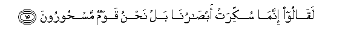

  
[Intangible Textual Heritage](../../index)  [Islam](../index.md) 
[Index](index.md)   
[Hypertext Qur'an](../htq/index)  [Unicode](../uq/015.htm#015_001.md) 
[Palmer](../sbe06/015)  [Pickthall](../pick/015.htm#015_001.md)  [Yusuf Ali
English](../yaq/yaq015)  [Rodwell](../qr/015.md)   
  
[Sūra XV.: Al-Hijr, or The Rocky Tract. Index](015.md)  
  [Previous](01407)  [Next](01502.md) 

------------------------------------------------------------------------

  
*The Holy Quran*, tr. by Yusuf Ali, \[1934\], at Intangible Textual
Heritage

------------------------------------------------------------------------

# Sūra XV.: Al-Hijr, or The Rocky Tract.

### Section 1

1. Alif-l<u>a</u>m-r<u>a</u> tilka <u>a</u>y<u>a</u>tu alkit<u>a</u>bi
waqur-<u>a</u>nin mubeen**in**

1\. A. L. R. These are  
The Āyats of Revelation,—  
Of a Qur-ān  
That makes things clear.

------------------------------------------------------------------------

2. Rubam<u>a</u> yawaddu alla<u>th</u>eena kafaroo law k<u>a</u>noo
muslimeen**a**

2\. Again and again will those  
Who disbelieve, wish that they  
Had bowed (to God's Will)  
In Islam.

------------------------------------------------------------------------

3. <u>Th</u>arhum ya/kuloo wayatamattaAAoo wayulhihimu al-amalu fasawfa
yaAAlamoon**a**

3\. Leave them alone, to enjoy  
(The good things of this life)  
And to please themselves:  
Let (false) Hope amuse them: soon  
Will knowledge (undeceive them).

------------------------------------------------------------------------

4. Wam<u>a</u> ahlakn<u>a</u> min qaryatin ill<u>a</u> walah<u>a</u>
kit<u>a</u>bun maAAloom**un**

4\. Never did We destroy  
A population that had not  
A term decreed and assigned  
Beforehand.

------------------------------------------------------------------------

5. M<u>a</u> tasbiqu min ommatin ajalah<u>a</u> wam<u>a</u>
yasta/khiroon**a**

5\. Neither can a people anticipate  
Its Term, nor delay it.

------------------------------------------------------------------------

6. Waq<u>a</u>loo y<u>a</u> ayyuh<u>a</u> alla<u>th</u>ee nuzzila
AAalayhi a**l**<u>thth</u>ikru innaka lamajnoon**un**

6\. They say: "O thou to whom  
The Message is being revealed!  
Truly thou art mad (or possessed)!

------------------------------------------------------------------------

7. Law m<u>a</u> ta/teen<u>a</u> bi**a**lmal<u>a</u>-ikati in kunta mina
a**l**<u>ssa</u>diqeen**a**

7\. "Why bringest thou not  
Angels to us if it be  
That thou hast the Truth?"

------------------------------------------------------------------------

8. M<u>a</u> nunazzilu almal<u>a</u>-ikata ill<u>a</u>
bi**a**l<u>h</u>aqqi wam<u>a</u> k<u>a</u>noo i<u>th</u>an
mun*<u>th</u>*areen**a**

8\. We send not the angels  
Down except for just cause:  
If they came (to the ungodly),  
Behold! no respite would they have!

------------------------------------------------------------------------

9. Inn<u>a</u> na<u>h</u>nu nazzaln<u>a</u> a**l**<u>thth</u>ikra
wa-inn<u>a</u> lahu la<u>ha</u>fi*<u>th</u>*oon**a**

9\. We have, without doubt,  
Sent down the Message;  
And We will assuredly  
Guard it (from corruption).

------------------------------------------------------------------------

10. Walaqad arsaln<u>a</u> min qablika fee shiyaAAi al-awwaleen**a**

10\. We did send apostles before thee  
Amongst the religious sects  
Of old:

------------------------------------------------------------------------

11. Wam<u>a</u> ya/teehim min rasoolin ill<u>a</u> k<u>a</u>noo bihi
yastahzi-oon**a**

11\. But never came an apostle  
To them but they mocked him.

------------------------------------------------------------------------

12. Ka<u>tha</u>lika naslukuhu fee quloobi almujrimeen**a**

12\. Even so do we let it creep  
Into the hearts of the sinners—

------------------------------------------------------------------------

13. L<u>a</u> yu/minoona bihi waqad khalat sunnatu al-awwaleen**a**

13\. That they should not believe  
In the (Message); but the ways  
Of the ancients have passed away.

------------------------------------------------------------------------

14. Walaw fata<u>h</u>n<u>a</u> AAalayhim b<u>a</u>ban mina
a**l**ssam<u>a</u>-i fa*<u>th</u>*alloo feehi yaAArujoon**a**

14\. Even if We opened out to them  
A gate from heaven,  
And they were to continue  
(All day) ascending therein,

------------------------------------------------------------------------

15. Laq<u>a</u>loo innam<u>a</u> sukkirat ab<u>sa</u>run<u>a</u> bal
na<u>h</u>nu qawmun mas<u>h</u>ooroon**a**

15\. They would only say:  
"Our eyes have been intoxicated:  
Nay, we have been bewitched  
By sorcery."

------------------------------------------------------------------------

[Next: Section 2 (16-25)](01502.md)

