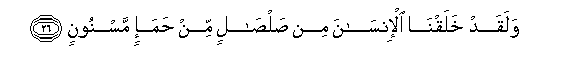
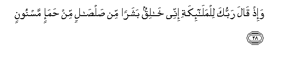
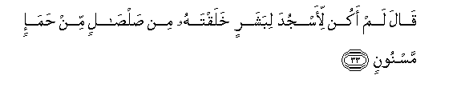
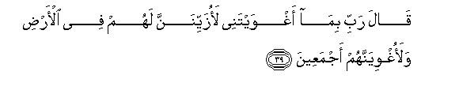

  
[Intangible Textual Heritage](../../index)  [Islam](../index.md) 
[Index](index.md)   
[Hypertext Qur'an](../htq/index)  [Unicode](../uq/015.htm#015_026.md) 
[Palmer](../sbe06/015)  [Pickthall](../pick/015.htm#015_026.md)  [Yusuf Ali
English](../yaq/yaq015)  [Rodwell](../qr/015.md)   
  
[Sūra XV.: Al-Hijr, or The Rocky Tract. Index](015.md)  
  [Previous](01502)  [Next](01504.md) 

------------------------------------------------------------------------

  
*The Holy Quran*, tr. by Yusuf Ali, \[1934\], at Intangible Textual
Heritage

------------------------------------------------------------------------

# Sūra XV.: Al-Hijr, or The Rocky Tract.

### Section 3

------------------------------------------------------------------------

26. Walaqad khalaqn<u>a</u> al-ins<u>a</u>na min <u>s</u>al<u>sa</u>lin
min <u>h</u>ama-in masnoon**in**

26\. We created man from sounding clay,  
From mud moulded into shape;

------------------------------------------------------------------------

27. Wa**a**lj<u>a</u>nna khalaqn<u>a</u>hu min qablu min n<u>a</u>ri
a**l**ssamoom**i**

27\. And the Jinn race, We had  
Created before, from the fire  
Of a scorching wind.

------------------------------------------------------------------------

28. Wa-i<u>th</u> q<u>a</u>la rabbuka lilmal<u>a</u>-ikati innee
kh<u>a</u>liqun basharan min <u>s</u>al<u>sa</u>lin min <u>h</u>ama-in
masnoon**in**

28\. Behold! thy Lord said  
To the angels: "I am about  
To create man, from sounding clay  
From mud moulded into shape;

------------------------------------------------------------------------

29. Fa-i<u>tha</u> sawwaytuhu wanafakhtu feehi min roo<u>h</u>ee
faqaAAoo lahu s<u>a</u>jideen**a**

29\. "When I have fashioned him  
(In due proportion) and breathed  
Into him of My spirit,  
Fall ye down in obeisance  
Unto him.

------------------------------------------------------------------------

30. Fasajada almal<u>a</u>-ikatu kulluhum ajmaAAoon**a**

30\. So the angels prostrated themselves,  
All of them together:

------------------------------------------------------------------------

31. Ill<u>a</u> ibleesa ab<u>a</u> an yakoona maAAa
a**l**ss<u>a</u>jideen**a**

31\. Not so Iblīs: he refused to be  
Among those who prostrated themselves.

------------------------------------------------------------------------

32. Q<u>a</u>la y<u>a</u> ibleesu m<u>a</u> laka all<u>a</u> takoona
maAAa a**l**ss<u>a</u>jideen**a**

32\. (God) said: "O Iblīs!  
What is your reason  
For not being among those  
Who prostrated themselves?"

------------------------------------------------------------------------

33. Q<u>a</u>la lam akun li-asjuda libasharin khalaqtahu min
<u>s</u>al<u>sa</u>lin min <u>h</u>ama-in masnoon**in**

33\. (Iblīs) said: "I am not one  
To prostrate myself to man,  
Whom Thou didst create  
From sounding clay, from mud  
Moulded into shape."

------------------------------------------------------------------------

34. Q<u>a</u>la fa**o**khruj minh<u>a</u> fa-innaka rajeem**un**

34\. (God) said: "Then get thee out  
From here; for thou art  
Rejected, accursed.

------------------------------------------------------------------------

35. Wa-inna AAalayka allaAAnata il<u>a</u> yawmi a**l**ddeen**i**

35\. "And the Curse shall be  
On thee till the Day of Judgment."

------------------------------------------------------------------------

36. Q<u>a</u>la rabbi faan*<u>th</u>*irnee il<u>a</u> yawmi
yubAAathoon**a**

36\. (Iblīs) said: "O my Lord!  
Give me then respite  
Till the Day  
The (dead) are raised."

------------------------------------------------------------------------

37. Q<u>a</u>la fa-innaka mina almun*<u>th</u>*areen**a**

37\. (God) said: "Respite  
Is granted thee—

------------------------------------------------------------------------

38. Il<u>a</u> yawmi alwaqti almaAAloom**i**

38\. "Till the Day  
Of the Time Appointed."

------------------------------------------------------------------------

39. Q<u>a</u>la rabbi bim<u>a</u> aghwaytanee laozayyinanna lahum fee
al-ar<u>d</u>i walaoghwiyannahum ajmaAAeen**a**

39\. (Iblīs) said: "O my Lord!  
Because Thou hast put me  
In the wrong, I will  
Make (wrong) fair-seeming  
To them on the earth,  
And I will put them  
All in the wrong,—

------------------------------------------------------------------------

40. Ill<u>a</u> AAib<u>a</u>daka minhumu almukhla<u>s</u>een**a**

40\. "Except Thy servants among them,  
Sincere and purified  
(By Thy grace)."

------------------------------------------------------------------------

41. Q<u>a</u>la h<u>atha</u> <u>s</u>ir<u>at</u>un AAalayya
mustaqeem**un**

41\. (God) said: "This (Way  
Of My sincere servants) is  
Indeed a Way that leads  
Straight to Me.

------------------------------------------------------------------------

42. Inna AAib<u>a</u>dee laysa laka AAalayhim sul<u>ta</u>nun
ill<u>a</u> mani ittabaAAaka mina algh<u>a</u>ween**a**

42\. "For over My servants  
No authority shalt thou  
Have, except such as  
Put themselves in the wrong  
And follow thee."

------------------------------------------------------------------------

43. Wa-inna jahannama lamawAAiduhum ajmaAAeen**a**

43\. And verily, Hell  
Is the promised abode  
For them all!

------------------------------------------------------------------------

44. Lah<u>a</u> sabAAatu abw<u>a</u>bin likulli b<u>a</u>bin minhum
juz-on maqsoom**un**

44\. To it are seven Gates:  
For each of those Gates  
Is a (special) class  
(Of sinners) assigned.

------------------------------------------------------------------------

[Next: Section 4 (45-60)](01504.md)

