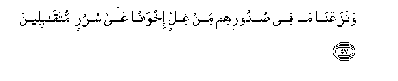
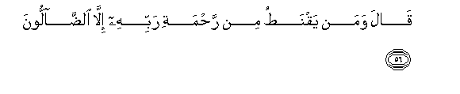

  
[Intangible Textual Heritage](../../index)  [Islam](../index.md) 
[Index](index.md)   
[Hypertext Qur'an](../htq/index)  [Unicode](../uq/015.htm#015_045.md) 
[Palmer](../sbe06/015)  [Pickthall](../pick/015.htm#015_045.md)  [Yusuf Ali
English](../yaq/yaq015)  [Rodwell](../qr/015.md)   
  
[Sūra XV.: Al-Hijr, or The Rocky Tract. Index](015.md)  
  [Previous](01503)  [Next](01505.md) 

------------------------------------------------------------------------

  
*The Holy Quran*, tr. by Yusuf Ali, \[1934\], at Intangible Textual
Heritage

------------------------------------------------------------------------

# Sūra XV.: Al-Hijr, or The Rocky Tract.

### Section 4

------------------------------------------------------------------------

45. Inna almuttaqeena fee jann<u>a</u>tin waAAuyoon**in**

45\. The righteous (will be)  
Amid Gardens  
And fountains  
(Of clear-flowing water).

------------------------------------------------------------------------

46. Odkhulooh<u>a</u> bisal<u>a</u>min <u>a</u>mineen**a**

46\. (Their greeting will be):  
"Enter ye here  
In Peace and Security."

------------------------------------------------------------------------

47. WanazaAAn<u>a</u> m<u>a</u> fee <u>s</u>udoorihim min ghillin
ikhw<u>a</u>nan AAal<u>a</u> sururin mutaq<u>a</u>bileen**a**

47\. And We shall remove  
From their hearts any  
Lurking sense of injury:  
(They will be) brothers  
(Joyfully) facing each other  
On thrones (of dignity).

------------------------------------------------------------------------

48. L<u>a</u> yamassuhum feeh<u>a</u> na<u>s</u>abun wam<u>a</u> hum
minh<u>a</u> bimukhrajeen**a**

48\. There no sense of fatigue  
Shall touch them,  
Nor shall they (ever)  
Be asked to leave.

------------------------------------------------------------------------

49. Nabbi/ AAib<u>a</u>dee annee an<u>a</u> alghafooru
a**l**rra<u>h</u>eem**u**

49\. Tell My servants  
That I am indeed  
The Oft-Forgiving,  
Most Merciful;

------------------------------------------------------------------------

50. Waanna AAa<u>tha</u>bee huwa alAAa<u>tha</u>bu al-aleem**u**

50\. And that My Penalty  
Will be indeed  
The most grievous Penalty.

------------------------------------------------------------------------

51. Wanabbi/hum AAan <u>d</u>ayfi ibr<u>a</u>heem**a**

51\. Tell them about  
The guests of Abraham.

------------------------------------------------------------------------

52. I<u>th</u> dakhaloo AAalayhi faq<u>a</u>loo sal<u>a</u>man
q<u>a</u>la inn<u>a</u> minkum wajiloon**a**

52\. When they entered his presence  
And said, "Peace!"  
He said, "We feel  
Afraid of you!"

------------------------------------------------------------------------

53. Q<u>a</u>loo l<u>a</u> tawjal inn<u>a</u> nubashshiruka
bighul<u>a</u>min AAaleem**in**

53\. They said: "Fear not!  
We give thee glad tidings  
Of a son endowed  
With wisdom."

------------------------------------------------------------------------

54. Q<u>a</u>la abashshartumoonee AAal<u>a</u> an massaniya alkibaru
fabima tubashshiroon**i**

54\. He said: "Do ye give me  
Glad tidings that old age  
Has seized me? Of what,  
Then, is your good news?"

------------------------------------------------------------------------

55. Q<u>a</u>loo bashsharn<u>a</u>ka bi**a**l<u>h</u>aqqi fal<u>a</u>
takun mina alq<u>a</u>ni<u>t</u>een**a**

55\. They said: "We give thee  
Glad tidings in truth:  
Be not then in despair!"

------------------------------------------------------------------------

56. Q<u>a</u>la waman yaqna<u>t</u>u min ra<u>h</u>mati rabbihi
ill<u>a</u> a**l**<u>dda</u>lloon**a**

56\. He said: "And who  
Despairs of the mercy  
Of his Lord, but such  
As go astray?"

------------------------------------------------------------------------

57. Q<u>a</u>la fam<u>a</u> kha<u>t</u>bukum ayyuh<u>a</u>
almursaloon**a**

57\. Abraham said: "What then  
Is the business on which  
Ye (have come), O ye  
Messengers (of God)?"

------------------------------------------------------------------------

58. Q<u>a</u>loo inn<u>a</u> orsiln<u>a</u> il<u>a</u> qawmin
mujrimeen**a**

58\. They said: "We have been  
Sent to a people  
(Deep) in sin,

------------------------------------------------------------------------

59. Ill<u>a</u> <u>a</u>la loo<u>t</u>in inn<u>a</u> lamunajjoohum
ajmaAAeen**a**

59\. "Excepting the adherents  
Of Lūt: them we are certainly  
(Charged) to save (from harm),—  
All—

------------------------------------------------------------------------

60. Ill<u>a</u> imraatahu qaddarn<u>a</u> innah<u>a</u> lamina
algh<u>a</u>bireen**a**

60\. "Except his wife, who,  
We have ascertained,  
Will be among those  
Who will lag behind."

------------------------------------------------------------------------

[Next: Section 5 (61-79)](01505.md)

