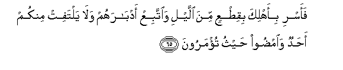
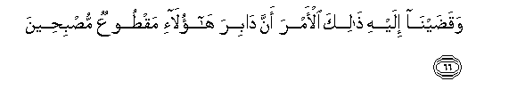

  
[Intangible Textual Heritage](../../index)  [Islam](../index.md) 
[Index](index.md)   
[Hypertext Qur'an](../htq/index)  [Unicode](../uq/015.htm#015_061.md) 
[Palmer](../sbe06/015)  [Pickthall](../pick/015.htm#015_061.md)  [Yusuf Ali
English](../yaq/yaq015)  [Rodwell](../qr/015.md)   
  
[Sūra XV.: Al-Hijr, or The Rocky Tract. Index](015.md)  
  [Previous](01504)  [Next](01506.md) 

------------------------------------------------------------------------

  
*The Holy Quran*, tr. by Yusuf Ali, \[1934\], at Intangible Textual
Heritage

------------------------------------------------------------------------

# Sūra XV.: Al-Hijr, or The Rocky Tract.

### Section 5

------------------------------------------------------------------------

61. Falamm<u>a</u> j<u>a</u>a <u>a</u>la loo<u>t</u>in almursaloon**a**

61\. At length when the messengers  
Arrived among the adherents  
Of Lūt,

------------------------------------------------------------------------

62. Q<u>a</u>la innakum qawmun munkaroon**a**

62\. He said: "Ye appear  
To be uncommon folk."

------------------------------------------------------------------------

63. Q<u>a</u>loo bal ji/n<u>a</u>ka bim<u>a</u> k<u>a</u>noo feehi
yamtaroon**a**

63\. They said: "Yea,  
We have come to thee  
To accomplish that  
Of which they doubt.

------------------------------------------------------------------------

64. Waatayn<u>a</u>ka bi**a**l<u>h</u>aqqi wa-inn<u>a</u>
la<u>sa</u>diqoon**a**

64\. "We have brought to thee  
That which is inevitably  
Due, and assuredly  
We tell the truth.

------------------------------------------------------------------------

65. Faasri bi-ahlika biqi<u>t</u>AAin mina allayli wa**i**ttabiAA
adb<u>a</u>rahum wal<u>a</u> yaltafit minkum a<u>h</u>adun
wa**i**m<u>d</u>oo <u>h</u>aythu tu/maroon**a**

65\. "Then travel by night  
With thy household,  
When a portion of the night  
(Yet remains), and do thou  
Bring up the rear:  
Let no one amongst you  
Look back, but pass on  
Whither ye are ordered."

------------------------------------------------------------------------

66. Waqa<u>d</u>ayn<u>a</u> ilayhi <u>tha</u>lika al-amra anna
d<u>a</u>bira h<u>a</u>ol<u>a</u>-i maq<u>t</u>ooAAun
mu<u>s</u>bi<u>h</u>een**a**

66\. And We made known  
This decree to him,  
That the last remnants  
Of those (sinners) should be  
Cut off by the morning.

------------------------------------------------------------------------

67. Waj<u>a</u>a ahlu almadeenati yastabshiroon**a**

67\. The inhabitants of the City  
Came in (mad) joy  
(At news of the young men).

------------------------------------------------------------------------

68. Q<u>a</u>la inna h<u>a</u>ol<u>a</u>-i <u>d</u>ayfee fal<u>a</u>
taf<u>d</u>a<u>h</u>oon**i**

68\. Lūt said: "These are  
My guests: disgrace me not:

------------------------------------------------------------------------

69. Wa**i**ttaqoo All<u>a</u>ha wal<u>a</u> tukhzoon**i**

69\. "But fear God,  
And shame me not."

------------------------------------------------------------------------

70. Q<u>a</u>loo awa lam nanhaka AAani alAA<u>a</u>lameen**a**

70\. They said: "Did we not  
Forbid thee (to speak)  
For all and sundry?"

------------------------------------------------------------------------

71. Q<u>a</u>la h<u>a</u>ol<u>a</u>-i ban<u>a</u>tee in kuntum
f<u>a</u>AAileen**a**

71\. He said: "There are  
My daughters (to marry),  
If ye must act (so)."

------------------------------------------------------------------------

72. LaAAamruka innahum lafee sakratihim yaAAmahoona

72\. Verily, by thy life (O Prophet),  
In their wild intoxication,  
They wander in distraction,  
To and fro.

------------------------------------------------------------------------

73. Faakha<u>th</u>at-humu a**l**<u>ss</u>ay<u>h</u>atu mushriqeen**a**

73\. But the (mighty) Blast  
Overtook them before morning;

------------------------------------------------------------------------

74. FajaAAaln<u>a</u> AA<u>a</u>liyah<u>a</u> s<u>a</u>filah<u>a</u>
waam<u>t</u>arn<u>a</u> AAalayhim <u>h</u>ij<u>a</u>ratan min
sijjeel**in**

74\. And We turned (the Cities)  
Upside down, and rained down  
On them brimstones  
Hard as baked clay.

------------------------------------------------------------------------

75. Inna fee <u>tha</u>lika la<u>a</u>y<u>a</u>tin lilmutawassimeen**a**

75\. Behold! in this are Signs  
For those who by tokens  
Do understand.

------------------------------------------------------------------------

76. Wa-innah<u>a</u> labisabeelin muqeem**in**

76\. And the (Cities were)  
Right on the high-road.

------------------------------------------------------------------------

77. Inna fee <u>tha</u>lika la<u>a</u>yatan lilmu/mineen**a**

77\. Behold! in this  
Is a Sign  
For those who believe!

------------------------------------------------------------------------

78. Wa-in k<u>a</u>na a<u>s</u>-<u>ha</u>bu al-aykati
la*<u>th</u>*<u>a</u>limeen**a**

78\. And the Companions of the Wood  
Were also wrong-doers;

------------------------------------------------------------------------

79. Fa**i**ntaqamn<u>a</u> minhum wa-innahum<u>a</u> labi-im<u>a</u>min
mubeen**in**

79\. So We exacted retribution  
From them. They were both  
On an open highway,  
Plain to see.

------------------------------------------------------------------------

[Next: Section 6 (80-99)](01506.md)

