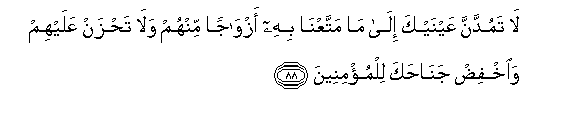

  
[Intangible Textual Heritage](../../index)  [Islam](../index) 
[Index](index)   
[Hypertext Qur'an](../htq/index)  [Unicode](../uq/015.htm#015_080) 
[Palmer](../sbe06/015)  [Pickthall](../pick/015.htm#015_080)  [Yusuf Ali
English](../yaq/yaq015)  [Rodwell](../qr/015)   
  
[Sūra XV.: Al-Hijr, or The Rocky Tract. Index](015)  
  [Previous](01505)  [Next](01601) 

------------------------------------------------------------------------

  
*The Holy Quran*, tr. by Yusuf Ali, \[1934\], at Intangible Textual
Heritage

------------------------------------------------------------------------

# Sūra XV.: Al-Hijr, or The Rocky Tract.

### Section 6

------------------------------------------------------------------------

80. Walaqad ka<u>thth</u>aba a<u>s</u>-<u>ha</u>bu al<u>h</u>ijri
almursaleen**a**

80\. The Companions of the Rocky Tract  
Also rejected the apostles:

------------------------------------------------------------------------

81. Wa<u>a</u>tayn<u>a</u>hum <u>a</u>y<u>a</u>tin<u>a</u>
fak<u>a</u>noo AAanh<u>a</u> muAAri<u>d</u>een**a**

81\. We sent them Our Signs,  
But they persisted  
In turning away from them.

------------------------------------------------------------------------

82. Wak<u>a</u>noo yan<u>h</u>itoona mina aljib<u>a</u>li buyootan
<u>a</u>mineen**a**

82\. Out of the mountains  
Did they hew (their) edifices,  
(Feeling themselves) secure.

------------------------------------------------------------------------

83. Faakha<u>th</u>at-humu a**l**<u>ss</u>ay<u>h</u>atu
mu<u>s</u>bi<u>h</u>een**a**

83\. But the (mighty) Blast  
Seized them of a morning,

------------------------------------------------------------------------

84. Fam<u>a</u> aghn<u>a</u> AAanhum m<u>a</u> k<u>a</u>noo
yaksiboon**a**

84\. And of no avail to them  
Was all that they did  
(With such art and care)!

------------------------------------------------------------------------

85. Wam<u>a</u> khalaqn<u>a</u> a**l**ssam<u>a</u>w<u>a</u>ti
wa**a**l-ar<u>d</u>a wam<u>a</u> baynahum<u>a</u> ill<u>a</u>
bi**a**l<u>h</u>aqqi wa-inna a**l**ss<u>a</u>AAata la<u>a</u>tiyatun
fa**i**<u>s</u>fa<u>h</u>i a**l**<u>ss</u>af<u>h</u>a aljameel**a**

85\. We created not the heavens,  
The earth, and all between them,  
But for just ends.  
And the Hour is surely  
Coming (when this will be manifest).  
So overlook (any human faults)  
With gracious forgiveness.

------------------------------------------------------------------------

86. Inna rabbaka huwa alkhall<u>a</u>qu alAAaleem**u**

86\. For verily it is thy Lord  
Who is the Master-Creator,  
Knowing all things.

------------------------------------------------------------------------

87. Walaqad <u>a</u>tayn<u>a</u>ka sabAAan mina almath<u>a</u>nee
wa**a**lqur-<u>a</u>na alAAa*<u>th</u>*eem**a**

87\. And We have bestowed  
Upon thee the Seven  
Oft-repeated (Verses)  
And the Grand Qur-ān.

------------------------------------------------------------------------

88. L<u>a</u> tamuddanna AAaynayka il<u>a</u> m<u>a</u> mattaAAn<u>a</u>
bihi azw<u>a</u>jan minhum wal<u>a</u> ta<u>h</u>zan AAalayhim
wa**i**khfi<u>d</u> jan<u>ah</u>aka lilmu/mineen**a**

88\. Strain not thine eyes.  
(Wistfully) at what We  
Have bestowed on certain classes  
Of them, nor grieve over them:  
But lower thy wing  
(in gentleness)  
To the Believers.

------------------------------------------------------------------------

89. Waqul innee an<u>a</u> a**l**nna<u>th</u>eeru almubeen**u**

89\. And say: "I am indeed he  
That warneth openly  
And without ambiguity,"—

------------------------------------------------------------------------

90. Kam<u>a</u> anzaln<u>a</u> AAal<u>a</u> almuqtasimeen**a**

90\. (Of just such wrath)  
As We sent down  
On those who divided  
(Scripture into arbitrary parts),—

------------------------------------------------------------------------

91. Alla<u>th</u>eena jaAAaloo alqur-<u>a</u>na AAi<u>d</u>een**a**

91\. (So also on such)  
As have made Qur-ān  
Into shreds (as they please).

------------------------------------------------------------------------

92. Fawarabbika lanas-alannahum ajmaAAeen**a**

92\. Therefore, by the Lord,  
We will, of a surety,  
Call them to account,

------------------------------------------------------------------------

93. AAamm<u>a</u> k<u>a</u>noo yaAAmaloon**a**

93\. For all their deeds.

------------------------------------------------------------------------

94. Fa**i**<u>s</u>daAA bim<u>a</u> tu/maru waaAAri<u>d</u> AAani
almushrikeen**a**

94\. Therefore expound openly  
What thou art commanded,  
And turn away from those  
Who join false gods with God.

------------------------------------------------------------------------

95. Inn<u>a</u> kafayn<u>a</u>ka almustahzi-een**a**

95\. For sufficient are We  
Unto thee against those  
Who scoff,—

------------------------------------------------------------------------

96. Alla<u>th</u>eena yajAAaloona maAAa All<u>a</u>hi il<u>a</u>han
<u>a</u>khara fasawfa yaAAlamoon**a**

96\. Those who adopt, with God,  
Another god: but soon  
Will they come to know.

------------------------------------------------------------------------

97. Walaqad naAAlamu annaka ya<u>d</u>eequ <u>s</u>adruka bim<u>a</u>
yaqooloon**a**

97\. We do indeed know  
How thy heart is distressed  
At what they say.

------------------------------------------------------------------------

98. Fasabbi<u>h</u> bi<u>h</u>amdi rabbika wakun mina
a**l**ss<u>a</u>jideen**a**

98\. But celebrate the praises  
Of thy Lord, and be of those  
Who prostrate themselves  
In adoration.

------------------------------------------------------------------------

99. Wa**o**AAbud rabbaka <u>h</u>att<u>a</u> ya/tiyaka alyaqeen**u**  

99\. And serve thy Lord  
Until there come unto thee  
The Hour that is Certain.

------------------------------------------------------------------------

[Next: Section 1 (1-9)](01601)

