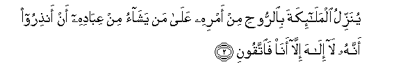
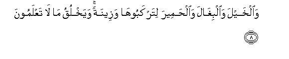

  
[Intangible Textual Heritage](../../index)  [Islam](../index) 
[Index](index)   
[Hypertext Qur'an](../htq/index)  [Unicode](../uq/016.htm#016_001) 
[Palmer](../sbe06/016)  [Pickthall](../pick/016.htm#016_001)  [Yusuf Ali
English](../yaq/yaq016)  [Rodwell](../qr/016)   
  
[Sūra XVI.: Naḥl or The Bee. Index](016)  
  [Previous](01506)  [Next](01602) 

------------------------------------------------------------------------

  
*The Holy Quran*, tr. by Yusuf Ali, \[1934\], at Intangible Textual
Heritage

------------------------------------------------------------------------

# Sūra XVI.: Naḥl or The Bee.

### Section 1

1. At<u>a</u> amru All<u>a</u>hi fal<u>a</u> tastaAAjiloohu
sub<u>ha</u>nahu wataAA<u>a</u>l<u>a</u> AAamm<u>a</u> yushrikoon**a**

1\. (Inevitable) cometh (to pass)  
The Command of God:  
Seek ye not then  
To hasten it: glory to Him,  
And far is He above  
Having the partners  
They ascribe unto Him!

------------------------------------------------------------------------

2. Yunazzilu almal<u>a</u>-ikata bi**al**rroo<u>h</u>i min amrihi
AAal<u>a</u> man yash<u>a</u>o min AAib<u>a</u>dihi an an<u>th</u>iroo
annahu l<u>a</u> il<u>a</u>ha ill<u>a</u> an<u>a</u> fa**i**ttaqoon**i**

2\. He doth send down His angels  
With inspiration of His Command,  
To such of His servants  
As He pleaseth, (saying):  
"Warn (Man) that there is  
No god but I: so do  
Your duty unto Me."

------------------------------------------------------------------------

3. Khalaqa a**l**ssam<u>a</u>w<u>a</u>ti wa**a**l-ar<u>d</u>a
bi**a**l<u>h</u>aqqi taAA<u>a</u>l<u>a</u> AAamm<u>a</u> yushrikoon**a**

3\. He has created the heavens  
And the earth for just ends:  
Far is He above having  
The partners they ascribe to Him!

------------------------------------------------------------------------

4. Khalaqa al-ins<u>a</u>na min nu<u>t</u>fatin fa-i<u>tha</u> huwa
kha<u>s</u>eemun mubeen**un**

4\. He has created man  
From a sperm-drop;  
And behold this same (man)  
Becomes an open disputer!

------------------------------------------------------------------------

5. Wa**a**l-anAA<u>a</u>ma khalaqah<u>a</u> lakum feeh<u>a</u> dif-on
waman<u>a</u>fiAAu waminh<u>a</u> ta-kuloon**a**

5\. And cattle He has created  
For you (men): from them  
Ye derive warmth,  
And numerous benefits,  
And of their (meat) ye eat.

------------------------------------------------------------------------

6. Walakum feeh<u>a</u> jam<u>a</u>lun <u>h</u>eena turee<u>h</u>oona
wa<u>h</u>eena tasra<u>h</u>oon**a**

6\. And ye have a sense  
Of pride and beauty in them  
As ye drive them home  
In the evening, and as ye  
Lead them forth to pasture  
In the morning.

------------------------------------------------------------------------

7. Wata<u>h</u>milu athq<u>a</u>lakum il<u>a</u> baladin lam takoonoo
b<u>a</u>ligheehi ill<u>a</u> bishiqqi al-anfusi inna rabbakum laraoofun
ra<u>h</u>eem**un**

7\. And they carry your heavy loads  
To lands that ye could not  
(Otherwise) reach except with  
Souls distressed: for your Lord  
Is indeed Most Kind, Most Merciful

------------------------------------------------------------------------

8. Wa**a**lkhayla wa**a**lbigh<u>a</u>la wa**a**l<u>h</u>ameera
litarkabooh<u>a</u> wazeenatan wayakhluqu m<u>a</u> l<u>a</u>
taAAlamoon**a**

8\. And (He has created) horses,  
Mules, and donkeys, for you  
To ride and use for show;  
And He has created (other) things  
Of which ye have no knowledge.

------------------------------------------------------------------------

9. WaAAal<u>a</u> All<u>a</u>hi qa<u>s</u>du a**l**ssabeeli
waminh<u>a</u> j<u>a</u>-irun walaw sh<u>a</u>a lahad<u>a</u>kum
ajmaAAeen**a**

9\. and unto God leads straight  
The Way, but there are ways  
That turn aside: if God  
Had willed, He could have  
Guided all of you.

------------------------------------------------------------------------

[Next: Section 2 (10-21)](01602)

