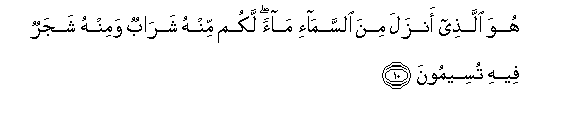
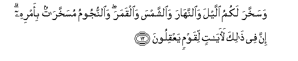
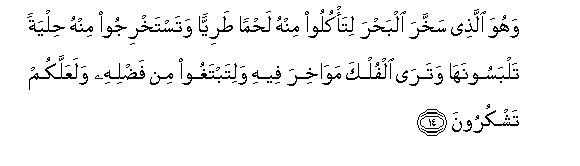
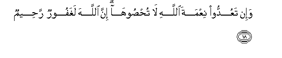

  
[Intangible Textual Heritage](../../index)  [Islam](../index.md) 
[Index](index.md)   
[Hypertext Qur'an](../htq/index)  [Unicode](../uq/016.htm#016_010.md) 
[Palmer](../sbe06/016)  [Pickthall](../pick/016.htm#016_010.md)  [Yusuf Ali
English](../yaq/yaq016)  [Rodwell](../qr/016.md)   
  
[Sūra XVI.: Naḥl or The Bee. Index](016.md)  
  [Previous](01601)  [Next](01603.md) 

------------------------------------------------------------------------

  
*The Holy Quran*, tr. by Yusuf Ali, \[1934\], at Intangible Textual
Heritage

------------------------------------------------------------------------

# Sūra XVI.: Naḥl or The Bee.

### Section 2

------------------------------------------------------------------------

10. Huwa alla<u>th</u>ee anzala mina a**l**ssam<u>a</u>-i m<u>a</u>an
lakum minhu shar<u>a</u>bun waminhu shajarun feehi tuseemoon**a**

10\. It is He Who sends down  
Rain from the sky:  
From it ye drink,  
And out of it (grows)  
The vegetation on which  
Ye feed your cattle.

------------------------------------------------------------------------

11. Yunbitu lakum bihi a**l**zzarAAa wa**al**zzaytoona wa**al**nnakheela
wa**a**l-aAAn<u>a</u>ba wamin kulli a**l**ththamar<u>a</u>ti inna fee
<u>tha</u>lika la<u>a</u>yatan liqawmin yatafakkaroon**a**

11\. With it He produces  
For you corn, olives,  
Date-palms, grapes,  
And every kind of fruit:  
Verily in this is a Sign  
For those who give thought.

------------------------------------------------------------------------

12. Wasakhkhara lakumu allayla wa**al**nnah<u>a</u>ra wa**al**shshamsa
wa**a**lqamara wa**al**nnujoomu musakhkhar<u>a</u>tun bi-amrihi inna fee
<u>tha</u>lika la<u>a</u>y<u>a</u>tin liqawmin yaAAqiloon**a**

12\. He has made subject to you  
The Night and the Day;  
The Sun and the Moon;  
And the Stars are in subjection  
By His Command: verily  
In this are Signs  
For men who are wise.

------------------------------------------------------------------------

13. Wam<u>a</u> <u>th</u>araa lakum fee al-ar<u>d</u>i mukhtalifan
alw<u>a</u>nuhu inna fee <u>tha</u>lika la<u>a</u>yatan liqawmin
ya<u>thth</u>akkaroon**a**

13\. And the things on this earth  
Which He has multiplied  
In varying colours  
(and qualities):  
Verily in this is a Sign  
For men who celebrate  
The praises of God  
(in gratitude).

------------------------------------------------------------------------

14. Wahuwa alla<u>th</u>ee sakhkhara alba<u>h</u>ra lita/kuloo minhu
la<u>h</u>man <u>t</u>ariyyan watastakhrijoo minhu <u>h</u>ilyatan
talbasoonah<u>a</u> watar<u>a</u> alfulka maw<u>a</u>khira feehi
walitabtaghoo min fa<u>d</u>lihi walaAAallakum tashkuroon**a**

14\. It is He Who has made  
The sea subject, that ye  
May eat thereof flesh  
That is fresh and tender,  
And that ye may extract  
Therefrom ornaments to wear;  
And thou seest the ships  
Therein that plough the waves,  
That ye may seek (thus)  
Of the bounty of God  
And that ye may be grateful.

------------------------------------------------------------------------

15. Waalq<u>a</u> fee al-ar<u>d</u>i raw<u>a</u>siya an tameeda bikum
waanh<u>a</u>ran wasubulan laAAallakum tahtadoon**a**

15\. And He has set up  
On the earth mountains  
Standing firm, lest it should  
Shake with you; and rivers  
And roads; that ye  
May guide yourselves;

------------------------------------------------------------------------

16. WaAAal<u>a</u>m<u>a</u>tin wabi**al**nnajmi hum yahtadoon**a**

16\. And marks and sign-posts;  
And by the stars  
(Men) guide themselves.

------------------------------------------------------------------------

17. Afaman yakhluqu kaman l<u>a</u> yakhluqu afal<u>a</u>
ta<u>th</u>akkaroon**a**

17\. Is then He Who creates  
Like one that creates not?  
Will ye not receive admonition?

------------------------------------------------------------------------

18. Wa-in taAAuddoo niAAmata All<u>a</u>hi l<u>a</u>
tu<u>hs</u>ooh<u>a</u> inna All<u>a</u>ha laghafoorun
ra<u>h</u>eem**un**

18\. If ye would count up  
The favours of God,  
Never would ye be able  
To number them: for God  
Is Oft-Forgiving, Most Merciful.

------------------------------------------------------------------------

19. Wa**A**ll<u>a</u>hu yaAAlamu m<u>a</u> tusirroona wam<u>a</u>
tuAAlinoon**a**

19\. And God doth know  
What ye conceal,  
And what ye reveal.

------------------------------------------------------------------------

20. Wa**a**lla<u>th</u>eena yadAAoona min dooni All<u>a</u>hi l<u>a</u>
yakhluqoona shay-an wahum yukhlaqoon**a**

20\. Those whom they invoke  
Besides God create nothing  
And are themselves created.

------------------------------------------------------------------------

21. Amw<u>a</u>tun ghayru a<u>h</u>y<u>a</u>-in wam<u>a</u> yashAAuroona
ayy<u>a</u>na yubAAathoon**a**

21\. (They are things) dead,  
Lifeless: nor do they know  
When they will be raised up.

------------------------------------------------------------------------

[Next: Section 3 (22-25)](01603.md)

