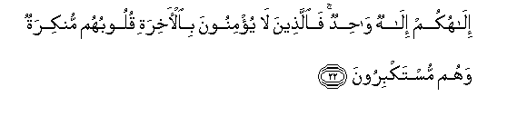
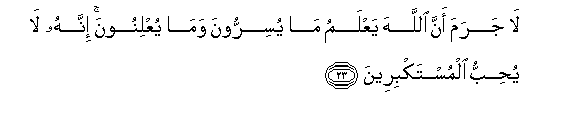
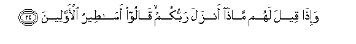

  
[Intangible Textual Heritage](../../index)  [Islam](../index.md) 
[Index](index.md)   
[Hypertext Qur'an](../htq/index)  [Unicode](../uq/016.htm#016_022.md) 
[Palmer](../sbe06/016)  [Pickthall](../pick/016.htm#016_022.md)  [Yusuf Ali
English](../yaq/yaq016)  [Rodwell](../qr/016.md)   
  
[Sūra XVI.: Naḥl or The Bee. Index](016.md)  
  [Previous](01602)  [Next](01604.md) 

------------------------------------------------------------------------

  
*The Holy Quran*, tr. by Yusuf Ali, \[1934\], at Intangible Textual
Heritage

------------------------------------------------------------------------

# Sūra XVI.: Naḥl or The Bee.

### Section 3

------------------------------------------------------------------------

22. Il<u>a</u>hukum il<u>a</u>hun w<u>ah</u>idun fa**a**lla<u>th</u>eena
l<u>a</u> yu/minoona bi**a**l-<u>a</u>khirati quloobuhum munkiratun
wahum mustakbiroon**a**

22\. Your God is One God:  
As to those who believe not  
In the Hereafter, their hearts  
Refuse to know, and they  
Are arrogant.

------------------------------------------------------------------------

23. L<u>a</u> jarama anna All<u>a</u>ha yaAAlamu m<u>a</u> yusirroona
wam<u>a</u> yuAAlinoona innahu l<u>a</u> yu<u>h</u>ibbu
almustakbireen**a**

23\. Undoubtedly God doth know  
What they conceal,  
And what they reveal:  
Verily He loveth not the arrogant.

------------------------------------------------------------------------

24. Wa-i<u>tha</u> qeela lahum m<u>atha</u> anzala rabbukum q<u>a</u>loo
as<u>at</u>eeru al-awwaleen**a**

24\. When it is said to them,  
"What is it that your Lord  
Has revealed?" they say,  
"Tales of the ancients!"

------------------------------------------------------------------------

25. Liya<u>h</u>miloo awz<u>a</u>rahum k<u>a</u>milatan yawma
alqiy<u>a</u>mati wamin awz<u>a</u>ri alla<u>th</u>eena
yu<u>d</u>illoonahum bighayri AAilmin al<u>a</u> s<u>a</u>a m<u>a</u>
yaziroon**a**

25\. Let them bear, on the Day  
Of Judgment, their own burdens  
In full, and also (something)  
Of the burdens of those  
Without knowledge, whom they  
Misled. Alas, how grievous  
The burdens they will bear!

------------------------------------------------------------------------

[Next: Section 4 (26-34)](01604.md)

