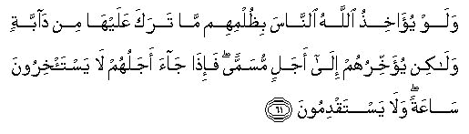
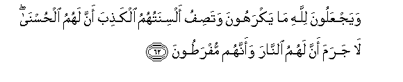
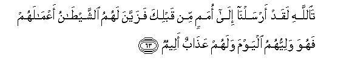
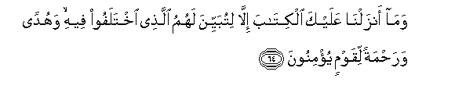
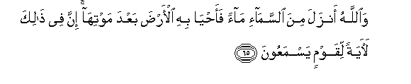

  
[Intangible Textual Heritage](../../index)  [Islam](../index.md) 
[Index](index.md)   
[Hypertext Qur'an](../htq/index)  [Unicode](../uq/016.htm#016_061.md) 
[Palmer](../sbe06/016)  [Pickthall](../pick/016.htm#016_061.md)  [Yusuf Ali
English](../yaq/yaq016)  [Rodwell](../qr/016.md)   
  
[Sūra XVI.: Naḥl or The Bee. Index](016.md)  
  [Previous](01607)  [Next](01609.md) 

------------------------------------------------------------------------

  
*The Holy Quran*, tr. by Yusuf Ali, \[1934\], at Intangible Textual
Heritage

------------------------------------------------------------------------

# Sūra XVI.: Naḥl or The Bee.

### Section 8

------------------------------------------------------------------------

61. Walaw yu-<u>a</u>khi<u>th</u>u All<u>a</u>hu a**l**nn<u>a</u>sa
bi*<u>th</u>*ulmihim m<u>a</u> taraka AAalayh<u>a</u> min
d<u>a</u>bbatin wal<u>a</u>kin yu-akhkhiruhum il<u>a</u> ajalin musamman
fa-i<u>tha</u> j<u>a</u>a ajaluhum l<u>a</u> yasta/khiroona
s<u>a</u>AAatan wal<u>a</u> yastaqdimoon**a**

61\. If God were to punish  
Men for their wrong-doing,  
He would not leave, on the (earth);  
A single living creature:  
But He gives them respite  
For a stated Term:  
When their Term expires,  
They would not be able  
To delay (the punishment)  
For a single hour, just as  
They would not be able  
To anticipate it (for a single hour).

------------------------------------------------------------------------

62. WayajAAaloona lill<u>a</u>hi m<u>a</u> yakrahoona wata<u>s</u>ifu
alsinatuhumu alka<u>th</u>iba anna lahumu al<u>h</u>usn<u>a</u>
l<u>a</u> jarama anna lahumu a**l**nn<u>a</u>ra waannahum
mufra<u>t</u>oon**a**

62\. They attribute to God  
What they hate (for themselves),  
And their tongues assert  
The falsehood that all good things  
Are for themselves: without doubt  
For them is the Fire, and they  
Will be the first to be  
Hastened on into it!

------------------------------------------------------------------------

63. Ta**A**ll<u>a</u>hi laqad arsaln<u>a</u> il<u>a</u> omamin min
qablika fazayyana lahumu a**l**shshay<u>ta</u>nu aAAm<u>a</u>lahum
fahuwa waliyyuhumu alyawma walahum AAa<u>tha</u>bun aleem**un**

63\. By God, We (also) sent  
(Our apostles) to Peoples  
Before thee; but Satan  
Made, (to the wicked),  
Their own acts seem alluring:  
He is also their patron to-day,  
But they shall have  
A most grievous penalty.

------------------------------------------------------------------------

64. Wam<u>a</u> anzaln<u>a</u> AAalayka alkit<u>a</u>ba ill<u>a</u>
litubayyina lahumu alla<u>th</u>ee ikhtalafoo feehi wahudan
wara<u>h</u>matan liqawmin yu/minoon**a**

64\. And We sent down the Book  
To thee for the express purpose,  
That thou shouldst make clear  
To them those things in which  
They differ, and that it should he  
A guide and a mercy  
To those who believe.

------------------------------------------------------------------------

65. Wa**A**ll<u>a</u>hu anzala mina a**l**ssam<u>a</u>-i m<u>a</u>an
faa<u>h</u>y<u>a</u> bihi al-ar<u>d</u>a baAAda mawtih<u>a</u> inna fee
<u>tha</u>lika la<u>a</u>yatan liqawmin yasmaAAoon**a**

65\. And God sends down rain  
From the skies, and gives therewith  
Life to the earth after its death:  
Verily in this is a Sign  
For those who listen.

------------------------------------------------------------------------

[Next: Section 9 (66-70)](01609.md)

