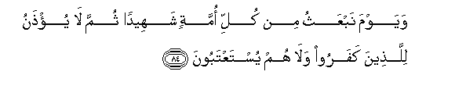
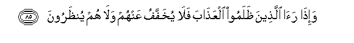
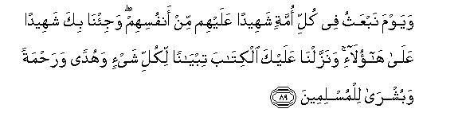

  
[Intangible Textual Heritage](../../index)  [Islam](../index.md) 
[Index](index.md)   
[Hypertext Qur'an](../htq/index)  [Unicode](../uq/016.htm#016_084.md) 
[Palmer](../sbe06/016)  [Pickthall](../pick/016.htm#016_084.md)  [Yusuf Ali
English](../yaq/yaq016)  [Rodwell](../qr/016.md)   
  
[Sūra XVI.: Naḥl or The Bee. Index](016.md)  
  [Previous](01611)  [Next](01613.md) 

------------------------------------------------------------------------

  
*The Holy Quran*, tr. by Yusuf Ali, \[1934\], at Intangible Textual
Heritage

------------------------------------------------------------------------

# Sūra XVI.: Naḥl or The Bee.

### Section 12

------------------------------------------------------------------------

84. Wayawma nabAAathu min kulli ommatin shaheedan thumma l<u>a</u>
yu/<u>th</u>anu lilla<u>th</u>eena kafaroo wal<u>a</u> hum
yustaAAtaboon**a**

84\. One Day We shall raise  
From all Peoples a Witness:  
Then will no excuse be accepted  
From Unbelievers, nor will they  
Receive any favours.

------------------------------------------------------------------------

85. Wa-i<u>tha</u> ra<u>a</u> alla<u>th</u>eena *<u>th</u>*alamoo
alAAa<u>tha</u>ba fal<u>a</u> yukhaffafu AAanhum wal<u>a</u> hum
yun*<u>th</u>*aroon**a**

85\. When the wrong-doers  
(Actually) see the Penalty,  
Then will it in no way  
Be mitigated, nor will they  
Then receive respite.

------------------------------------------------------------------------

86. Wa-i<u>tha</u> ra<u>a</u> alla<u>th</u>eena ashrakoo
shurak<u>a</u>ahum q<u>a</u>loo rabban<u>a</u> h<u>a</u>ol<u>a</u>-i
shurak<u>a</u>on<u>a</u> alla<u>th</u>eena kunn<u>a</u> nadAAoo min
doonika faalqaw ilayhimu alqawla innakum lak<u>ath</u>iboon**a**

86\. When those who gave partners  
To God will see their "partners",  
They will say: "Our Lord!  
These are our "partners," those  
Whom we used to invoke  
Besides Thee." But they will  
Throw back their word at them  
(And say): "Indeed ye are liars!"

------------------------------------------------------------------------

87. Waalqaw il<u>a</u> All<u>a</u>hi yawma-i<u>th</u>in a**l**ssalama
wa<u>d</u>alla AAanhum m<u>a</u> k<u>a</u>noo yaftaroon**a**

87\. That day shall they (openly) show  
(Their) submission to God; and all  
Their inventions shall leave  
Them in the lurch.

------------------------------------------------------------------------

88. Alla<u>th</u>eena kafaroo wa<u>s</u>addoo AAan sabeeli All<u>a</u>hi
zidn<u>a</u>hum AAa<u>tha</u>ban fawqa alAAa<u>tha</u>bi bim<u>a</u>
k<u>a</u>noo yufsidoon**a**

88\. Those who reject God  
And hinder (men) from the Path  
Of God—for them  
Will We add Penalty  
To Penalty; for that they  
Used to spread mischief.

------------------------------------------------------------------------

89. Wayawma nabAAathu fee kulli ommatin shaheedan AAalayhim min
anfusihim waji/n<u>a</u> bika shaheedan AAal<u>a</u>
h<u>a</u>ol<u>a</u>-i wanazzaln<u>a</u> AAalayka alkit<u>a</u>ba
tiby<u>a</u>nan likulli shay-in wahudan wara<u>h</u>matan
wabushr<u>a</u> lilmuslimeen**a**

89\. One day We shall raise  
From all Peoples a witness  
Against them, from amongst themselves:  
And We shall bring thee  
As a witness against these  
(Thy people): and We have sent down  
To thee the Book explaining  
All things, a Guide, a Mercy,  
And Glad Tidings to Muslims.

------------------------------------------------------------------------

[Next: Section 13 (90-100)](01613.md)

