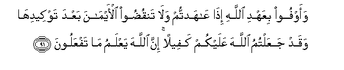
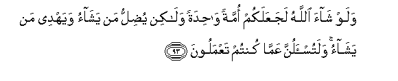
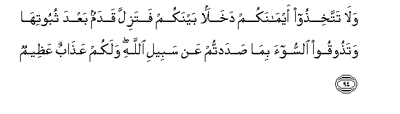
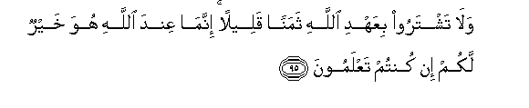
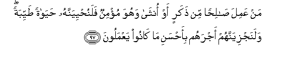
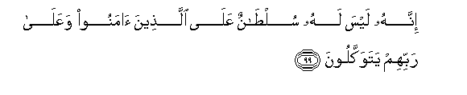

  
[Intangible Textual Heritage](../../index)  [Islam](../index) 
[Index](index)   
[Hypertext Qur'an](../htq/index)  [Unicode](../uq/016.htm#016_090) 
[Palmer](../sbe06/016)  [Pickthall](../pick/016.htm#016_090)  [Yusuf Ali
English](../yaq/yaq016)  [Rodwell](../qr/016)   
  
[Sūra XVI.: Naḥl or The Bee. Index](016)  
  [Previous](01612)  [Next](01614) 

------------------------------------------------------------------------

  
*The Holy Quran*, tr. by Yusuf Ali, \[1934\], at Intangible Textual
Heritage

------------------------------------------------------------------------

# Sūra XVI.: Naḥl or The Bee.

### Section 13

------------------------------------------------------------------------

90. Inna All<u>a</u>ha ya/muru bi**a**lAAadli
wa**a**l-i<u>h</u>s<u>a</u>ni wa-eet<u>a</u>-i <u>th</u>ee
alqurb<u>a</u> wayanh<u>a</u> AAani alfa<u>h</u>sh<u>a</u>-i
wa**a**lmunkari wa**a**lbaghyi yaAAi*<u>th</u>*ukum laAAallakum
ta<u>th</u>akkaroon**a**

90\. God commands justice, the doing  
Of good, and liberality to kith  
And kin, and He forbids  
All shameful deeds, and injustice  
And rebellion: He instructs you,  
That ye may receive admonition.

------------------------------------------------------------------------

91. Waawfoo biAAahdi All<u>a</u>hi i<u>tha</u> AA<u>a</u>hadtum
wal<u>a</u> tanqu<u>d</u>oo al-aym<u>a</u>na baAAda tawkeedih<u>a</u>
waqad jaAAaltumu All<u>a</u>ha AAalaykum kafeelan inna All<u>a</u>ha
yaAAlamu m<u>a</u> tafAAaloon**a**

91\. Fulfil the Covenant of God  
When ye have entered into it,  
And break not your oaths  
After ye have confirmed them;  
Indeed ye have made  
God your surety; for God  
Knoweth all that ye do.

------------------------------------------------------------------------

92. Wal<u>a</u> takoonoo ka**a**llatee naqa<u>d</u>at ghazlah<u>a</u>
min baAAdi quwwatin ank<u>a</u>than tattakhi<u>th</u>oona
aym<u>a</u>nakum dakhalan baynakum an takoona ommatun hiya arb<u>a</u>
min ommatin innam<u>a</u> yablookumu All<u>a</u>hu bihi walayubayyinanna
lakum yawma alqiy<u>a</u>mati m<u>a</u> kuntum feehi takhtalifoon**a**

92\. And be not like a woman  
Who breaks into untwisted strands  
The yarn which she has spun,  
After it has become strong  
Nor take your oaths to practise  
Deception between yourselves,  
Lest one party should be  
More numerous than another:  
For God will test you by this;  
And on the Day of Judgment  
He will certainly make clear  
To you (the truth of) that  
Wherein ye disagree.

------------------------------------------------------------------------

93. Walaw sh<u>a</u>a All<u>a</u>hu lajaAAalakum ommatan
w<u>ah</u>idatan wal<u>a</u>kin yu<u>d</u>illu man yash<u>a</u>o
wayahdee man yash<u>a</u>o walatus-alunna AAamm<u>a</u> kuntum
taAAmaloon**a**

93\. If God so willed, He  
Could make you all one People:  
But He leaves straying  
Whom He pleases, and He guides  
Whom He pleases: but ye  
Shall certainly be called to account  
For all your actions.

------------------------------------------------------------------------

94. Wal<u>a</u> tattakhi<u>th</u>oo aym<u>a</u>nakum dakhalan baynakum
fatazilla qadamun baAAda thubootih<u>a</u> wata<u>th</u>ooqoo
a**l**ssoo-a bim<u>a</u> <u>s</u>adadtum AAan sabeeli All<u>a</u>hi
walakum AAa<u>tha</u>bun AAa*<u>th</u>*eem**un**

94\. And take not your oaths,  
To practise deception between  
yourselves,  
With the result that someone's foot  
May slip after it was  
Firmly planted, and ye may  
Have to taste the evil  
(consequences)  
Of having hindered (men)  
From the Path of God,  
And a mighty Wrath  
Descend on you.

------------------------------------------------------------------------

95. Wal<u>a</u> tashtaroo biAAahdi All<u>a</u>hi thamanan qaleelan
innam<u>a</u> AAinda All<u>a</u>hi huwa khayrun lakum in kuntum
taAAlamoon**a**

95\. Nor sell the Covenant of God  
For a miserable price:  
For with God is (a prize)  
Far better for you,  
If ye only knew.

------------------------------------------------------------------------

96. M<u>a</u> AAindakum yanfadu wam<u>a</u> AAinda All<u>a</u>hi
b<u>a</u>qin walanajziyanna alla<u>th</u>eena <u>s</u>abaroo ajrahum
bi-a<u>h</u>sani m<u>a</u> k<u>a</u>noo yaAAmaloon**a**

96\. What is with you must vanish:  
What is with God will endure.  
And We will certainly bestow,  
On those who patiently persevere,  
Their reward according to  
The best of their actions.

------------------------------------------------------------------------

97. Man AAamila <u>sa</u>li<u>h</u>an min <u>th</u>akarin aw
onth<u>a</u> wahuwa mu/minun falanu<u>h</u>yiyannahu
<u>h</u>ay<u>a</u>tan <u>t</u>ayyibatan walanajziyannahum ajrahum
bi-a<u>h</u>sani m<u>a</u> k<u>a</u>noo yaAAmaloon**a**

97\. Whoever works righteousness,  
Man or woman, and has Faith,  
Verily, to him will We give  
A new Life, a life  
That is good and pure, and We  
Will bestow on such their reward  
According to the best  
Of their actions.

------------------------------------------------------------------------

98. Fa-i<u>tha</u> qara/ta alqur-<u>a</u>na fa**i**staAAi<u>th</u>
bi**A**ll<u>a</u>hi mina a**l**shshay<u>ta</u>ni a**l**rrajeem**i**

98\. When thou dost read  
The Qur-ān, seek God's protection  
From Satan the Rejected One.

------------------------------------------------------------------------

99. Innahu laysa lahu sul<u>ta</u>nun AAal<u>a</u> alla<u>th</u>eena
<u>a</u>manoo waAAal<u>a</u> rabbihim yatawakkaloon**a**

99\. No authority has he over those  
Who believe and put their trust  
In their Lord.

------------------------------------------------------------------------

100. Innam<u>a</u> sul<u>ta</u>nuhu AAal<u>a</u> alla<u>th</u>eena
yatawallawnahu wa**a**lla<u>th</u>eena hum bihi mushrikoon**a**

100\. His authority is over those  
Only, who take him as patron  
And who join partners with God.

------------------------------------------------------------------------

[Next: Section 14 (101-110)](01614)

