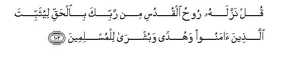
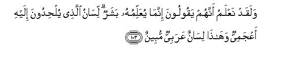
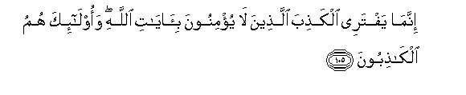
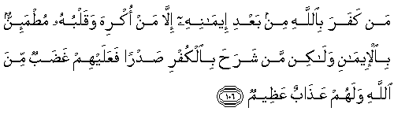
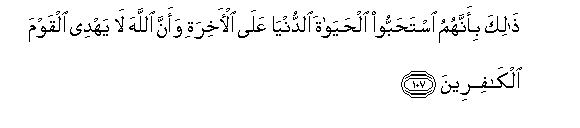
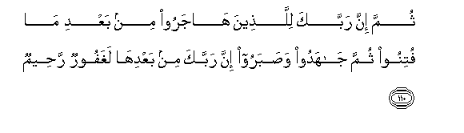

  
[Intangible Textual Heritage](../../index)  [Islam](../index) 
[Index](index)   
[Hypertext Qur'an](../htq/index)  [Unicode](../uq/016.htm#016_101) 
[Palmer](../sbe06/016)  [Pickthall](../pick/016.htm#016_101)  [Yusuf Ali
English](../yaq/yaq016)  [Rodwell](../qr/016)   
  
[Sūra XVI.: Naḥl or The Bee. Index](016)  
  [Previous](01613)  [Next](01615) 

------------------------------------------------------------------------

  
*The Holy Quran*, tr. by Yusuf Ali, \[1934\], at Intangible Textual
Heritage

------------------------------------------------------------------------

# Sūra XVI.: Naḥl or The Bee.

### Section 14

------------------------------------------------------------------------

101. Wa-i<u>tha</u> baddaln<u>a</u> <u>a</u>yatan mak<u>a</u>na
<u>a</u>yatin wa**A**ll<u>a</u>hu aAAlamu bim<u>a</u> yunazzilu
q<u>a</u>loo innam<u>a</u> anta muftarin bal aktharuhum l<u>a</u>
yaAAlamoon**a**

101\. When We substitute one revelation  
For another,—and God knows best  
What He reveals (in stages),—  
They say, "Thou art but a forger":  
But most of them understand not.

------------------------------------------------------------------------

102. Qul nazzalahu roo<u>h</u>u alqudusi min rabbika
bi**a**l<u>h</u>aqqi liyuthabbita alla<u>th</u>eena <u>a</u>manoo
wahudan wabushr<u>a</u> lilmuslimeen**a**

102\. Say, the Holy Spirit has brought  
The revelation from thy Lord  
In Truth, in order to strengthen  
Those who believe, and as a Guide  
And Glad Tidings to Muslims.

------------------------------------------------------------------------

103. Walaqad naAAlamu annahum yaqooloona innam<u>a</u> yuAAallimuhu
basharun lis<u>a</u>nu alla<u>th</u>ee yul<u>h</u>idoona ilayhi
aAAjamiyyun wah<u>atha</u> lis<u>a</u>nun AAarabiyyun mubeen**un**

103\. We know indeed that they  
Say, "It is a man that.  
Teaches him." The tongue  
Of him they wickedly point to  
Is notably foreign, while this  
Is Arabic, pure and clear.

------------------------------------------------------------------------

104. Inna alla<u>th</u>eena l<u>a</u> yu/minoona bi-<u>a</u>y<u>a</u>ti
All<u>a</u>hi l<u>a</u> yahdeehimu All<u>a</u>hu walahum
AAa<u>tha</u>bun aleem**un**

104\. Those who believe not  
In the Signs of God,—  
God will not guide them,  
And theirs will be  
A grievous Penalty.

------------------------------------------------------------------------

105. Innam<u>a</u> yaftaree alka<u>th</u>iba alla<u>th</u>eena l<u>a</u>
yu/minoona bi-<u>a</u>y<u>a</u>ti All<u>a</u>hi waol<u>a</u>-ika humu
alk<u>ath</u>iboon**a**

105\. It is those who believe not  
In the Signs of God,  
That forge falsehood:  
It is they who lie!

------------------------------------------------------------------------

106. Man kafara bi**A**ll<u>a</u>hi min baAAdi eem<u>a</u>nihi
ill<u>a</u> man okriha waqalbuhu mu<u>t</u>ma-innun
bi**a**l-eem<u>a</u>ni wal<u>a</u>kin man shara<u>h</u>a bi**a**lkufri
<u>s</u>adran faAAalayhim gha<u>d</u>abun mina All<u>a</u>hi walahum
AAa<u>tha</u>bun AAa*<u>th</u>*eem**un**

106\. Any one who, after accepting  
Faith in God, utters Unbelief,—  
Except under compulsion,  
His heart remaining firm  
In Faith—but such as  
Open their breast to Unbelief,—  
On them is Wrath from God,  
And theirs will be  
A dreadful Penalty.

------------------------------------------------------------------------

107. <u>Tha</u>lika bi-annahumu ista<u>h</u>abboo al<u>h</u>ay<u>a</u>ta
a**l**dduny<u>a</u> AAal<u>a</u> al-<u>a</u>khirati waanna All<u>a</u>ha
l<u>a</u> yahdee alqawma alk<u>a</u>fireen**a**

107\. This because they love  
The life of this world  
Better than the Hereafter:  
And God will not guide  
Those who reject Faith.

------------------------------------------------------------------------

108. Ol<u>a</u>-ika alla<u>th</u>eena <u>t</u>abaAAa All<u>a</u>hu
AAal<u>a</u> quloobihim wasamAAihim waab<u>sa</u>rihim waol<u>a</u>-ika
humu algh<u>a</u>filoon**a**

108\. Those are they whose hearts,  
Ears, and eyes God has sealed up  
And they take no heed.

------------------------------------------------------------------------

109. L<u>a</u> jarama annahum fee al-<u>a</u>khirati humu
alkh<u>a</u>siroon**a**

109\. Without doubt, in the Hereafter  
They will perish.

------------------------------------------------------------------------

110. Thumma inna rabbaka lilla<u>th</u>eena h<u>a</u>jaroo min baAAdi
m<u>a</u> futinoo thumma j<u>a</u>hadoo wa<u>s</u>abaroo inna rabbaka
min baAAdih<u>a</u> laghafoorun ra<u>h</u>eem**un**

110\. But verily thy Lord,—  
To those who leave their homes  
After trials and persecutions,—  
And who thereafter strive  
And fight for the Faith  
And patiently persevere,  
Thy Lord, after all this  
Is Oft-Forgiving, Most Merciful.

------------------------------------------------------------------------

[Next: Section 15 (111-119)](01615)

