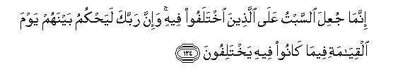
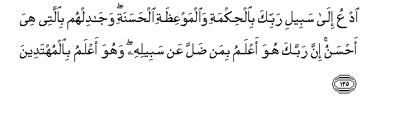
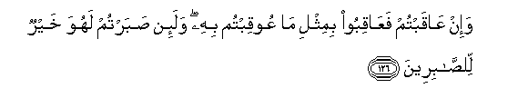

  
[Intangible Textual Heritage](../../index)  [Islam](../index) 
[Index](index)   
[Hypertext Qur'an](../htq/index)  [Unicode](../uq/016.htm#016_120) 
[Palmer](../sbe06/016)  [Pickthall](../pick/016.htm#016_120)  [Yusuf Ali
English](../yaq/yaq016)  [Rodwell](../qr/016)   
  
[Sūra XVI.: Naḥl or The Bee. Index](016)  
  [Previous](01615)  [Next](01701) 

------------------------------------------------------------------------

  
*The Holy Quran*, tr. by Yusuf Ali, \[1934\], at Intangible Textual
Heritage

------------------------------------------------------------------------

# Sūra XVI.: Naḥl or The Bee.

### Section 16

------------------------------------------------------------------------

120. Inna ibr<u>a</u>heema k<u>a</u>na ommatan q<u>a</u>nitan
lill<u>a</u>hi <u>h</u>aneefan walam yaku mina almushrikeen**a**

120\. Abraham was indeed a model,  
Devoutly obedient to God,  
(And) true in faith, and he  
Joined not gods with God:

------------------------------------------------------------------------

121. Sh<u>a</u>kiran li-anAAumihi ijtab<u>a</u>hu wahad<u>a</u>hu
il<u>a</u> <u>s</u>ir<u>at</u>in mustaqeem**in**

121\. He showed his gratitude  
For the favours of God,  
Who chose him, and guided him  
To a Straight Way.

------------------------------------------------------------------------

122. Wa<u>a</u>tayn<u>a</u>hu fee a**l**dduny<u>a</u> <u>h</u>asanatan
wa-innahu fee al-<u>a</u>khirati lamina
a**l**<u>ssa</u>li<u>h</u>een**a**

122\. And We gave him Good  
In this world, and he will be,  
In the Hereafter, in the ranks  
Of the Righteous,''

------------------------------------------------------------------------

123. Thumma aw<u>h</u>ayn<u>a</u> ilayka ani ittabiAA millata
ibr<u>a</u>heema <u>h</u>aneefan wam<u>a</u> k<u>a</u>na mina
almushrikeen**a**

123\. So We have taught thee  
The inspired (message),  
"Follow the ways of Abraham  
The True in Faith, and he  
Joined not gods with God."

------------------------------------------------------------------------

124. Innam<u>a</u> juAAila a**l**ssabtu AAal<u>a</u> alla<u>th</u>eena
ikhtalafoo feehi wa-inna rabbaka laya<u>h</u>kumu baynahum yawma
alqiy<u>a</u>mati feem<u>a</u> k<u>a</u>noo feehi yakhtalifoon**a**

124\. The Sabbath was only made  
(Strict) for those who disagreed  
(As to its observance);  
But God will judge between them  
On the Day of Judgment,  
As to their differences,

------------------------------------------------------------------------

125. OdAAu il<u>a</u> sabeeli rabbika bi**a**l<u>h</u>ikmati
wa**a**lmawAAi*<u>th</u>*ati al<u>h</u>asanati waj<u>a</u>dilhum
bi**a**llatee hiya a<u>h</u>sanu inna rabbaka huwa aAAlamu biman
<u>d</u>alla AAan sabeelihi wahuwa aAAlamu bi**a**lmuhtadeen**a**

125\. Invite (all) to the Way  
Of thy Lord with wisdom  
And beautiful preaching;  
And argue with them  
In ways that are best  
And most gracious:  
For thy Lord knoweth best,  
Who have strayed from His Path,  
And who receive guidance.

------------------------------------------------------------------------

126. Wa-in AA<u>a</u>qabtum faAA<u>a</u>qiboo bimithli m<u>a</u>
AAooqibtum bihi wala-in <u>s</u>abartum lahuwa khayrun
li**l**<u>ssa</u>bireen**a**

126\. And if ye do catch them out,  
Catch them out no worse  
Than they catch you out:  
But if ye show patience,  
That is indeed the best (course)  
For those who are patient.

------------------------------------------------------------------------

127. Wa**i**<u>s</u>bir wam<u>a</u> <u>s</u>abruka ill<u>a</u>
bi**A**ll<u>a</u>hi wal<u>a</u> ta<u>h</u>zan AAalayhim wal<u>a</u> taku
fee <u>d</u>ayqin mimm<u>a</u> yamkuroon**a**

127\. And do thou be patient,  
For thy patience is but  
From God; nor grieve over them:  
And distress not thyself  
Because of their plots.

------------------------------------------------------------------------

128. Inna All<u>a</u>ha maAAa alla<u>th</u>eena ittaqaw
wa**a**lla<u>th</u>eena hum mu<u>h</u>sinoon**a**

128\. For God is with those  
Who restrain themselves,  
And those who do good.

------------------------------------------------------------------------

[Next: Section 1 (1-10)](01701)

