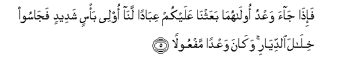

  
[Intangible Textual Heritage](../../index)  [Islam](../index.md) 
[Index](index.md)   
[Hypertext Qur'an](../htq/index)  [Unicode](../uq/017.htm#017_001.md) 
[Palmer](../sbe09/017)  [Pickthall](../pick/017.htm#017_001.md)  [Yusuf Ali
English](../yaq/yaq017)  [Rodwell](../qr/017.md)   
  
[Sūra XVII.: Banī Isrā-īl, or the Children of Israel, Index](017.md)  
  [Previous](01616)  [Next](01702.md) 

------------------------------------------------------------------------

  
*The Holy Quran*, tr. by Yusuf Ali, \[1934\], at Intangible Textual
Heritage

------------------------------------------------------------------------

# Sūra XVII.: Banī Isrā-īl, or the Children of Israel,

### Section 1

1. Sub<u>ha</u>na alla<u>th</u>ee asr<u>a</u> biAAabdihi laylan mina
almasjidi al<u>h</u>ar<u>a</u>mi il<u>a</u> almasjidi al-aq<u>sa</u>
alla<u>th</u>ee b<u>a</u>rakn<u>a</u> <u>h</u>awlahu linuriyahu min
<u>a</u>y<u>a</u>tin<u>a</u> innahu huwa a**l**ssameeAAu
alba<u>s</u>eer**u**

1\. Glory to (God)  
Who did take His Servant  
For a Journey by night  
From the Sacred Mosque  
To the Farthest Mosque,  
Whose precincts We did  
Bless,—in order that We  
Might show him some  
Of Our Signs: for He  
Is the One Who heareth  
And seeth (all things).

------------------------------------------------------------------------

2. Wa<u>a</u>tayn<u>a</u> moos<u>a</u> alkit<u>a</u>ba
wajaAAaln<u>a</u>hu hudan libanee isr<u>a</u>-eela all<u>a</u>
tattakhi<u>th</u>oo min doonee wakeel<u>a</u>**n**

2\. We gave Moses the Book,  
And made it a Guide  
To the Children of Israel,  
(Commanding): "Take not  
Other than Me  
As Disposer of (your) affairs."

------------------------------------------------------------------------

3. <u>Th</u>urriyyata man <u>h</u>amaln<u>a</u> maAAa noo<u>h</u>in
innahu k<u>a</u>na AAabdan shakoor<u>a</u>**n**

3\. O ye that are sprung  
From those whom We carried  
(In the Ark) with Noah!  
Verily he was a devotee  
Most grateful.

------------------------------------------------------------------------

4. Waqa<u>d</u>ayn<u>a</u> il<u>a</u> banee isr<u>a</u>-eela fee
alkit<u>a</u>bi latufsidunna fee al-ar<u>d</u>i marratayni walataAAlunna
AAuluwwan kabeer<u>a</u>**n**

4\. And We gave (clear) warning  
To the Children of Israel  
In the Book, that twice  
Would they do mischief  
On the earth and be elated  
With mighty arrogance  
(And twice would they be punished)!

------------------------------------------------------------------------

5. Fa-i<u>tha</u> j<u>a</u>a waAAdu ool<u>a</u>hum<u>a</u>
baAAathn<u>a</u> AAalaykum AAib<u>a</u>dan lan<u>a</u> olee ba/sin
shadeedin faj<u>a</u>soo khil<u>a</u>la a**l**ddiy<u>a</u>ri
wak<u>a</u>na waAAdan mafAAool<u>a</u>**n**

5\. When the first of the warnings  
Came to pass, We sent  
Against you Our servants  
Given to terrible warfare:  
They entered the very inmost  
Parts of your homes;  
And it was a warning  
(Completely) fulfilled.

------------------------------------------------------------------------

6. Thumma radadn<u>a</u> lakumu alkarrata AAalayhim waamdadn<u>a</u>kum
bi-amw<u>a</u>lin wabaneena wajaAAaln<u>a</u>kum akthara
nafeer<u>a</u>**n**

6\. Then did We grant you  
The Return as against them:  
We gave you increase  
In resources and sons,  
And made you  
The more numerous  
In man-power.

------------------------------------------------------------------------

7. In a<u>h</u>santum a<u>h</u>santum li-anfusikum wa-in asa/tum
falah<u>a</u> fa-i<u>tha</u> j<u>a</u>a waAAdu al-<u>a</u>khirati
liyasoo-oo wujoohakum waliyadkhuloo almasjida kam<u>a</u> dakhaloohu
awwala marratin waliyutabbiroo m<u>a</u> AAalaw tatbeer<u>a</u>**n**

7\. If ye did well,  
Ye did well for yourselves;  
If ye did evil,  
(Ye did it) against yourselves?  
So when the second  
Of the warnings came to pass,  
(We permitted your enemies)  
To disfigure your faces,  
And to enter your Temple  
As they had entered it before,  
And to visit with destruction  
All that fell into their power.

------------------------------------------------------------------------

8. AAas<u>a</u> rabbukum an yar<u>h</u>amakum wa-in AAudtum
AAudn<u>a</u> wajaAAaln<u>a</u> jahannama lilk<u>a</u>fireena
<u>h</u>a<u>s</u>eer<u>a</u>**n**

8\. It may be that your Lord  
May (yet) show Mercy  
Unto you; but if ye  
Revert (to your sins),  
We shall revert  
(To Our punishments):  
And We have made Hell  
A prison for those who  
Reject (all Faith),

------------------------------------------------------------------------

9. Inna h<u>atha</u> alqur-<u>a</u>na yahdee lillatee hiya aqwamu
wayubashshiru almu/mineena alla<u>th</u>eena yaAAmaloona
a**l**<u>ssa</u>li<u>ha</u>ti anna lahum ajran kabeer<u>a</u>**n**

9\. Verily this Qur-ān  
Doth guide to that  
Which is most right (or stable),  
And giveth the glad tidings  
To the Believers who work  
Deeds of righteousness,  
That they shall have  
A magnificent reward;

------------------------------------------------------------------------

10. Waanna alla<u>th</u>eena l<u>a</u> yu/minoona
bi**a**l-<u>a</u>khirati aAAtadn<u>a</u> lahum AAa<u>tha</u>ban
aleem<u>a</u>**n**

10\. And to those who believe not  
In the Hereafter, (it announceth)  
That We have prepared  
For them a Penalty  
Grievous (indeed).

------------------------------------------------------------------------

[Next: Section 2 (11-22)](01702.md)

