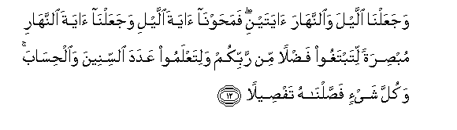
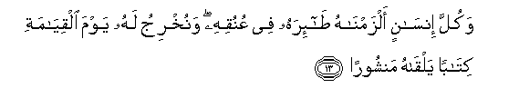
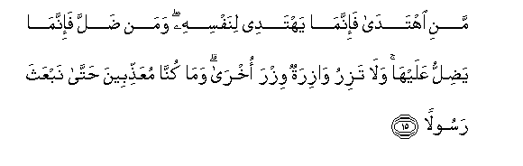
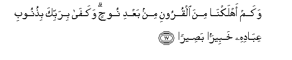
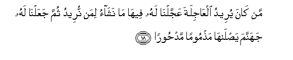
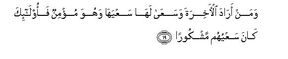
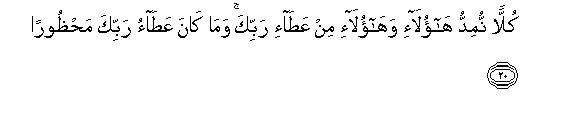
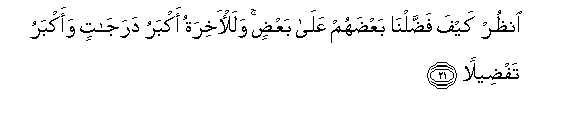

  
[Intangible Textual Heritage](../../index)  [Islam](../index.md) 
[Index](index.md)   
[Hypertext Qur'an](../htq/index)  [Unicode](../uq/017.htm#017_011.md) 
[Palmer](../sbe09/017)  [Pickthall](../pick/017.htm#017_011.md)  [Yusuf Ali
English](../yaq/yaq017)  [Rodwell](../qr/017.md)   
  
[Sūra XVII.: Banī Isrā-īl, or the Children of Israel, Index](017.md)  
  [Previous](01701)  [Next](01703.md) 

------------------------------------------------------------------------

  
*The Holy Quran*, tr. by Yusuf Ali, \[1934\], at Intangible Textual
Heritage

------------------------------------------------------------------------

# Sūra XVII.: Banī Isrā-īl, or the Children of Israel,

### Section 2

------------------------------------------------------------------------

11. WayadAAu al-ins<u>a</u>nu bi**al**shsharri duAA<u>a</u>ahu
bi**a**lkhayri wak<u>a</u>na al-ins<u>a</u>nu AAajool<u>a</u>**n**

11\. The prayer that man  
Should make for good,  
He maketh for evil;  
For man is given to  
Hasty (deeds).

------------------------------------------------------------------------

12. WajaAAaln<u>a</u> allayla wa**al**nnah<u>a</u>ra <u>a</u>yatayni
fama<u>h</u>awn<u>a</u> <u>a</u>yata allayli wajaAAaln<u>a</u>
<u>a</u>yata a**l**nnah<u>a</u>ri mub<u>s</u>iratan litabtaghoo
fa<u>d</u>lan min rabbikum walitaAAlamoo AAadada a**l**ssineena
wa**a**l<u>h</u>is<u>a</u>ba wakulla shay-in fa<u>ss</u>aln<u>a</u>hu
taf<u>s</u>eel<u>a</u>**n**

12\. We have made the Night  
And the Day as two  
(Of Our) Signs: the Sign  
Of the Night have We obscured,  
While the Sign of the Day  
We have made to enlighten  
You; that ye may seek  
Bounty from your Lord,  
And that ye may know  
The number and count  
Of the years: all things  
Have We explained in detail.

------------------------------------------------------------------------

13. Wakulla ins<u>a</u>nin alzamn<u>a</u>hu <u>ta</u>-irahu fee
AAunuqihi wanukhriju lahu yawma alqiy<u>a</u>mati kit<u>a</u>ban
yalq<u>a</u>hu manshoor<u>a</u>**n**

13\. Every man's fate  
We have fastened  
On his own neck:  
On the Day of Judgment  
We shall bring out  
For him a scroll,  
Which he will see  
Spread open.

------------------------------------------------------------------------

14. Iqra/ kit<u>a</u>baka kaf<u>a</u> binafsika alyawma AAalayka
<u>h</u>aseeb<u>a</u>**n**

14\. (It will be said to him:)  
"Read thine (own) record:  
Sufficient is thy soul  
This day to make out  
An account against thee."

------------------------------------------------------------------------

15. Mani ihtad<u>a</u> fa-innam<u>a</u> yahtadee linafsihi waman
<u>d</u>alla fa-innam<u>a</u> ya<u>d</u>illu AAalayh<u>a</u> wal<u>a</u>
taziru w<u>a</u>ziratun wizra okhr<u>a</u> wam<u>a</u> kunn<u>a</u>
muAAa<u>thth</u>ibeena <u>h</u>att<u>a</u> nabAAatha rasool<u>a</u>**n**

15\. Who receiveth guidance,  
Receiveth it for his own  
Benefit: who goeth astray  
Doth so to his own loss:  
No bearer of burdens  
Can bear the burden  
Of another: nor would We  
Visit with Our Wrath  
Until We had sent  
An apostle (to give warning).

------------------------------------------------------------------------

16. Wa-i<u>tha</u> aradn<u>a</u> an nuhlika qaryatan amarn<u>a</u>
mutrafeeh<u>a</u> fafasaqoo feeh<u>a</u> fa<u>h</u>aqqa AAalayh<u>a</u>
alqawlu fadammarn<u>a</u>h<u>a</u> tadmeer<u>a</u>**n**

16\. When We decide to destroy  
A population, We (first) send  
A definite order to those  
Among them who are given  
The good things of this life  
And yet transgress; so that  
The word is proved true  
Against them: then (it is)  
We destroy them utterly.

------------------------------------------------------------------------

17. Wakam ahlakn<u>a</u> mina alqurooni min baAAdi noo<u>h</u>in
wakaf<u>a</u> birabbika bi<u>th</u>unoobi AAib<u>a</u>dihi khabeeran
ba<u>s</u>eer<u>a</u>**n**

17\. How many generations  
Have We destroyed. after Noah?  
And enough is thy Lord  
To note and see  
The sins of His servants

------------------------------------------------------------------------

18. Man k<u>a</u>na yureedu alAA<u>a</u>jilata AAajjaln<u>a</u> lahu
feeh<u>a</u> m<u>a</u> nash<u>a</u>o liman nureedu thumma
jaAAaln<u>a</u> lahu jahannama ya<u>s</u>l<u>a</u>h<u>a</u>
ma<u>th</u>mooman mad<u>h</u>oor<u>a</u>**n**

18\. If any do wish  
For the transitory things  
(Of this life), We readily  
Grant them—such things  
As We will, to such persons  
As We will: in the end  
Have We provided Hell  
For them: they will burn  
Therein, disgraced and rejected.

------------------------------------------------------------------------

19. Waman ar<u>a</u>da al-<u>a</u>khirata wasaAA<u>a</u> lah<u>a</u>
saAAyah<u>a</u> wahuwa mu/minun faol<u>a</u>-ika k<u>a</u>na saAAyuhum
mashkoor<u>a</u>**n**

19\. Those who do wish  
For the (things of) the  
Hereafter,  
And strive therefor  
With all due striving,  
And have Faith,—  
They are the ones  
Whose striving is acceptable  
(To God).

------------------------------------------------------------------------

20. Kullan numiddu h<u>a</u>ol<u>a</u>-i wah<u>a</u>ol<u>a</u>-i min
AAa<u>ta</u>-i rabbika wam<u>a</u> k<u>a</u>na AAa<u>ta</u>o rabbika
ma<u>h</u>*<u>th</u>*oor<u>a</u>**n**

20\. Of the bounties of thy Lord  
We bestow freely on all—  
These as well as those:  
The bounties of thy Lord  
Are not closed (to anyone).

------------------------------------------------------------------------

21. On*<u>th</u>*ur kayfa fa<u>dd</u>aln<u>a</u> baAA<u>d</u>ahum
AAal<u>a</u> baAA<u>d</u>in walal-<u>a</u>khiratu akbaru
daraj<u>a</u>tin waakbaru taf<u>d</u>eel<u>a</u>**n**

21\. See how We have bestowed  
More on some than on others;  
But verily the Hereafter  
Is more in rank and gradation  
And more in excellence.

------------------------------------------------------------------------

22. L<u>a</u> tajAAal maAAa All<u>a</u>hi il<u>a</u>han <u>a</u>khara
fataqAAuda ma<u>th</u>mooman makh<u>th</u>ool<u>a</u>**n**

22\. Take not with God  
Another object of worship;  
Or thou (O man!) wilt sit  
In disgrace and destitution.'

------------------------------------------------------------------------

[Next: Section 3 (23-30)](01703.md)

